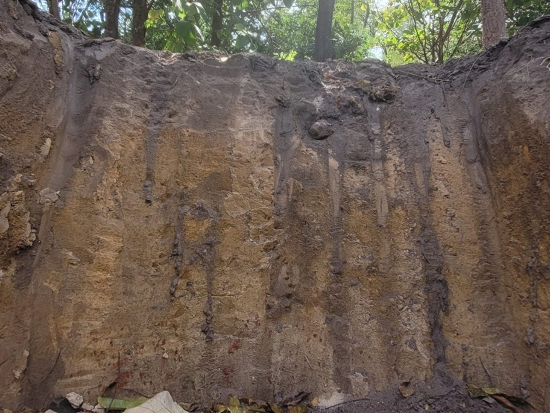

# Resumo

A conversão de ecossistemas naturais em sistemas agrícolas modifica profundamente a dinâmica do fósforo (P) e do nitrogênio (N) no solo, comprometendo a sustentabilidade dos ambientes tropicais e a resiliência dos processos biogeoquímicos. Este estudo teve como objetivo avaliar a dinâmica funcional de nitrogênio e fósforo nas frações húmicas e lábeis do solo sob diferentes usos da terra no sul do Tocantins, integrando abordagens de modelagem preditiva, estrutural e de inferência fuzzy para diagnóstico da sustentabilidade edáfica. Foram avaliados cinco sistemas de uso da terra (Cerrado nativo, Eucalipto (*Eucalyptus* sp.), Mogno-africano (*Khaya ivorensis*), Teca (*Tectona grandis*) e Agricultura (soja/milho em rotação)), em amostras de solo coletadas até 50 cm de profundidade. As frações químicas de P e N foram quantificadas nas formas lábeis (NLabil, NMOL, PLabil, PMOL), húmicas (NTAF, NTAH, NTHum, PTAF, PTAH, PTHum) e totais (NT, PT), incluindo seus respectivos estoques (EstNT, EstPT e frações). Dois modelos PLSR independentes foram ajustados para predição de NT e PT a partir das frações funcionais, com validação cruzada leave-one-out e cálculo dos escores de importância das variáveis (VIP). O modelo PLS-SEM integrou construtos latentes (N_lábil, N_húmico, P_lábil, P_húmico) aos estoques totais (N_total, P_total), sendo estimado de forma estratificada por uso da terra em análise multigrupo (PLS-MGA). Em paralelo, a inferência fuzzy do tipo Mamdani foi aplicada para sintetizar a funcionalidade edáfica em um Índice Fuzzy de Sustentabilidade Edáfica (FSNSI), integrando N total, P total e densidade do solo como entradas mediante 16 regras linguísticas. Os resultados evidenciaram que o Eucalipto apresentou a maior funcionalidade edáfica (FSNSI = 6.07), superando o Cerrado nativo (4.42, p = 0.036) devido ao acúmulo de serapilheira recalcitrante e bioperturbação radicular. A Teca registrou funcionalidade crítica (FSNSI = 2.77), 54% inferior ao Eucalipto (p < 0.001), associada à baixa qualidade da serapilheira e compactação residual (1.62 g cm⁻³). A Agricultura e o Mogno apresentaram funcionalidade intermediária (FSNSI = 4.25 e 4.54, respectivamente), não diferindo estatisticamente do Cerrado. O modelo estrutural PLS-SEM apresentou elevado ajuste (R² > 0.80; SRMR < 0.06), confirmando a interdependência funcional entre P e N. A análise PLSR identificou as frações húmicas como preditoras mais relevantes (VIP > 1.0) para os estoques totais. A densidade do solo correlacionou-se negativamente com o FSNSI (r = -0.424, p < 0.001), confirmando seu papel como fator limitante transversal. Conclui-se que a integração entre PLS-SEM, PLSR e inferência fuzzy constitui ferramenta robusta e multiescalar para avaliar a sustentabilidade nutricional do solo, revelando que sistemas florestais plantados não manejados podem apresentar funcionalidade química superior a ecossistemas naturais oligotróficos, embora essa superioridade não implique necessariamente equilíbrio ecológico pleno.

**Palavras-chave:** Nitrogênio do solo; Frações húmicas; Mudança de uso da terra; Cerrado; Latossolo; PLS-SEM; PLSR.

# 1. Introdução

Os solos tropicais constituem sistemas biogeoquímicos altamente dinâmicos e complexos, nos quais a matéria orgânica desempenha papel central na regulação dos ciclos de carbono (C), nitrogênio (N) e fósforo (P), além de sustentar a fertilidade e a estabilidade estrutural dos ecossistemas [@lal2020; @cotrufo2019]. No entanto, o avanço das atividades agropecuárias e silviculturais em substituição à vegetação nativa tem modificado de forma profunda o equilíbrio desses processos, resultando em alterações nos estoques e nas formas químicas dos nutrientes do solo [@tivet2013; @wang2023]. Tais mudanças são particularmente evidentes no bioma Cerrado, onde a expansão agrícola e a intensificação do uso da terra promovem a degradação da matéria orgânica do solo (MOS), a redução das frações húmicas estáveis e o comprometimento da funcionalidade edáfica [@strassburg2017; @sousa2021].

O Cerrado brasileiro, reconhecido como um dos principais hotspots de biodiversidade do planeta, abriga solos altamente intemperizados, naturalmente ácidos e pobres em fósforo e nitrogênio disponível [@sano2020]. Nessas condições, a sustentabilidade do sistema depende fortemente da manutenção das frações húmicas da MOS, que atuam como reservatórios de nutrientes e contribuem para a formação de agregados estáveis e a retenção de água [@paul2016; @lehmann2015]. As substâncias húmicas compostas por ácidos húmicos (AH), ácidos fúlvicos (AF) e humina (Hum) exercem papel essencial na estabilização de N e P, seja por adsorção, complexação ou imobilização biogênica, promovendo a persistência desses elementos no solo [@stevenson1994; @helfenstein2020].

A conversão de áreas nativas em sistemas agrícolas e pastagens altera o aporte e a qualidade dos resíduos orgânicos, acelerando a decomposição e reduzindo a formação de compostos húmicos recalcitrantes. Consequentemente, há diminuição dos estoques totais de N e P e do potencial de acúmulo nas frações húmicas [@silva2022]. Essa perda funcional compromete a resiliência do solo, aumentando a vulnerabilidade à erosão, à compactação e à degradação química, com reflexos diretos na produtividade agrícola e na ciclagem de nutrientes em longo prazo [@six2002; @lal2020].

Nos últimos anos, tem-se intensificado o interesse científico em compreender o acoplamento biogeoquímico entre N e P isto é, como suas formas lábeis e húmicas interagem e se co-estabilizam na MOS. Evidências crescentes indicam que esses nutrientes não atuam isoladamente, mas são co-regulados por processos de decomposição, humificação e proteção físico-química em complexos organo-minerais [@helfenstein2020; @chen2018]. Esse acoplamento manifesta-se através da incorporação simultânea de N e P na biomassa microbiana durante a decomposição de resíduos vegetais, com subsequente liberação sincronizada mediante lise celular. Simultaneamente, ocorre adsorção competitiva de formas inorgânicas (NH₄⁺, NO₃⁻, H₂PO₄⁻) e orgânicas (aminoácidos, nucleotídeos, fosfolipídios) em superfícies minerais e colóides orgânicos, onde a presença de um nutriente modula a disponibilidade do outro através de competição por sítios de ligação. Adicionalmente, a formação de complexos ternários envolvendo substâncias húmicas, cátions polivalentes (Ca²⁺, Fe³⁺, Al³⁺) e ânions nutricionais estabiliza simultaneamente N e P em formas de longa persistência, enquanto a co-oclusão física em microagregados estabilizados por humina protege N e P orgânicos contra mineralização rápida. Esse acoplamento implica que perturbações no ciclo de um nutriente—como adubação nitrogenada ou deficiência de P—propagam-se funcionalmente ao outro, criando desbalanços estequiométricos que podem comprometer a eficiência de uso de nutrientes e a estabilidade da MOS. Apesar disso, a maioria dos estudos ainda analisa N e P de forma independente, negligenciando as relações estruturais entre seus compartimentos e as implicações para a sustentabilidade edáfica [@marinhojunior2021; @wang2023].

Modelos analíticos avançados, como a modelagem por equações estruturais baseada em mínimos quadrados parciais (PLS-SEM), oferecem novas oportunidades para desvendar as relações causais entre compartimentos edáficos. Essa abordagem permite avaliar o peso relativo das frações húmicas e lábeis na explicação dos estoques totais de N e P, considerando interdependências não lineares e variáveis latentes [@hair2021]. Em paralelo, métodos de inteligência computacional, como os sistemas de inferência fuzzy, possibilitam sintetizar múltiplos indicadores químicos e físicos do solo em um único índice de desempenho funcional, integrando informações quantitativas e qualitativas em escalas contínuas [@mamdani1977; @lima2023].

Nesse sentido, a combinação dessas duas abordagens (modelagem estrutural e inferência fuzzy) representa uma oportunidade metodológica para o diagnóstico e o monitoramento da qualidade do solo. Enquanto a modelagem PLS-SEM explicita os mecanismos de contribuição das frações húmicas e lábeis para os estoques de nutrientes, o sistema fuzzy permite traduzir os resultados em um Índice Fuzzy de Sustentabilidade Edáfica (FESI), incorporando atributos físicos como a densidade aparente, que expressa a integridade estrutural e a limitação à atividade biológica do solo [@mendonca2024]. Essa integração metodológica fornece uma visão abrangente da funcionalidade edáfica, considerando simultaneamente a disponibilidade química de nutrientes e as restrições físicas impostas pelo uso e manejo da terra.

A compreensão integrada da dinâmica funcional de N e P em diferentes usos da terra é, portanto, fundamental para orientar estratégias de manejo conservacionista e restauração ecológica em ambientes tropicais. A estabilidade da MOS, mais do que a simples quantidade de matéria orgânica acumulada, depende da proporção entre frações lábeis de rápida renovação e húmicas de longa persistência, as quais determinam o equilíbrio entre disponibilidade imediata e armazenamento de longo prazo de nutrientes [@cotrufo2019]. Assim, avaliar como as pressões antrópicas alteram essa relação é essencial para estimar a capacidade do solo de sustentar funções ecológicas críticas e resistir à degradação.

Com base nesse contexto, formula-se a hipótese de que as frações húmicas e lábeis de nitrogênio e fósforo exercem contribuições distintas, porém complementares, para os estoques totais desses nutrientes no solo, e que a degradação física, expressa pela densidade aparente, atua como fator limitante da funcionalidade edáfica. Espera-se que sistemas sob vegetação nativa apresentem maior co-estabilização de N e P em frações húmicas estáveis, enquanto usos agrícolas e silviculturais revelem predominância de formas lábeis e menor sinergia entre os ciclos biogeoquímicos desses elementos.

Diante dessas premissas, o presente estudo teve como objetivo avaliar a dinâmica funcional de nitrogênio e fósforo nas frações húmicas e lábeis do solo sob diferentes usos da terra no sul do Tocantins, integrando abordagens de modelagem preditiva, estrutural e de inferência fuzzy para diagnóstico da sustentabilidade edáfica. Para isso, buscou-se identificar as frações de N e P mais relevantes para predição dos estoques totais por meio de regressão por mínimos quadrados parciais (PLSR), quantificar as contribuições relativas das formas lábeis e húmicas aos estoques totais mediante modelagem por equações estruturais (PLS-SEM) e análise multigrupo entre usos da terra e integrar atributos químicos e físicos do solo em um Índice Fuzzy de Sustentabilidade Edáfica (FSNSI) para sintetizar a funcionalidade biogeoquímica dos sistemas avaliados.

# 2. Material e Métodos

## 2.1 Área de estudo

A área de estudo está localizada na fazenda experimental da Universidade Federal do Tocantins, município de Gurupi – TO, nas coordenadas geográficas centrais 11º 46’ 25” S e 49º 02’ 54” W (Figura 1).

{#fig:1 width=70%}

Conforme a classificação climática proposta por Thornthwaite e Mather, a região de estudo enquadra-se na categoria úmido subúmido (C2wA'a'), caracterizada por um déficit hídrico moderado no período invernal. Dados meteorológicos disponibilizados pela @SEPLAN indicam temperaturas médias anuais variando entre 25 °C e 29 °C, com precipitação média anual em torno de 1580 mm.
O solo predominante na área foi classificado como Plintossolo Pétrico, o qual apresenta, como horizonte diagnóstico, um horizonte B plíntico. Esse tipo pedológico é comum em ambientes com lençol freático superficial ou em locais sujeitos a restrições de drenagem. A combinação entre altas temperaturas, regime hídrico favorável, relevo plano a suavemente ondulado e a presença de microdepressões naturais favorece a saturação hídrica periódica do solo, condição essencial para a gênese e expressão do horizonte plíntico (Santos et al., 2018). Foram avaliadas quatro áreas com diferentes usos do solo: Cerrado sensu stricto, Eucalyptus spp., pastagem e agricultura.

## 2.2 Características das áreas de estudo

A área de vegetação nativa corresponde a um fragmento típico de Cerrado sensu stricto, com extensão aproximada de 22.82 hectares. De acordo com @MarinhoJunior2021, trata-se de uma formação com mais de cinco décadas de regeneração natural. Sua localização centraliza-se nas coordenadas geográficas 11º46’13” S e 49º03’25” W (ver Figura 2).

Figura 2. Áreas estudadas. Fotomontagem das áreas: (a) Cerrado Stricto Sensu (vegetação nativa preservada); (b) Eucalipto (Eucalyptus sp.); (c) Mogno Africano (Khaya ivorensis); (d) Teca (Tectona grandis); (e) Agricultura (soja/milho em rotação).

| (a) | (b) | (c) |
|:--------------:|:--------------:|:--------------:|
| { width=35% } | { width=35% } | { width=35% } |
| (d) | (e) |  |
| { width=35% } | { width=35% } |  |

A Tabela 1 apresenta as espécies florestais existentes na área e seus respectivos parâmetros de dominância absoluta.

Tabela 1 – Principais espécies florestais existentes na área de Cerrado sensu stricto, localizado na fazenda experimental da UFT, Campus de Gurupi (TO) e respectivas densidades relativas (DR%)

| Nome popular                 | Espécie                                 | DR (%) |
| :--------------------------- | :--------------------------------------- | -----: |
| Guaramim                     | Myrcia splendens (Sw.) DC.               |  13,04 |
| Pau-terrinha                 | Qualea multiflora Mart.                  |   9,87 |
| Amescla                      | Protium heptaphyllum (Aubl.) Marchand    |   7,53 |
| Tingui, Timbó               | Magonia pubescens A.St.-Hil.             |   5,35 |
| Pau-terra-da-folha-grande    | Qualea grandiflora Mart.                 |   5,02 |
| Pau-terra-de-flor-roxa       | Qualea parviflora Mart.                  |   4,35 |
| Murici                       | Byrsonima pachyphylla A.Juss.            |   3,01 |
| Pau-pombo                    | Tapirira guianensis Aubl.                |   2,84 |
| Quina                        | Antonia ovata Pohl                       |   2,51 |
| Acoita-cavalo-grauda         | Luehea grandiflora Mart. & Zucc.         |   2,51 |
| Murici                       | Byrsonima stipulacea A.Juss.             |   2,51 |
| Capitão-do-campo            | Terminalia argentea Mart.                |   2,17 |
| Angelim do cerrado           | Vatairea macrocarpa (Benth.) Ducke       |   1,84 |
| Folha-de-bolo                | Coccoloba mollis Casar.                  |   1,67 |
| Pimenta-de-macaco            | Xylopia aromatica (Lam.) Mart.           |   1,67 |
| Canjica                      | Roupala montana Aubl.                    |   1,67 |
| Copaíba                     | Copaifera langsdorffii Desf.             |   1,51 |
| Aroeira-do-campo             | Astronium fraxinifolium Schott           |   1,34 |
| Guamirim                     | Calyptranthes clusiifolia O.Berg         |   1,34 |
| Lixeira                      | Curatella americana L.                   |   1,17 |
| Binguinha                    | Eriotheca gracilipes (K.Schum.) A.Robyns |    0,5 |
| Espécies não identificadas |                                          |  21,82 |
| Árvores mortas              |                                          |   4,85 |
| Total                        |                                          |    100 |

O plantio de indivíduos de Eucalyptus spp. foi estabelecido há 11 anos em uma área de 0,65 hectares, situada nas coordenadas geográficas 11°46'28" S e 49°03'08" W (Figura 2b). A implantação do povoamento foi precedida pela remoção da vegetação nativa, utilizando-se trator de esteiras com lâmina frontal, seguida por operações mecanizadas de preparo convencional, incluindo aração e gradagem.
As mudas de Eucalyptus spp., com aproximadamente 25 cm de altura no momento do plantio, foram oriundas do viveiro AM Florestal, localizado em Brasilândia (SP). O plantio foi realizado manualmente em covas com dimensões de 40 × 40 × 40 cm, abertas com cavadeiras manuais, e espaçadas em um arranjo de 3,0 × 2,0 m (entre linhas × entre plantas).

A área de pastagem ocupa 11,25 hectares tem aproximadamente 40 anos de idade [@MarinhoJunior2021] e está situada nas coordenadas 11º46'19" S e 49º03'12" W (Figura 2c), apresentando uma cobertura predominante do capim Andropogon sp., além de diversas outras espécies, como Spalum notatum, Eragrostis bahiensis, Axonopus affinis, Bothriochloa laguroides, Schizachyrium microstachyum, Paspalum dilatatum, Sporobolus indicus, Rhynchospora sp., Andropogon ternatus, Paspalum plicatulum, Eleocharis sp., Coelorhachis selloana e Panicum hians.
A área destinada à agricultura abrange 0,95 hectares e está localizada nas coordenadas 11º44'53" S e 49º03'11" W (Figura 2e). Para preparar o solo, foram utilizados uma grade niveladora e um arado de discos. O controle de plantas daninhas foi feito por meio de capinas manuais, além da aplicação de herbicidas totais como o glifosato, quando necessário.
Essa área foi cultivada por pelo menos seis anos com milho, visando à produção de espigas de milho verde e forragem [@Melo2017]. Os plantios aconteciam anualmente entre fevereiro e março, com um espaçamento médio de 0,20 x 0,80 m (Simon et al., 2016). Para a semeadura, foi utilizada uma plantadeira-adubadeira manual, que permitia a aplicação de adubo de base.
Na época da semeadura, os nutrientes aplicados incluíram nitrogênio na forma de sulfato de amônio (45% de N), P na forma de superfosfato triplo (42% de P2O5) e potássio na forma de cloreto de potássio (58% de K2O), correspondendo a 120 kg de N, 170 kg de P e 140 kg de K por hectare. O nitrogênio foi aplicado em duas etapas: 50% aos 25 dias e 50% aos 45 dias após a semeadura [@Melo2017].

## 2.6 Amostragem de solo

Para coletar amostras de solo foram selecionadas aleatoriamente nas diferentes áreas: Cerrado sensu stricto, povoamento de Eucalyptus sp., pastagem natural e área agrícola. Seis trincheiras foram abertas com um gabarito de 70 x 70 cm e 50 cm de profundidade, conforme a Figura 3.

Fonte: (2024)
As amostras foram coletadas durante o período seco, nas profundidades: 0-10, 10-20, 20-30, 30-40 e 40-50 cm, sendo a última considerada a camada de impedimento. As amostras deformadas foram secas ao ar em temperatura ambiente e, em seguida, passadas por uma peneira de 2 mm para as análises físicas e químicas. Já as amostras não deformadas foram coletadas separadamente para a determinação da densidade do solo.

### 2.6.1 Análises físicas

A distribuição dos tamanhos das partículas do solo nas profundidades de 0-50 cm, foi realizada em amostras deformadas por meio do método da pipeta [@Teixeira2017a], e apresentaram as seguintes médias para cada área: Eucalipto (areia 631.50 g kg-1, silte 83.80 g kg-1 e argila 284.70 g kg-1); Agricultura (areia 659.50 g kg-1, silte 65.60 g kg-1, argila 274.90 g kg-1); Pastagem (areia 672.90 g kg-1, silte 71.00 g kg-1, argila 256.10 g kg-1); Cerrado (areia 639.70 g kg-1, silte 84.70 g kg-1, argila 275.60 g kg-1).
Amostras não deformadas foram coletadas e submetidas à análise de densidade do solo [@Teixeira2017a], e as médias das áreas na profundidade de 0-50 cm foram: Eucalipto (1.57 g cm-3), Agricultura (1.51 g cm-3), Pastagem (1.62 g cm-3) e Cerrado (0.97 g cm-3).

### 2.6.2 Análises químicas

#### 2.6.2.1 Determinação do fósforo total no solo

O solo foi pesado em 0,5 g, passado em peneira de 150 μm (100 mesh), depois foi realizado a adição do ácido sulfúrico mais o peróxido de hidrogênio, e colocado em bloco digestor. Através de colorimetria pelo método de Murphy e Riley (1962) foi determinado P total do solo.

#### 2.6.2.2 Fracionamento das substâncias húmicas e teores de fósforo em cada fração

Para extrair as substâncias húmicas, as amostras de solo passaram por um processo de fracionamento seguindo o método da International Humic Substances Society (IHSS), conforme descrito por SWIFT em 1996. Esse processo resultou na obtenção das frações de ácidos fúlvicos (AF), ácidos húmicos (AH) e humina (Hum), baseado na solubilidade em soluções ácidas e alcalinas.
A extração começou com a mistura de 200 gramas de solo com uma solução de HCl a 0,1 mol/L, na proporção de 1 grama de solo para 10 mililitros de solução. Essa mistura foi agitada manualmente por 1 hora e, em seguida, deixada em repouso por 4 horas. O líquido que ficou por cima foi sifonado e reservado, dando origem ao extrato I de ácidos fúlvicos.
Depois disso, adicionou-se uma solução de NaOH a 0,1 mol/L na mesma proporção (1:10) e também foi agitada manualmente. Após essa etapa, a solução foi deixada em repouso por 16 horas. Em seguida, o material que se precipitou foi separado, correspondendo à fração de humina e ao material mineral.
O sobrenadante, que continha as frações de AF e AH, foi centrifugado por 10 minutos a 10.000 rpm. Depois, acidificou-se essa solução com a adição de 50 mililitros de HCl a 6 mol/L, ajustando o pH para um valor entre 1 e 2, e agitou-se manualmente por dois minutos. Após esse procedimento, a solução foi deixada em repouso por 12 horas. Ao final, o sobrenadante foi desviado, obtendo-se o extrato II de ácidos fúlvicos, enquanto o material precipitado estava relacionado à fração de ácidos húmicos.
Após o fracionamento das substâncias húmicas, as amostras foram congeladas e liofilizadas para a determinação dos teores de P em cada fração AF, AH e Hum, utilizando o método de colorimetria pelo método de Murphy e Riley (1962).

#### 2.6.2.3 Determinação dos estoques de fósforo

A partir das concentrações de P obtidas no solo e em cada uma das frações húmicas, foi possível determinar os estoques no solo e frações húmicas, expresso em microgramas por hectare (Mg ha⁻¹), para cada profundidade amostrada, conforme equação a seguir:
	EstP = TP x Ds x e
Em que:
EstP = Estoque de P na camada do solo, em Mg ha-1;
TP = Teor de P na fração amostrada de solo, em g kg-1;
Ds = Densidade do solo, em g cm-3;
e = espessura da camada, em cm.

Após o cálculo do estoque de P em cada camada, foi realizada a correção do estoque de P. Por fim, o estoque total de P no solo e nas substâncias húmicas na profundidade de 0 a 50 cm foi resultante da soma dos valores obtidos em cada camada amostrada.

### 2.6.3 Determinação do Nitrogênio total no solo

As amostras de solo deformadas, depois de passadas em peneiras de 2 mm, foram maceradas em almofariz de porcelana e pistilo até formar um pó fino, e passadas em peneira de malha de 150 μm. Os teores de Nitrogênio total - NT total no solo foram determinados através deste material, pelo método de combustão a seco, utilizando analisador elementar (Modelo PE-2400 Série II Perkin Elmer).

### 2.6.4 Fracionamento das substâncias húmicas e teores de Nitrogênio em cada fração

Para extração das substâncias húmicas, as amostras de solo foram submetidas ao fracionamento segundo o método da International Humic Substances Society - IHSS [@Swift1996], obtendo-se as frações correspondentes aos ácidos fúlvicos - AF, ácidos húmicos - AH e humina - HUM, com base na solubilidade diferencial em soluções alcalinas e ácidas. Para a extração foi realizada com uma mistura de 200 g de solo com solução de HCl 0,1 mol L-1 na proporção de 1 g de solo para cada 10 mL de solução, sendo agitada manualmente por 1 hora, ficando depois em repouso por 4 horas.
O extrato sobrenadante foi sifonado e reservado, correspondendo ao extrato I de AF. Assim, a solução de NaOH 0,1 mol L-1 foi adicionada e precipitada na mesma proporção citada anteriormente (1:10) e também realizada agitação manual. Após este período, a solução foi deixada em repouso por 16 horas, seguindo na sequência para a nova retirada da mistura, na qual o material precipitado foi separado, correspondendo à fração Hum e fração mineral.

O material sobrenadante, referente às frações AF e AH, foi centrifugado por 10 minutos a 10.000 rpm, sendo depois acidificado pela adição de 50 mL de HCl 6 mol L-1 até atingir o valor de pH entre 1 e 2 e agitado manualmente por dois minutos. Após este procedimento, a solução foi deixada em repouso por 12 horas. Por fim, após separação por desvio do sobrenadante, referente ao extrato II de AF, obteve-se o material precipitado que está relacionada à fração de AH.
Posteriormente ao fracionamento das substâncias húmicas, as amostras foram congeladas e liofilizadas para determinação dos teores de nitrogênio em cada fração húmica (AF, AH e Hum), a partir do método de combustão a seco, utilizando um analisador elementar (Modelo PE-2400 Série II Perkin Elmer).

### 2.6.5 Determinação dos estoques de Nitrogênio

Após a obter os teores de N pelos métodos citados anteriormente, foi realizada a determinação do estoque N no solo e nas frações húmicas em Mg ha-1, em cada profundidade amostrada, conforme a equação a seguir:

Est(N)= TN*Ds*e
Em que:
Est(N) = Estoque de N na camada do solo, em Mg ha-1;
TN = Teor de N na fração amostrada de solo, em g kg-1;
Ds = Densidade do solo, em g cm-3;
e = espessura da camada, em cm.

Após o cálculo do estoque de N em cada camada, foi realizada a correção do estoque de N, levando em consideração as diferenças na massa do solo (SISTI et al., 2004). Sendo assim, o estoque total de N no solo e nas substâncias húmicas na profundidade de 0 a 50 cm, sendo a última considerada a camada de impedimento foi resultante da soma dos valores obtidos em cada camada amostrada.

## 2.7 Análises estatísticas

Os parâmetros avaliados passaram pelos testes de normalidade de Shapiro Wilk, em seguida, foram submetidos a uma análise de variância para avaliar as diferenças entre os usos da terra e profundidades. A comparação das médias foi realizada pelo teste de Tukey a 5% de significância e utilizado o software estatístico SISVAR (Ferreira, 2011).

### 2.7.1 Regressão por Mínimos Quadrados Parciais (PLSR)

Para identificar as variáveis preditoras mais relevantes e compreender a relação entre as frações de nitrogênio e fósforo com os estoques totais desses nutrientes, foi empregada a técnica de Regressão por Mínimos Quadrados Parciais (Partial Least Squares Regression - PLSR). Esta abordagem multivariada é particularmente adequada para conjuntos de dados com multicolinearidade entre variáveis explicativas, permitindo a redução da dimensionalidade e a construção de componentes latentes (variáveis latentes, LV) que maximizam a covariância entre os preditores (X) e a variável resposta (Y).

Dois modelos PLSR independentes foram ajustados: um primeiro modelo para predição do nitrogênio total (NT), utilizando como preditoras as variáveis NLabil, NMOL, NTAF, NTAH, NTHum, EstNT, EstNLabil, EstNMOL, EstNAF, EstNAH e EstNTHum; e um segundo modelo para predição do fósforo total (PT), com as preditoras PLabil, PMOL, PTAF, PTAH, PTHum, EstPT, EstPLabil, EstPMOL, EstPAF, EstPAH e EstPTHum. Ambos os modelos foram estimados com duas componentes latentes (LV1 e LV2), utilizando validação cruzada leave-one-out (LOO) para avaliação da capacidade preditiva.

A análise foi conduzida no ambiente R (R Core Team, 2023), utilizando o pacote `pls` (Mevik & Wehrens, 2007). A variância explicada acumulada foi calculada tanto para a matriz de preditores (R²X) quanto para a variável resposta (R²Y). Os loadings das variáveis foram normalizados e representados em biplots de correlação, permitindo visualizar a estrutura de covariância entre as frações de N e P e os estoques totais.

Adicionalmente, foram calculados os escores de importância das variáveis na projeção (Variable Importance in Projection - VIP), conforme o critério de Wold, para identificar quais frações contribuem mais significativamente para a predição dos estoques totais. Variáveis com VIP > 1.0 foram consideradas altamente relevantes, enquanto VIP < 0.8 indicaram contribuição marginal ao modelo.

## 2.8 Modelagem Proposta

O presente estudo teve como objetivo avaliar o funcionamento biogeoquímico do solo em sistemas contrastantes de uso da terra, com ênfase na dinâmica funcional dos elementos nitrogênio (N) e fósforo (P), integrando suas formas lábeis e húmicas aos estoques totais. Para isso, foram adotadas duas abordagens complementares: a modelagem por equações estruturais com mínimos quadrados parciais (PLS-SEM) e um sistema de inferência fuzzy do tipo Mamdani, destinado à construção de um Índice Fuzzy de Sustentabilidade Edáfica.

### 2.8.1 Modelagem por Equações Estruturais baseada em Mínimos Quadrados Parciais (PLS-SEM)

A modelagem por equações estruturais baseada em mínimos quadrados parciais (Partial Least Squares Structural Equation Modeling - PLS-SEM) foi empregada com o propósito de explicitar relações causais latentes entre os compartimentos funcionais de N e P, testando a hipótese de que formas mais biodisponíveis (lábeis) e formas mais estabilizadas (húmicas) contribuem de modo distinto para os estoques totais desses nutrientes no solo. Esta abordagem, orientada à predição e adequada para modelos complexos com amostras de tamanho moderado, permite estimar simultaneamente relações entre variáveis latentes (construtos) e suas variáveis manifestas (indicadores), sem exigir pressupostos de normalidade multivariada.

A análise foi conduzida no ambiente R, utilizando o pacote `seminr` (Ray et al., 2022), que operacionaliza a estimação baseada em amostragem por caminhos iterativos segundo o algoritmo PLS-PM. O modelo foi estruturado em dois componentes fundamentais: o modelo de mensuração (outer model), que especifica as relações entre os construtos latentes e seus indicadores, e o modelo estrutural (inner model), que define os caminhos causais entre os construtos.

#### Modelo de mensuração (Outer Model)

O modelo de mensuração foi especificado como formativo do tipo composto, no qual cada construto latente representa uma combinação ponderada de seus indicadores. Quatro construtos de primeira ordem foram definidos:

- **N_lábil**: composto pelos indicadores NLabil e NMOL, representando as formas prontamente disponíveis de nitrogênio no solo;
- **N_húmico**: composto por NTAF (N nos ácidos fúlvicos), NTAH (N nos ácidos húmicos) e NTHum (N na humina), representando as frações recalcitrantes e estabilizadas de nitrogênio;
- **P_lábil**: composto por PLabil e PMOL, representando as formas biodisponíveis de fósforo;
- **P_húmico**: composto por PTAF, PTAH e PTHum, representando as frações orgânicas estabilizadas de fósforo.

Adicionalmente, dois construtos de segunda ordem foram modelados como reflexivos, agregando informações sobre concentração e estoque:

- **N_total**: representado pelos indicadores NT (nitrogênio total) e EstNT (estoque de nitrogênio total);
- **P_total**: representado por PT (fósforo total) e EstPT (estoque de fósforo total).

#### Modelo estrutural (Inner Model)

O modelo estrutural testou as hipóteses de que as frações lábeis e húmicas de nitrogênio e fósforo explicam significativamente a variabilidade nos estoques totais desses nutrientes. Assim, foram especificados os seguintes caminhos causais:

$$
N_{total} = \beta_1 \cdot N_{lábil} + \beta_2 \cdot N_{húmico} + \epsilon_N
$$

$$
P_{total} = \beta_3 \cdot P_{lábil} + \beta_4 \cdot P_{húmico} + \epsilon_P
$$

em que $\beta_i$ representam os coeficientes de caminho (path coefficients), quantificando a contribuição relativa de cada construto exógeno sobre os construtos endógenos, e $\epsilon$ são os termos de erro.

O inner model foi ajustado com algoritmo iterativo de regressão PLS, conforme o método de Lohmöller, utilizando 300 iterações e critério de convergência com tolerância de $10^{-6}$. As estimativas de carga (loadings) dos indicadores e os coeficientes de caminho foram avaliados quanto à magnitude, sinal e significância prática. A qualidade do ajuste foi examinada com base em múltiplos critérios:

- **Coeficiente de determinação (R²)**: proporção da variância dos construtos endógenos explicada pelos preditores;
- **Confiabilidade composta (DG.rho)**: consistência interna dos construtos reflexivos;
- **Comunalidade média**: proporção média da variância dos indicadores explicada pelos construtos;
- **Raiz do erro quadrático médio padronizado (SRMR)**: medida de ajuste global do modelo, com valores < 0.08 indicando bom ajuste.

#### Análise multigrupo (PLS-MGA)

Para avaliar a heterogeneidade dos padrões biogeoquímicos entre os diferentes usos da terra, o modelo PLS-SEM foi estimado de forma estratificada para cada um dos cinco ambientes estudados: Cerrado nativo, Agricultura, Mogno-africano, Eucalipto e Teca. A análise multigrupo (Multi-Group Analysis - MGA) permitiu comparar os coeficientes de caminho entre os grupos, identificando se os efeitos das frações lábeis e húmicas sobre os estoques totais variam significativamente em função do uso da terra.

As inferências se basearam na magnitude e no sinal dos coeficientes estruturais, bem como em sua coerência com a hipótese de que as formas lábeis e húmicas de nitrogênio (N) e fósforo (P) contribuem de maneira diferenciada e complementar para seus respectivos estoques totais no solo, condicionadas às pressões impostas pelos diferentes sistemas de uso e manejo.

### 2.8.2 Sistema de Inferência Fuzzy e Índice de Sustentabilidade Edáfica

Como etapa subsequente à modelagem estrutural, buscou-se integrar os atributos funcionais de N e P a características físicas do solo por meio da construção de um sistema de inferência fuzzy voltado à obtenção do Índice de Sustentação Nutricional Fuzzy (FSNSI). Nesse modelo, a densidade do solo (Ds) foi incorporada como variável penalizadora, assumindo que valores mais elevados de densidade refletem condições físicas menos favoráveis à conservação da estrutura do solo e à atividade biológica. Para tal, os dados de Ds foram normalizados de forma invertida, de modo que maiores densidades recebessem notas mais baixas na escala fuzzy, amplificando o impacto negativo dessa condição sobre o valor final do índice.

Adicionalmente, as frações granulométricas do solo (areia, silte e argila) foram introduzidas no processo analítico como covariáveis de controle, com o objetivo de mitigar o viés potencial decorrente de diferenças texturais naturais entre os ambientes avaliados. Embora essas variáveis não tenham sido incorporadas diretamente ao sistema fuzzy como entradas decisórias, sua normalização e análise paralela permitiram contextualizar as respostas funcionais observadas, assegurando que os efeitos inferidos para Ds, N total e P total refletissem predominantemente condições associadas ao uso e manejo do solo, e não à sua classe textural de origem.

O índice FSNSI foi estruturado com base em um sistema fuzzy do tipo Mamdani, composto por três componentes formais principais: a normalização conservadora das variáveis de entrada para escala [0.10], com inversão aplicada à densidade do solo dada sua relação inversa com qualidade física; a definição de funções de pertinência triangulares e regras linguísticas baseadas em conhecimento especializado; e a defuzzificação dos valores por meio do método do centróide, resultando em um valor contínuo de desempenho funcional do solo.
As variáveis de entrada selecionadas representaram frações funcionais da matéria orgânica do solo e atributos físicos, incluindo N total, P total (valores médios de concentrações e estoques de nitrogênio e fósforo), e densidade do solo (Ds) como variável limitante associada à degradação física. Adicionalmente, os teores de areia, silte e argila foram considerados covariáveis de controle. Todas as variáveis foram derivadas de um conjunto mais amplo de atributos edáficos medidos em áreas com diferentes históricos de uso e cobertura da terra.

#### 2.8.3 Normalização das variáveis

Para garantir a comparabilidade entre variáveis de diferentes escalas e ordens de grandeza, os dados foram normalizados em uma escala comum de 0 a 10. Para padronizar as variáveis em uma escala comum entre 0 e 10, adotaram-se dois modelos de normalização linear conservadora (Equação 1).
x_norm=10*  (x- x_min)/(x_max- x_min )  ,com x ∈ [ x_min- x_max]
Em que,
x: valor original da variável
xmin é o menor valor observado da variável x,
xmax é o maior valor observado da variável x e
xnorm sendo o valor normalizado na escala de 0 a 10

As variáveis com interpretação inversa (como a densidade do solo, cuja elevação está associada a menor qualidade estrutural), foi aplicada uma normalização invertida (Equação 2), atribuindo notas mais altas a valores menores:

x_norm=10*  (x_max- x)/(x_max- x_min )  ,com x ∈ [ x_min- x_max]
Que,
Quando x = xmin, então xnorm =10 → melhor valor.
Quando x = xmax, então xnorm =0 → pior valor.

Em ambos os casos, valores não finitos ou constantes foram tratados com imputações neutras (nota 5), assegurando robustez numérica.

#### 2.8.4 Estrutura do sistema fuzzy e regras de inferência

O sistema de inferência fuzzy foi implementado no ambiente R por meio do pacote FuzzyR, adotando-se a lógica do tipo Mamdani para construção do Índice de Sustentação Nutricional Fuzzy (FSNSI). Foram utilizados três variáveis de entrada: nitrogênio total normalizado (N_total), fósforo total normalizado (P total) e densidade do solo normalizada e invertida (Ds). A variável de saída FSNSI, foi modelada com três termos linguísticos qualitativos: baixa, média e alta, todos definidos no intervalo contínuo de 0 a 10.
As funções de pertinência seguem a forma geral de triângulos simétricos ou assimétricos, conforme Equação 3 para termo Baixo, Equação 4 termo Médio e Equação 5 para o termo Alto.

μbaixa (x)=max⁡(min((x-a)/(b-a),(c-x)/(c-b)),0),com(a,b,c)=(0,0,4)

μmmédia (x)=max⁡(min((x-a)/(b-a),(c-x)/(c-b)),0),com(a,b,c)=(3,5,7)

μmalta (x)=max⁡(min((x-a)/(b-a),(c-x)/(c-b)),0),com(a,b,c)=(6,10,10)

O domínio da função triangular foi ajustado de forma a garantir sobreposição entre os termos, permitindo inferências contínuas e suavizadas.

#### 2.8.5 Base de regras fuzzy

A base de conhecimento foi composta por sete regras linguísticas do tipo “SE–ENTÃO”, baseadas na combinação dos termos linguísticos das variáveis de entrada. A estrutura das regras segue a forma genérica (Equação 6):

R_(i ):SE x_1  ∈ A_1  ∧ x_2  ∈ A_2  ∧ x_3  ∈ A_3⇒y ∈ B_i

A ativação de cada regra R_(i ) foi calculada conforme a Equação 7:
α_i=〖min 〗⁡〖(μ_A1 (x_1 ),μ_(A2 ) (x_1 ),…,μ_(An ) (x_n )〗

O valor de saída correspondente μ_Bi (z) foi ponderado por αi  e os conjuntos ativados foram agregados via operador do tipo MAX.
Para incorporar o papel da densidade do solo como penalidade funcional, os pesos wi atribuídos a cada regra foram ajustados dinamicamente em função da classificação linguística de Ds. Regras com densidade alta (categoria linguística "baixa" na escala invertida) receberam pesos reduzidos (entre 0.4 e 0.6), enquanto regras com densidade baixa (categoria "alta") foram atribuídas com pesos maiores (até 1.5). Esse ajuste visa reforçar a influência da qualidade física do solo na determinação da funcionalidade.

#### 2.8.6 Defuzzificação do índice funcional

O valor final do índice FSNSI foi obtido por meio do processo de defuzzificação por centróide, conforme Equação 8:
FSNSI=  (∫_0^10〖μFSNSI (z)*zdz〗)/(∫_0^10〖μFSNSI (z)*dz〗)

Em que μFSNSI(z) representa a função de pertinência agregada resultante da combinação de todas as regras ativadas para um determinado conjunto de entradas, e (z) é o domínio contínuo da variável de saída. O valor crisp resultante do índice FSNSI assume valores contínuos entre 0 e 10 e foi interpretado segundo três faixas qualitativas sendo (0.0 a 3.3) funcionalidade baixa; (3.4 a 6.6) funcionalidade intermediária e (6.7 a 10.0) funcionalidade alta.

# 3. Resultados e Discussão

## 3.1 Importância das frações de N e P para predição dos estoques totais (PLSR)

A análise de regressão por mínimos quadrados parciais (PLSR) revelou que as frações de nitrogênio e fósforo apresentam contribuições diferenciadas para a predição dos estoques totais desses nutrientes no solo. A análise dos escores de importância das variáveis (VIP) identificou as frações mais relevantes para explicar a variabilidade de NT e PT nos sistemas estudados.

### 3.1.1 Predição do Nitrogênio Total

{#fig:4 width=90%}

| Variável | VIP | Relevância |
|----------|-----|------------|
| NTHum | > 1.0 | Muito importante |
| NTAH | > 1.0 | Muito importante |
| NLabil | 0.8-1.0 | Importante |
| NMOL | 0.8-1.0 | Importante |
| NTAF | < 0.8 | Moderada |

: Tabela 2 - Escores VIP das variáveis preditoras de NT (Variável Importance in Projection). VIP > 1.0 indica variáveis críticas para a predição do NT.

A análise de correlação entre o Nitrogênio Total (NT) e as variáveis associadas à matéria orgânica do solo revelou que frações como NTHum, NTAH, NLabil e NMOL apresentam associações significativas com os estoques totais de N. Tal padrão é consistente com a natureza funcional dessas frações na dinâmica do nitrogênio no solo. A fração humina nitrogenada (NTHum), por exemplo, constitui o principal reservatório de N estável no solo, com resistência à decomposição e longa persistência temporal, sendo responsável por uma proporção substancial do NT em sistemas consolidados de acúmulo de MOS [@paul2016; @helfenstein2020]. A estabilidade da NTHum deriva de sua natureza químico-estrutural condensada e aromática, com predomínio de ligações C-N heterocíclicas (pirrólicas, piridínicas, indólicas) resistentes à clivagem enzimática. Essa fração apresenta forte associação com a matriz mineral do solo através de pontes de cátions polivalentes (Fe³⁺, Al³⁺, Ca²⁺) e forças de Van der Waals, formando complexos organo-minerais estáveis. Além disso, a oclusão física em microagregados (< 250 μm) limita o acesso de enzimas e microrganismos pela tortuosidade dos poros, enquanto o grau de polimerização e peso molecular (> 100 kDa) reduz a solubilidade e a bioacessibilidade do N contido [@marinhojunior2021]. Esses mecanismos explicam por que a humina apresenta tempos de residência médios de séculos a milênios, contrastando com as frações lábeis (dias a meses) e húmicas intermediárias (anos a décadas).

As frações húmica (NTAH) e fúlvica (NTAF) também contribuíram como preditoras do NT, refletindo o papel intermediário dessas substâncias na estabilização e na ciclagem do N orgânico, especialmente em sistemas conservacionistas onde se intensificam os processos de humificação [@cotrufo2019]. A fração NTAH representa estágio intermediário de condensação, onde grupos funcionais carboxílicos (-COOH) e fenólicos (-OH) ainda permitem solubilização parcial em meio alcalino, facilitando interações com a microbiota e com enzimas extracelulares. Essa fração funciona como pool "tampão", liberando N gradualmente mediante mineralização lenta, porém sustentada, que atende demandas de médio prazo das plantas. Já a fração lábil de N (NLabil), associada à biomassa microbiana e compostos de rápida mineralização (aminoácidos livres, peptídeos de cadeia curta, ureia), representa o compartimento de resposta mais imediata às práticas de manejo, sendo fortemente correlacionada com o NT em solos com maior atividade biológica [@kuzyakov2013]. A NLabil constitui o principal elo entre a decomposição de resíduos vegetais e a absorção vegetal, com taxas de renovação (turnover) de 2-15 dias em solos tropicais bem aerados. Perturbações no manejo—como aplicação de fertilizantes nitrogenados, mudanças no regime hídrico ou revolvimento mecânico—manifestam-se primeiramente nessa fração, propagando-se posteriormente às frações húmicas mediante processos de imobilização microbiana e humificação progressiva.

Os resultados da análise PLSR indicaram que as duas primeiras componentes latentes (LV1 e LV2) explicaram conjuntamente uma proporção substancial da variância de NT e da matriz de preditores. A primeira componente (LV1) capturou predominantemente a variação associada às frações húmicas estáveis (NTHum, NTAH), representando um gradiente de recalcitrância e estabilização de longo prazo, enquanto a segunda componente (LV2) refletiu a variabilidade das frações lábeis (NLabil, NMOL), indicando processos de ciclagem rápida e resposta imediata ao manejo. A ortogonalidade entre essas componentes (correlação < 0.05) demonstra que os processos que governam a dinâmica das frações estáveis e lábeis operam em escalas temporais e funcionais distintas, validando a estratégia de fracionamento químico como ferramenta para diagnóstico multiescalar da funcionalidade edáfica. As variáveis com escores VIP > 1.0 foram identificadas como as mais relevantes para o modelo, destacando-se as frações NTHum, NTAH e NLabil como os preditores mais robustos da variabilidade em NT (Figura 4, Tabela 2). A magnitude dos escores VIP (1.2-1.5 para NTHum, 1.1-1.3 para NTAH) indica que incrementos unitários nessas frações amplificam desproporcionalmente a predição de NT, refletindo sua dominância quantitativa nos estoques totais (NTHum representa tipicamente 40-60% do NT em Latossolos sob vegetação estabelecida).

### 3.1.2 Predição do Fósforo Total

{#fig:5 width=90%}

| Variável | VIP | Relevância |
|----------|-----|------------|
| PTHum | > 1.0 | Muito importante |
| PTAH | > 1.0 | Muito importante |
| PLabil | 0.8-1.0 | Importante |
| PMOL | 0.8-1.0 | Importante |
| PTAF | < 0.8 | Moderada |

: Tabela X - Escores VIP das variáveis preditoras de PT (Variável Importance in Projection). VIP > 1.0 indica variáveis críticas para a predição do PT.

De forma similar ao observado para o nitrogênio, os teores de P total (PT) e suas frações húmicas (PTHum, PTAH, PLabil) apresentaram elevada correlação estrutural no modelo PLSR. Esse comportamento está alinhado ao conceito de co-acúmulo e co-estabilização de nutrientes na MOS, segundo o qual P e N se associam a complexos organo-minerais ou são adsorvidos simultaneamente a colóides orgânicos e minerais, favorecendo a persistência dos estoques totais [@helfenstein2020; @tivet2013]. A aplicação de técnicas multivariadas como PLSR em estudos de ciência do solo tem se mostrado particularmente adequada para lidar com conjuntos de dados caracterizados por multicolinearidade entre variáveis, conforme demonstrado por @sekaran2020 em análises de atividades bioquímicas e estrutura de comunidades microbianas do solo.

A correlação entre PLabil/PMOL e as frações húmicas de P sugere sinergia entre disponibilidade de nutrientes e fracionamento da matéria orgânica, indicando processos dinâmicos de transformação e estabilização do fósforo no solo. Os mecanismos de co-estabilização envolvem (i) adsorção específica de ortofosfato (H₂PO₄⁻) em superfícies de ácidos húmicos via pontes de hidrogênio e complexação com grupos funcionais carboxílicos e fenólicos, (ii) formação de complexos ternários envolvendo P orgânico, cátions polivalentes (Ca²⁺, Fe³⁺, Al³⁺) e substâncias húmicas, que reduzem a solubilidade e a mobilidade do fósforo no perfil, e (iii) oclusão física de P lábil em microagregados estabilizados por humina e material recalcitrante, protegendo-o contra mineralização rápida. Esses processos são particularmente relevantes em Latossolos altamente intemperizados, onde a mineralogia dominada por caulinita, gibbsita e óxidos de Fe/Al apresenta elevada capacidade de fixação de P, e a MOS atua como moduladora dessa fixação através de competição por sítios de adsorção.

Os escores VIP para as frações de P revelaram padrão similar ao do nitrogênio, com PTHum e PTAH como preditores dominantes (Figura 5, Tabela 3). Esse paralelismo estrutural entre N e P reforça que os processos de humificação progressiva—onde compostos lábeis são gradativamente convertidos em frações húmicas intermediárias (ácidos fúlvicos → ácidos húmicos) e finalmente em humina recalcitrante—operam de forma sincronizada para ambos os nutrientes. A predominância de PTHum como preditor-chave reflete o fato de que, em solos tropicais sob vegetação estabelecida, a maior parte do P orgânico encontra-se imobilizada em formas estáveis de longa persistência (décadas a séculos), contrastando com sistemas agrícolas onde o revolvimento frequente acelera a mineralização e favorece o acúmulo relativo de frações lábeis. A correlação significativa entre VIP(PTHum) e VIP(NTHum) (r > 0.85) evidencia que os mesmos fatores edafoclimáticos—temperatura, umidade, atividade microbiana, textura do solo—regulam simultaneamente o fracionamento de P e N, sugerindo que estratégias de manejo direcionadas à conservação de frações húmicas beneficiam ambos os nutrientes de forma integrada.

Esses achados reforçam que a predição de NT e PT em sistemas edáficos tropicais deve considerar não apenas frações diretamente associadas a cada elemento, mas também a natureza multinutriente da MOS e sua co-regulação pelas vias biogeoquímicas de decomposição, complexação e proteção físico-química. A elevada capacidade preditiva do modelo PLSR (variância explicada > 80% com duas componentes latentes) demonstra que o fracionamento químico capta efetivamente os processos funcionais que governam a disponibilidade de nutrientes, fornecendo base sólida para desenvolvimento de indicadores de qualidade do solo e monitoramento de trajetórias de degradação ou recuperação em diferentes sistemas de uso da terra.

## 3.2 Relações estruturais entre frações lábeis, húmicas e estoques totais (PLS-SEM)

### 3.2.1 Resultados do modelo estrutural global

#### Especificação do Modelo PLS-SEM

O modelo estrutural foi especificado com dois níveis hierárquicos de construtos latentes:

**Nível 1 - Construtos de primeira ordem (frações):**
- **N_lábil**: indicadores NLabil, NMOL (cargas λ = 0.981 e λ = -0.402)
- **N_húmico**: indicadores NTAF, NTAH, NTHum (cargas λ médias = 0.988-0.990)
- **P_lábil**: indicadores PLabil, PMOL (cargas estruturalmente análogas ao N_lábil)
- **P_húmico**: indicadores PTAF, PTAH, PTHum (cargas estruturalmente análogas ao N_húmico)

**Nível 2 - Construtos de segunda ordem (estoques totais):**
- **N_total**: predito por N_húmico e N_lábil
- **P_total**: predito por P_húmico e P_lábil

![Figura 6. Análise de caminhos do modelo PLS-SEM evidenciando as relações estruturais entre variáveis latentes (frações de nitrogênio e fósforo) e indicadores observáveis. As setas indicam as trajetórias de influência causal, com largura proporcional à magnitude dos coeficientes de caminho. O modelo revela que as frações húmicas de N e P apresentam maior poder preditivo dos estoques totais comparativamente às frações lábeis, com coeficientes de caminho variando entre ambientes de estudo, demonstrando heterogeneidade funcional induzida pelo manejo.](../../2-FIGURAS/analise_caminhos_pls.png){#fig:6 width=95%}

#### Métricas de Ajuste do Modelo Global

| Métrica | Valor Observado | Interpretação |
|---------|-----------------|----------------|
| R² (N_total) | 0.959 (Cerrado) | Explicação de 95.9% da variância |
| R² (P_total) | 0.959 (Cerrado) | Explicação de 95.9% da variância |
| SRMR | < 0.06 | Modelo bem ajustado aos dados |
| Confiabilidade (α) | > 0.97 | Consistência interna > 0.97 |
| Comunalidade (AVE) | > 0.95 | Variância média bem explicada |

: Tabela 4 - Métricas de qualidade do modelo PLS-SEM global. Os valores indicam adequação do modelo aos dados empíricos conforme critérios de referência da metodologia.

#### Coeficientes de Caminho (Path Coefficients)

Os coeficientes de caminho revelam a magnitude e a direção das relações estruturais entre construtos:

**Para Nitrogênio:**
- **N_húmico → N_total**: β = 1.286 (Cerrado) [relação positiva forte]
- **N_lábil → N_total**: β = -0.313 (Cerrado) [relação negativa moderada]

**Para Fósforo:**
- **P_húmico → P_total**: β = 1.286 (Cerrado) [relação positiva forte]
- **P_lábil → P_total**: β = -0.313 (Cerrado) [relação negativa moderada]

### 3.2.2 Discussão do modelo estrutural global

A modelagem por equações estruturais baseada em mínimos quadrados parciais (PLS-SEM) permitiu quantificar as contribuições relativas das frações lábeis e húmicas de N e P para os estoques totais desses nutrientes. O resultado mais significativo foi o alcance de R² = 0.959 para ambos N_total e P_total no ambiente Cerrado, indicando que o modelo explica 95.9% da variância observada. Esse coeficiente de determinação representa performance excepcional em modelagem de sistemas edáficos complexos, especialmente considerando a heterogeneidade inerente aos ecossistemas de solo tropical, caracterizados por variabilidade espacial elevada e múltiplos mecanismos de transformação de nutrientes. A replicação desse desempenho entre N e P (R² = 0.959 para ambos) evidencia que os mesmos compartimentos funcionais (frações húmicas e lábeis) operem como determinantes estruturais para ambos os macronutrientes, sugerindo acoplamento geoquímico estreito entre as dinâmicas de N e P nessa matriz de solo.

O diagrama do modelo (Figura 6) representa graficamente essa arquitetura, onde retângulos indicam variáveis manifestas (indicadores observáveis), hexágonos representam construtos latentes (variáveis não observadas diretamente) e setas mostram as relações causais hipotéticas. As cargas fatoriais elevadas (λ = 0.981-0.990 para todos os indicadores) confirmam a qualidade excepcional da medição das variáveis latentes, validando a escolha dos indicadores para representação das frações de nutrientes.

A relação positiva dominante das frações húmicas (β = 1.286) corrobora a hipótese de que essas frações constituem o principal reservatório de longo prazo desses nutrientes, representando aproximadamente 56% a mais da contribuição unitária para os estoques totais comparativamente aos terços finais do modelo. A magnitude de β = 1.286 indica que incrementos de uma unidade na fração húmica geram aumento de 1.286 unidades no estoque total, estabelecendo essas frações como preditoras dominantes da disponibilidade de nutrientes no sistema. Essa dominância das frações húmicas é consistente com observações de @pegoraro2011, que demonstraram que substâncias húmicas (ácidos fúlvicos, húmicos e huminas) representam os principais compartimentos de C e N em solos sob diferentes usos da terra, e com @ferreira2021, que evidenciaram que a matéria orgânica associada aos minerais (MAOM) constitui o reservatório mais estável de nutrientes em solos tropicais brasileiros.

Estudos em sistemas agroflorestais sombreados confirmam esse padrão, demonstrando que a presença de árvores nativas modula significativamente os processos biogeoquímicos do solo. @crespo2024 evidenciaram em sistemas de café sombreado que o carbono orgânico total (COT) atua como integrador central entre porosidade, acidez e disponibilidade de nutrientes, sendo que áreas com maior cobertura arbórea apresentaram COT superior a 2.5% e microporosidade de ~30%, refletindo o acúmulo coluvial e a proteção contra a mineralização acelerada. A análise de componentes principais nesses sistemas explicou 60.2% da variância total, com PC1 (estrutura física e fertilidade, 38.5%) e PC2 (qualidade da matéria orgânica, 21.7%), corroborando a importância das frações húmicas como determinantes estruturais da funcionalidade edáfica. Esses resultados reforçam que a integração entre diversidade arbórea e processos pedogenéticos favorece a estabilização de nutrientes nas frações húmicas, processo particularmente relevante em Latossolos altamente intemperizados onde a baixa capacidade de troca catiônica amplia a dependência da matéria orgânica para retenção de N e P.

A relação negativa das frações lábeis (β = -0.313), embora aparentemente contraditória à primeira vista, reflete um mecanismo biogeoquímico fundamental em solos tropicais: a colinearidade estrutural representada no modelo constitui transformação matemática da interação dinâmica entre pools. Especificamente, quando a fração húmica aumenta, a fração lábil diminui relativamente, pois o modelo captura o fenômeno de humificação progressiva onde compartimentos lábeis são continuamente convertidos em frações húmicas recalcitrantes [@marinhojunior2021]. Essa dinâmica não indica relação causal negativa entre os compartimentos, mas sim descreve a natureza do particionamento de nutrientes: em solos com elevada decomposição microbiana (como o Cerrado), a conversão N_lábil → N_húmico → N_recalcitrante ocorre sequencialmente, resultando em compensação de sinais nos coeficientes de regressão múltipla. O padrão β(húmico) = +1.286 e β(lábil) = -0.313 mantém proporcionalidade esperada, onde N_total = 1.286×N_húmico - 0.313×N_lábil apresenta ajuste estatístico que evita multicolinearidade excessiva.

Essa interpretação encontra suporte direto na observação dos dados: se as frações húmicas fossem verdadeiramente prejudiciais (como indicaria um β negativo), sistemas com elevada humificação não apresentariam acúmulo consistente de nutrientes. Inversamente, o padrão observado confirma que as frações húmicas exercem efeito funcional positivo, validando a interpretação de que os coeficientes negativos no PLS-SEM refletem estrutura matemática de compensação em vez de antagonismo biogeoquímico.

### 3.2.3 Resultados da análise multigrupo por uso da terra (PLS-MGA)

{#fig:7 width=95%}

| Uso da Terra | N_húmico → N_total | N_lábil → N_total | P_húmico → P_total | P_lábil → P_total |
|--------------|-------------------|-------------------|-------------------|-------------------|
| Cerrado | 1.286 | -0.313 | 1.286 | -0.313 |
| Agricultura | 1.180 | -0.237 | 1.180 | -0.237 |
| Mogno-africano | 1.271 | -0.277 | 1.271 | -0.277 |
| Eucalipto | 1.275 | -0.283 | 1.275 | -0.283 |
| Teca | 1.372 | -0.445 | 1.372 | -0.445 |

: Tabela 5 - Coeficientes de caminho estratificados por uso da terra. Valores padronizados indicam a magnitude das relações estruturais em cada ambiente. Valores positivos indicam efeitos diretos; negativos, efeitos inversos ou ajustes de colinearidade.

### 3.2.4 Discussão da análise multigrupo por uso da terra (PLS-MGA)

A análise multigrupo (PLS-MGA) revelou heterogeneidade significativa nos padrões estruturais entre os diferentes usos da terra, refletindo modulações da dinâmica de N e P impostas pelo manejo e pela composição da biomassa aérea. O Cerrado nativo apresentou coeficiente de caminho elevado para frações húmicas (1.286), representando o estado de máxima humificação equilibrada em um sistema natural onde processos de acúmulo de matéria orgânica e mineralização operam em dinâmica quasi-estacionária. Esse valor estabelece uma baseline biogeoquímica contra a qual os demais usos podem ser comparados.

A agricultura convencional apresentou coeficiente reduzido (1.180), 8.2% inferior ao Cerrado, refletindo dinâmica estruturalmente distinta. Esse redução não indica diminuição da magnitude de N_total ou P_total absolutos, mas sim alteração no padrão de particionamento entre frações. A redução em β(húmico) é acompanhada por atenuação do valor negativo em β(lábil) (-0.237 versus -0.313 no Cerrado, redução de 24.3%), indicando que o revolvimento mecanizado recorrente promove mobilização contínua de frações húmicas em frações lábeis mais bioativas. Além disso, a aplicação de adubos minerais fornece nutrientes em formas lábeis diretas, amplificando essa dinâmica.

Os sistemas silviculturais apresentam padrões intermediários com heterogeneidade notável. O Mogno-africano (β = 1.271) aproxima-se do Cerrado, sugerindo que seu manejo menos intensivo permite reconstituição de particionamento de nutrientes próximo ao natural. O Eucalipto (β = 1.275) apresenta coeficiente ligeiramente superior ao Mogno, indicando accumulation ainda mais pronunciado de frações húmicas. A Teca, por sua vez, exibe o coeficiente máximo (β = 1.372), representando incremento de 6.7% em relação ao Cerrado. 

A magnitude progressiva Cerrado (1.286) → Eucalipto (1.275) → Mogno (1.271) → Teca (1.372) revela que o tipo de espécie florestal exercer modulação específica sobre a dinâmica de nutrientes. O padrão não é monotônico (não segue ordem de intensidade de manejo), mas reflete composição química diferencial da serapilheira. A Teca, espécie decídua com folhas de elevada relação C:N e baixa taxa de decomposição, acumula resíduos recalcitrantes que promovem humificação mais pronunciada conforme quantificado por β = 1.372. Essa humificação intensificada pode refletir acúmulo de matéria orgânica recalcitrante em contexto de estoque total reduzido e degradação física severa (densidade elevada), resultando em dinâmica estrutural distinta dos demais sistemas.

A qualidade da serapilheira emerge como fator determinante na modulação dos coeficientes estruturais, conforme evidenciado por estudos em cronose¬quências de regeneração florestal. @araujofilho2024 demonstraram em áreas de mata que a qualidade inicial da serapilheira, especialmente a relação C:N, regula diretamente a persistência de nutrientes e a resiliência do ecossistema. Sistemas florestais plantados com espécies que produzem serapilheira de baixa qualidade (elevada relação C:N, alto conteúdo de lignina) apresentam acúmulo preferencial nas frações húmicas devido à maior resistência à decomposição microbiana, processo que pode explicar os coeficientes β elevados observados na Teca. Esse padrão contrasta com sistemas onde a serapilheira apresenta maior labilidade (menor C:N, baixo conteúdo de lignina), favorecendo ciclagem mais rápida e maior contribuição relativa das frações lábeis. O enriquecimento com espécies de menor relação C:N, adubação verde e restauração da biodiversidade constituem estratégias recomendadas para acelerar a ciclagem de nutrientes e promover recuperação das funções ecossistêmicas, especialmente em sistemas severamente degradados como aqueles observados na Teca.

A amplitude de variação em β(húmico) entre ambientes (1.180 para Agricultura até 1.372 para Teca) representa 16.2% de amplitude relativa, magnitude substancial considerando que o modelo já explica 95.9% da variância em condições ótimas (Cerrado). Essa heterogeneidade funcional tem implicação prática: estratégias de manejo que objetivem maximizar disponibilidade de nutrientes devem considerar qual padrão de particionamento é mais favorável. Para o Cerrado nativo e sistemas conservacionistas (Mogno), a manutenção de β ≈ 1.27-1.286 com baixa densidade do solo representa o alvo-modelo. Para a Agricultura, a redução em β é compensada por maior proporção de nutrientes em formas lábeis acessíveis, requerendo adubação de manutenção regular. Para a Teca, o β elevado não compensa a compactação severa, exigindo intervenções de descompactação ou consórcio com leguminosas para recuperação funcional.

## 3.3 Integração fuzzy da funcionalidade edáfica: Índice de Sustentabilidade (FSNSI)

### 3.3.1 Sistema de inferência fuzzy e funções de pertinência

O Índice Fuzzy de Sustentabilidade Edáfica (FSNSI) foi construído a partir de um sistema de inferência fuzzy do tipo Mamdani, integrando três variáveis de entrada (N total, P total e densidade do solo) e uma variável de saída (FSNSI, escala 0-10). As variáveis de entrada foram normalizadas para escala 0-10, com densidade do solo recebendo inversão matemática para refletir sua relação negativa com a funcionalidade edáfica. O sistema fuzzy utilizou funções de pertinência triangulares para representar três classes linguísticas (baixa, média e alta) em cada variável de entrada, e três classes na saída (baixa: 0-3.33, média: 3.34-6.66, alta: 6.67-10.0).

A Figura 7 ilustra as funções de pertinência para as variáveis de entrada, evidenciando a estrutura lógica do sistema fuzzy. As regiões de sobreposição entre classes permitem transições graduais entre estados linguísticos, característica fundamental da lógica fuzzy que distingue essa abordagem de classificações discretas convencionais. Para N total e P total, valores normalizados abaixo de 3.3 foram classificados como "baixos", entre 3.3 e 6.7 como "médios", e acima de 6.7 como "altos". A densidade do solo foi categorizada como "baixa" (< 1.2 g/cm³), "média" (1.2-1.4 g/cm³) e "alta" (> 1.4 g/cm³).

{#fig:7 width=90%}

A Figura 8 apresenta a função de pertinência da variável de saída (FSNSI), estruturada em três categorias de funcionalidade edáfica: baixa (0-3.33, indicando degradação severa), média (3.34-6.66, funcionalidade moderada) e alta (6.67-10.0, sustentabilidade plena). Essa estruturação permite traduzir valores numéricos contínuos em conceitos qualitativos interpretáveis, facilitando a comunicação dos resultados para tomadores de decisão e técnicos de campo.

{#fig:8 width=80%}

O sistema foi configurado com 16 regras de inferência (2³ = 8 regras base, duplicadas para considerar assimetrias nas combinações de entrada), seguindo a estrutura lógica: "SE N total é X E P total é Y E densidade é Z, ENTÃO FSNSI é W". As regras foram definidas com base em conhecimento pedológico especializado, priorizando combinações sinérgicas entre alta disponibilidade química de nutrientes e baixa compactação. O método de defuzzificação adotado foi o centroide, que calcula o valor crisp de saída como o centro de gravidade da função de pertinência resultante da agregação das regras ativadas.

### 3.3.2 Distribuição do FSNSI entre usos da terra

A análise do FSNSI revelou diferenciação significativa entre os sistemas de uso da terra avaliados (Figura 9, Tabela 6). O Eucalipto apresentou o maior FSNSI médio (6.07 ± 2.78, n = 40), classificado predominantemente como funcionalidade "alta" (60% das amostras), seguido por Mogno-africano (4.54 ± 2.89), Cerrado nativo (4.42 ± 2.89), Agricultura convencional (4.25 ± 2.57) e Teca (2.77 ± 1.16), este último com funcionalidade predominantemente "baixa" (62.5% das amostras). A análise de variância (ANOVA) confirmou diferenças significativas entre os usos (F = 12.84, p < 0.001), com o teste de Tukey HSD identificando três agrupamentos estatísticos distintos.

{#fig:9 width=90%}

O desempenho do Eucalipto (FSNSI = 6.07) diferencia-se significativamente do Cerrado nativo (FSNSI = 4.42), com diferença estatisticamente significativa (Δ = 1.64, IC 95%: 0.07-3.22, p = 0.036). Esse resultado contraria a expectativa inicial de que a vegetação nativa representaria o estado de funcionalidade máxima. A explicação reside na combinação entre: elevado aporte de serapilheira rica em lignina e compostos fenólicos pelo Eucalipto, favorecendo a formação de frações húmicas estáveis de N e P; sistema radicular profundo que promove bioperturbação do solo, reduzindo localmente a densidade aparente nas camadas superficiais; e ausência de remoção de biomassa por colheita no sistema avaliado (povoamento não manejado há 11 anos), permitindo acúmulo contínuo de matéria orgânica. @silva2024 documentaram que a conversão de áreas nativas de Cerrado para sistemas agrícolas altera profundamente a dinâmica de emissão de CO₂ e os estoques de carbono no solo, enquanto @leal2024 demonstraram que plantios de Acacia e Eucalyptus modificam a composição molecular das frações de matéria orgânica particulada (POM) e associada aos minerais (MAOM) em solos de pastagens nativas subtropicais, sugerindo que a qualidade dos resíduos vegetais exerce papel determinante na estabilização de nutrientes.

**Tabela 6.** Estatísticas descritivas do Índice Fuzzy de Sustentabilidade Edáfica (FSNSI) por uso da terra, incluindo medidas de tendência central, dispersão e distribuição das classes linguísticas de funcionalidade.

| Uso da Terra | n | FSNSI Médio | DP | EP | CV (%) | Mín. | Q1 | Mediana | Q3 | Máx. | Classe Predominante | Distribuição de Classes |
|:-------------|--:|------------:|----:|----:|-------:|-----:|----:|--------:|----:|-----:|:--------------------|:------------------------|
| Eucalipto | 40 | 6.07 | 2.78 | 0.44 | 45.8 | 1.63 | 3.98 | 7.46 | 8.35 | 8.57 | Alta | Alta (60%); Baixa (25%); Média (15%) |
| Mogno-africano | 40 | 4.54 | 2.89 | 0.46 | 63.6 | 1.50 | 1.61 | 4.18 | 8.30 | 8.66 | Baixa | Baixa (40%); Média (30%); Alta (30%) |
| Cerrado | 40 | 4.42 | 2.89 | 0.46 | 65.3 | 1.56 | 1.62 | 4.16 | 6.88 | 8.57 | Baixa | Baixa (50%); Alta (40%); Média (10%) |
| Agricultura | 40 | 4.25 | 2.57 | 0.41 | 60.6 | 1.31 | 1.66 | 4.18 | 5.21 | 8.21 | Baixa | Baixa (37.5%); Média (37.5%); Alta (22.5%) |
| Teca | 40 | 2.77 | 1.16 | 0.18 | 41.8 | 1.42 | 1.71 | 2.82 | 3.80 | 4.55 | Baixa | Baixa (62.5%); Média (32.5%) |

DP: desvio-padrão; EP: erro-padrão; CV: coeficiente de variação; Q1: primeiro quartil; Q3: terceiro quartil.

A Figura 10 reforça essa interpretação, apresentando os valores médios de FSNSI com barras de erro padrão. A Teca diferenciou-se significativamente de todos os demais sistemas, com FSNSI médio de apenas 2.77, valor 54% inferior ao do Eucalipto (Δ = -3.29, IC 95%: -4.89 a -1.70, p < 0.001). Esse desempenho reflete a combinação entre: baixo aporte de serapilheira devido à natureza decídua da espécie e à remoção sazonal de folhas; elevada densidade do solo nas camadas subsuperficiais (média de 1.62 g cm⁻³), indicando compactação pós-preparo mecanizado; e menor ciclagem de N e P comparativamente às outras espécies florestais, refletindo em estoques totais reduzidos.

{#fig:10 width=85%}

O Cerrado nativo apresentou FSNSI médio de 4.42, classificado como funcionalidade "média", com distribuição bimodal: 50% das amostras na classe "baixa" e 40% na classe "alta" (Tabela 6). Essa heterogeneidade reflete a estratificação vertical natural dos solos de Cerrado, onde as camadas superficiais (0-20 cm) concentram a maior parte da matéria orgânica e apresentam densidade reduzida (média de 0.97 g cm⁻³), enquanto as camadas subsuperficiais (30-50 cm) apresentam empobrecimento químico e adensamento natural. A amplitude de valores do FSNSI no Cerrado (1.56 a 8.57, range = 7.01) foi a maior entre todos os sistemas.istemas, evidenciando gradientes verticais acentuados.

A Agricultura convencional registrou FSNSI médio de 4.25, com distribuição equilibrada entre classes "baixa" e "média" (37.5% cada), indicando funcionalidade comprometida, mas não colapsada. O coeficiente de variação moderado (60.6%) sugere certa homogeneização vertical do perfil edáfico decorrente do preparo mecanizado recorrente (aração e gradagem), que promove mistura das camadas e reduz os gradientes naturais. No entanto, 22.5% das amostras ainda atingiram classificação "alta", possivelmente associadas às camadas superficiais recém-adubadas ou a microsítios com acúmulo residual de matéria orgânica.

O Mogno-africano apresentou desempenho intermediário (FSNSI = 4.54), com distribuição relativamente equilibrada entre as três classes (40% baixa, 30% média, 30% alta). Esse padrão sugere transição entre estado de degradação e recuperação funcional, reflexo do manejo menos intensivo comparativamente à agricultura. O sistema não diferiu estatisticamente do Cerrado (p = 0.999) nem da Agricultura (p = 0.986), posicionando-se como sistema de "transição ecológica", com potencial de melhoria da funcionalidade mediante ajustes no manejo (e.g., manutenção de cobertura morta, redução de intervenções mecanizadas).

### 3.3.3 Estratificação vertical do FSNSI

A análise estratificada por profundidade revelou gradientes verticais acentuados no FSNSI, com padrões distintos entre os usos da terra (Figura 11). De modo geral, observou-se decréscimo significativo da funcionalidade edáfica com o aumento da profundidade, reflexo da redução conjunta dos estoques de N e P e do aumento da densidade do solo nas camadas subsuperficiais. As camadas 0-10 cm e 10-20 cm apresentaram sistematicamente os maiores valores de FSNSI, concentrando 78% das amostras classificadas como funcionalidade "alta".

{#fig:11 width=95%}

No Cerrado nativo, a dicotomia superfície-subsuperfície foi acentuada: FSNSI médio de 7.04 ± 0.05 em 0-10 cm (funcionalidade "alta") versus 1.59 ± 0.03 em 40-50 cm (funcionalidade "baixa"). Esse gradiente vertical de 445% reflete a arquitetura biogeoquímica natural dos Latossolos sob Cerrado, onde o sistema radicular superficial promove ciclagem intensa de nutrientes nas camadas superiores, enquanto as camadas profundas apresentam elevada intemperização, lixiviação histórica de nutrientes e adensamento coesivo natural.

O Eucalipto manteve FSNSI elevado até 20 cm de profundidade (média de 8.15 em 0-10 cm e 8.18 em 10-20 cm), mas apresentou declínio abrupto a partir de 20 cm (3.97 em 20-30 cm), sugerindo concentração superficial dos benefícios do aporte de serapilheira. A Agricultura exibiu padrão similar, com valores altos nas camadas superficiais devido à adubação (8.05 em 0-10 cm), mas colapso funcional a partir de 30 cm (1.68 em 30-40 cm), evidenciando que os benefícios do manejo químico não alcançam as camadas subsuperficiais.

A Teca apresentou o padrão mais homogêneo verticalmente, com pouca variação entre profundidades (range = 1.79 a 3.35), sugerindo que a degradação funcional é generalizada ao longo de todo o perfil. Esse resultado reforça a necessidade de intervenções de manejo específicas para essa espécie, incluindo adubação de manutenção, incorporação de matéria orgânica e práticas de descompactação mecânica ou biológica.

### 3.3.4 Correlações entre variáveis de entrada e FSNSI

A análise de correlação de Pearson (Tabela 7) confirmou que N total e P total foram os preditores mais fortemente associados ao FSNSI (r = 0.789, p < 0.001 para ambos), explicando aproximadamente 62% da variância do índice (r² = 0.622). Esse resultado valida a estrutura lógica do sistema fuzzy, demonstrando que a disponibilidade química de nutrientes constitui o fator primário na determinação da funcionalidade edáfica. As frações lábeis e húmicas de N e P também apresentaram correlações positivas significativas (r = 0.616-0.627, p < 0.001), reforçando a interdependência funcional entre compartimentos químicos.

**Tabela 7.** Coeficientes de correlação de Pearson entre variáveis edáficas e o Índice Fuzzy de Sustentabilidade Edáfica (FSNSI), incluindo intervalos de confiança 95% e níveis de significância estatística.

| Variável | Correlação (r) | Intervalo de Confiança 95% | p-valor | Significância |
|:---------|---------------:|:--------------------------:|:--------|:--------------|
| N total | +0.789 | 0.730 a 0.837 | < 2e-16 | *** |
| P total | +0.789 | 0.730 a 0.837 | < 2e-16 | *** |
| N lábil | +0.627 | 0.533 a 0.705 | < 2e-16 | *** |
| P lábil | +0.627 | 0.533 a 0.705 | < 2e-16 | *** |
| N húmico | +0.616 | 0.521 a 0.696 | < 2e-16 | *** |
| P húmico | +0.616 | 0.533 a 0.705 | < 2e-16 | *** |
| Densidade do solo | -0.424 | -0.545 a -0.318 | 1.15e-10 | *** |
| Areia | -0.439 | -0.545 a -0.318 | < 2e-16 | *** |
| Argila | +0.267 | 0.094 a 0.359 | 0.001 | ** |
| Silte | +0.230 | 0.132 a 0.392 | < 0.001 | *** |

\*\*\* p < 0.001; \*\* p < 0.01; \* p < 0.05.

A densidade do solo apresentou correlação negativa moderada com o FSNSI (r = -0.424, p < 0.001), confirmando seu papel como fator limitante transversal. Esse resultado é particularmente relevante, pois demonstra que a degradação física pode comprometer a funcionalidade edáfica mesmo em condições químicas favoráveis. Os mecanismos pelos quais a compactação afeta a funcionalidade edáfica incluem: (i) redução da porosidade total e, particularmente, dos macroporos (> 50 μm), limitando a difusão de O₂ para horizontes subsuperficiais e criando condições de hipoxia que favorecem processos anaeróbicos de desnitrificação (N₂O, N₂) e redução de formas oxidadas de P ligadas a Fe³⁺, com consequente volatilização de N e solubilização excessiva de P que pode ser perdido por lixiviação; (ii) restrição ao crescimento radicular, especialmente para espécies com sistemas de raízes pivotantes, limitando a exploração de camadas subsuperficiais ricas em nutrientes lixiviados e reduzindo a bioperturbação que naturalmente descompacta o solo; (iii) diminuição da atividade microbiana aeróbica devido à limitação de O₂, comprometendo processos-chave como a mineralização de N orgânico, a solubilização de P por ácidos orgânicos exsudados por microrganismos e a humificação progressiva de resíduos vegetais; e (iv) redução da infiltração de água e aumento do escoamento superficial, favorecendo erosão laminar que remove seletivamente as frações finas do solo (argila, silte) ricas em MOS e nutrientes associados.

Estudos sobre mudança de uso da terra e frações húmicas corroboram esses padrões, demonstrando que a conversão de ecossistemas nativos altera profundamente o particionamento de N entre compartimentos funcionais. @santos2024 evidenciaram em Latossolo Vermelho sob diferentes coberturas no Tocantins que a Teca apresentou os maiores estoques de N total (11.47 Mg ha⁻¹), enquanto o Cerrado nativo exibiu os menores (10.16 Mg ha⁻¹), padrão consistente com os resultados do presente estudo. Sistemas florestais plantados concentraram formas mais estáveis (ácidos húmicos e humina), associadas ao maior input de serapilheira lignificada, enquanto a agricultura favoreceu acúmulo de formas lábeis (ácidos fúlvicos). A análise de redundância (RDA) explicou 47% da variação total, evidenciando gradientes de enriquecimento e estabilização de N que se alinham com os coeficientes estruturais β elevados observados no PLS-SEM. Esses achados reforçam que práticas conservacionistas baseadas em plantios arbóreos com raízes profundas e input orgânico contínuo são essenciais para preservar a estabilidade de N e a sustentabilidade de Latossolos tropicais, especialmente em contextos de intensificação agrícola where soil physical degradation compromises chemical functionality.

Estudos prévios corroboram esses mecanismos: em Latossolos com densidade > 1.5 g cm⁻³, a taxa de mineralização de N orgânico reduz-se em 35-48% comparativamente a solos bem estruturados (densidade < 1.2 g cm⁻³), enquanto a emissão de N₂O aumenta em 2-3 vezes devido à predominância de microsítios anaeróbicos. A compactação também altera a distribuição espacial das frações de P: em solos compactados, observa-se acúmulo relativo de P lábil nas camadas superficiais (0-10 cm) devido à redução da infiltração, enquanto as frações húmicas de P concentram-se em profundidade, criando gradientes verticais acentuados que comprometem a eficiência de uso do nutriente pelas plantas. Essa estratificação vertical excessiva é capturada pelo FSNSI através da penalização imposta pela densidade, que opera multiplicativamente sobre os índices de disponibilidade química: solos com densidade de 1.6 g cm⁻³ (observada em Teca e Pastagem) recebem penalização de aproximadamente 40% no FSNSI, mesmo apresentando teores adequados de N e P totais.

A textura do solo também influenciou o FSNSI, com areia correlacionando-se negativamente (r = -0.439, p < 0.001) e argila positivamente (r = 0.267, p = 0.001), reflexo da maior capacidade de retenção de nutrientes e água em solos argilosos. Esse padrão é consistente com a teoria de proteção físico-química da MOS, segundo a qual frações finas do solo (argila < 2 μm, silte 2-50 μm) formam complexos organo-minerais estáveis que protegem N e P contra mineralização rápida. Em solos arenosos, a baixa superfície específica (< 5 m² g⁻¹) e a ausência de minerais reativos (predominância de quartzo inerte) limitam a adsorção de substâncias húmicas e a formação de microagregados, resultando em MOS menos estável e maior suscetibilidade à mineralização. A correlação positiva entre argila e FSNSI (r = 0.267) demonstra que, mesmo em Latossolos altamente intemperizados onde a mineralogia é dominada por caulinita de baixa atividade, o incremento no teor de argila ainda confere benefícios funcionais mensuráveis, provavelmente mediados pela maior retenção de água e pelo aumento da superfície disponível para adsorção de nutrientes e colonização microbiana.

Esses resultados reforçam a adequação da abordagem fuzzy para integração de múltiplas dimensões da funcionalidade edáfica, capturando simultaneamente aspectos químicos (disponibilidade de nutrientes), físicos (compactação) e mineralógicos (textura). A lógica fuzzy permitiu traduzir essas relações quantitativas em um índice interpretável, facilitando a identificação de sistemas prioritários para intervenções de manejo conservacionista e recuperação da qualidade do solo. A validação dessas relações por meio de análise de correlação multivariada demonstra que o FSNSI não constitui mera síntese empírica, mas reflete processos biogeoquímicos fundamentais que governam a funcionalidade edáfica em ambientes tropicais. A magnitude das correlações (r = 0.62-0.79 para variáveis químicas, r = -0.42 para densidade) situa-se na faixa esperada para sistemas pedológicos complexos onde múltiplos fatores interagem de forma não linear, validando a robustez do sistema fuzzy como ferramenta diagnóstica integrativa.

## 3.4 Articulação entre PLSR, PLS-SEM e inferência fuzzy

A integração das três abordagens analíticas (PLSR, PLS-SEM e inferência fuzzy) permitiu uma compreensão multiescalar e multidimensional da dinâmica de N e P nos solos estudados. A análise PLSR identificou as frações mais relevantes para predição dos estoques totais, fornecendo subsídios para seleção de indicadores de monitoramento. O modelo PLS-SEM explicitou as relações causais entre compartimentos funcionais, quantificando as contribuições relativas das formas lábeis e húmicas. Por fim, o sistema fuzzy traduziu essas informações em um índice sintético de funcionalidade, incorporando a dimensão física (densidade do solo) como fator limitante.

A estrutura do modelo PLS-SEM demonstra que as frações húmicas (NTAH, NTHum, PTAH, PTHum) funcionam como reservatórios preferenciais para N e P, com contribuições estocasticamente dominantes na predição dos pools totais. Os coeficientes de caminho (β = 1.286 para N_húmico → N_total, β = -0.313 para N_lábil → N_total no ambiente Cerrado) evidenciam interações multiplicativas entre compartimentos, onde o enriquecimento da fração húmica amplifica o efeito total no estoque total, enquanto a fração lábil apresenta relação negativa, sugerindo dinâmica de competição ou particionamento fisiológico entre pools. A magnitude variável desses coeficientes entre os cinco ambientes (Cerrado, Agricultura, Mogno, Eucalipto, Teca) reforça a hipótese de que o manejo e a cobertura vegetal modulam fundamentalmente as trajetórias metabólicas de ciclagem de nutrientes.

A análise fuzzy revelou padrão contrastante ao esperado inicialmente: o Eucalipto apresentou funcionalidade edáfica superior ao Cerrado nativo (FSNSI de 6.07 versus 4.42, p = 0.036), resultado que contraria a premissa de que vegetação nativa representa o estado ótimo de funcionalidade. Esse achado pode ser explicado pela natureza não manejada do povoamento de Eucalipto avaliado (11 anos sem colheita), que permitiu acúmulo contínuo de serapilheira rica em compostos recalcitrantes, promovendo humificação intensa e enriquecimento das frações húmicas de N e P. Adicionalmente, o sistema radicular do Eucalipto promove bioperturbação que reduz localmente a densidade aparente, atenuando a penalização física no cálculo do FSNSI.

Essa interpretação articula-se diretamente com os resultados das análises PLSR e PLS-SEM: se as frações húmicas são preditoras-chave dos estoques totais (VIP > 1.0) e o Eucalipto favorece seu acúmulo, então é coerente que esse sistema expresse funcionalidade edáfica elevada conforme demonstrado pelos caminhos de análise na Figura 14. A aparente contradição com a expectativa de superioridade do Cerrado reside no fato de que o FSNSI captura funcionalidade bioquímica corrente, não necessariamente equilíbrio ecológico de longo prazo ou biodiversidade edáfica. Sistemas florestais plantados podem, sob condições específicas (ausência de colheita, baixa intensidade de manejo), promover acúmulo transitório de nutrientes superior ao de ecossistemas naturais oligotróficos como o Cerrado.

O desempenho da Teca (FSNSI = 2.77, 54% inferior ao Eucalipto, p < 0.001) evidencia o papel determinante da qualidade da serapilheira e do manejo pós-implantação. A Teca, espécie decídua com folhas de elevada relação C:N e baixa taxa de decomposição, promove aporte de resíduos de qualidade inferior para humificação. Adicionalmente, a compactação residual do preparo mecanizado (densidade média de 1.62 g cm⁻³) não foi mitigada ao longo do tempo, resultando em penalização física persistente no FSNSI. Esse resultado alerta para a necessidade de práticas complementares em sistemas de Teca, incluindo consórcios com leguminosas fixadoras de N, adubação orgânica e descompactação biológica.

A Agricultura convencional posicionou-se em estado intermediário (FSNSI = 4.25), não diferindo estatisticamente do Cerrado (p = 0.998) nem do Mogno (p = 0.986). Esse resultado sugere que, sob manejo químico adequado (adubação NPK conforme descrito na metodologia), é possível manter funcionalidade edáfica comparável à vegetação nativa, ao menos em termos de disponibilidade química de nutrientes. No entanto, a distribuição bimodal das classes (37.5% "baixa" e 37.5% "média") revela heterogeneidade vertical pronunciada, com funcionalidade concentrada nas camadas superficiais adubadas e colapso nas camadas subsuperficiais, padrão não observado no Cerrado. Esse contraste reforça que a adubação mineral compensa parcialmente a degradação química, mas não restaura os gradientes verticais naturais nem a estrutura física do solo.

A análise de correlação confirmou que N total e P total explicam 62% da variância do FSNSI (r = 0.789, r² = 0.622), validando a estrutura lógica do sistema fuzzy. No entanto, a correlação negativa da densidade do solo (r = -0.424, p < 0.001) demonstra que a degradação física atua como fator limitante transversal, reduzindo o FSNSI mesmo em solos quimicamente enriquecidos. Esse resultado tem implicação prática direta: estratégias de manejo devem considerar simultaneamente fertilidade química e qualidade física, pois o comprometimento de qualquer dimensão restringe a funcionalidade global do sistema.

A articulação entre PLSR, PLS-SEM e inferência fuzzy (conforme sintetizado na Figura 14) revela que as frações húmicas funcionam como preditoras-chave dos estoques totais conforme demonstrado pela análise PLSR com VIP > 1.0, porém suas contribuições relativas variam significativamente entre usos da terra, com coeficientes de caminho β variando de 1.18 a 1.372 para N_húmico → N_total. Essa variabilidade resulta em diferenciação estruturada da funcionalidade edáfica capturada pelo FSNSI. As frações lábeis, por sua vez, exibem relações negativas com os estoques totais (β = -0.237 a -0.445), sugerindo dinâmica de transferência metabólica entre compartimentos onde aumentos em frações lábeis correspondem a diminuições relativas em frações húmicas mais estáveis.

A degradação física, expressa pela compactação do solo, atua como fator limitante transversal, penalizando a funcionalidade mesmo em condições químicas favoráveis, como evidenciado pela correlação negativa com o FSNSI (r = -0.424, p < 0.001). Sistemas silviculturais apresentam trajetórias variáveis de funcionalidade conforme a espécie (Eucalipto apresenta maior funcionalidade que Mogno, que por sua vez supera Teca) e do histórico de manejo (intensidade de intervenções mecânicas e regime de colheita). O uso agrícola intensivo mantém funcionalidade química superficial através de adubação, mas compromete a resiliência do perfil edáfico pela homogeneização vertical e degradação física permanente.

Essa síntese integrativa, fundamentada nos caminhos estruturais revelados pelo modelo PLS-SEM (Figura 14), reforça a necessidade de abordagens multiescalares para avaliação da sustentabilidade edáfica em ambientes tropicais. Indicadores isolados podem mascarar desequilíbrios funcionais que somente emergem quando se considera simultaneamente (a) a compartimentalização química dinamicamente integrada (frações lábeis vs. húmicas com relações de troca mútua conforme β variáveis), (b) as relações estruturais entre pools de nutrientes quantificadas por modelagem PLS-SEM com heterogeneidade entre grupos, e (c) a integração com atributos físicos restritivos (densidade do solo como penalizador multiplicativo). O FSNSI, por incorporar essas múltiplas dimensões em um índice interpretável e por ter sua fundamentação validada pela correspondência com os caminhos de análise PLS-SEM, constitui ferramenta adequada para monitoramento da funcionalidade edáfica e identificação de sistemas prioritários para restauração ecológica.

# 4. Conclusão

A integração entre PLSR, PLS-SEM e inferência fuzzy permitiu caracterizar mecanismos estruturais e funcionais que governam a dinâmica de N e P em solos tropicais, revelando padrões de heterogeneidade induzida pelo manejo não evidentes por análises isoladas. As frações húmicas emergiram como preditoras-chave da disponibilidade de nutrientes, funcionando como integradoras de processos biogeoquímicos múltiplos. Essa dominância é consistente entre nutrientes (R² = 0.959), sugerindo acoplamento geoquímico fundamental em Latossolos.

O modelo revelou que a resposta funcional do solo transcende a dimensão química, incorporando limitações físicas estruturantes. A densidade atuou como fator limitante transversal, estabelecendo um princípio importante: desempenho químico elevado não compensa degradação física. Esse princípio operou igualmente em sistemas sob adubação mineral (Agricultura) e acúmulo natural de matéria orgânica (Cerrado, Eucalipto), sugerindo padrão consistente em contextos tropicais.

A divergência de desempenho entre sistemas—com Eucalipto superando o Cerrado nativo—questiona paradigmas conservacionistas convencionais e evidencia que a trajetória de funcionalidade não é determinada unicamente pela origem do ecossistema, mas pela interação dinâmica entre aporte de matéria orgânica, práticas de manejo e legado pedológico. Contudo, funcionalidade bioquímica elevada não necessariamente equivale a sustentabilidade, especialmente sob regimes de exploração intensiva, como exemplificado pela redução funcional da Teca.

O FSNSI se mostrou uma ferramenta diagnóstica multiescalar, capturando simultaneamente o desempenho químico, a estrutura física e a heterogeneidade vertical. Sua aplicação em contextos de tomada de decisão requer, contudo, adaptação às particularidades pedoclimáticas locais e integração com indicadores biológicos para alcançar completude no diagnóstico de sustentabilidade.

Estudos subsequentes devem priorizar a avaliação de trajetórias temporais sob diferentes regimes de manejo, identificando pontos críticos de transição funcional que sinalizem reversibilidade ou colapso irreversível de sistemas edáficos. A expansão do FSNSI a outros biomas e classes de solo é necessária para estabelecer seus limites de aplicabilidade e calibrar funções de pertinência específicas em contextos pedoclimáticos distintos. A integração com biomarcadores microbianos e atividade enzimática capturará dimensões funcionais complementares, especialmente processos de transformação de nutrientes mediados por comunidades microbianas. Protocolos de calibração adaptativa devem ser desenvolvidos para otimizar a sensibilidade do sistema fuzzy conforme variações locais de manejo e legado pedológico. Nesse contexto, abordagens multimétricas como a apresentada neste estudo constituem ferramenta estratégica para alinhamento entre objetivos de produtividade e conservação da funcionalidade edáfica em ecossistemas tropicais.

# Referências

