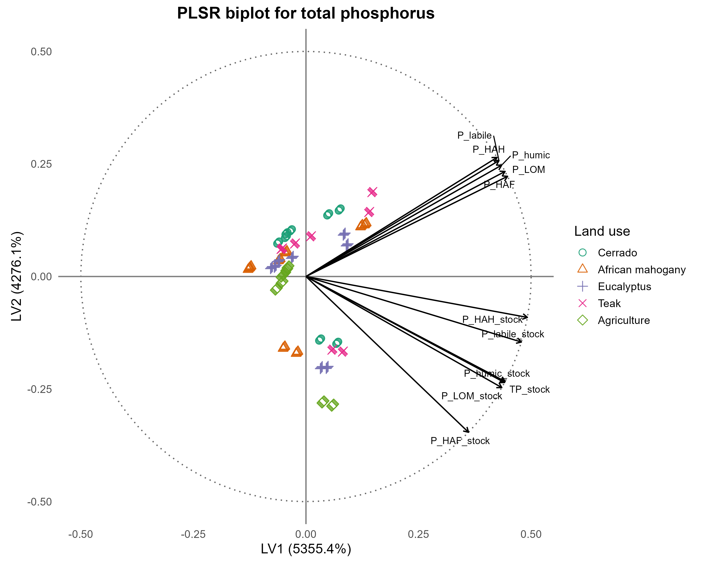

**Renisson Neponuceno de Araújo Filho**  
Professor doutor, Departamento de Tecnologia Rural  
Universidade Federal Rural de Pernambuco, Recife, PE, Brasil.  
Orcid: 0000-0002-9747-1276  
e-mail: renisson.neponuceno@ufrpe.br

**Luiz Diego Vidal Santos**  
Professor doutor, Departamento de Ciências Humanas e Filosofia  
Universidade Estadual de Feira de Santana, Feira de Santana, BA, Brasil.  
Orcid: 0000-0002-9747-1276  
e-mail: ldvsantos@uefs.br

**Francisco Sandro Rodrigues Holanda**  
Professor doutor, Departamento de Engenharia Agronômica  
Universidade Federal de Sergipe, São Cristóvão, PE, Brasil.  
Orcid: 0000-0001-6812-6679  
e-mail: fholanda@academico.ufs.br

**Alceu Pedrotti**  
Professor doutor, Departamento de Engenharia Agronômica  
Universidade Federal de Sergipe, São Cristóvão, PE, Brasil.  
Orcid: 0000-0003-3086-8399  
e-mail: alceupedrotti@gmail.com

**Olavo da Costa Leite**  
Professor Doutor, Colégio Agropecuário de Natividade  
Secretaria da Educação do Tocantins, Natividade, TO, Brasil.  
Orcid: https://orcid.org/0000-0002-8959-0064  
e-mail: olavo.leite@seduc.to.gov.br

**Ludmilla Morais Pereira**  
Mestre, Programa de Pós-graduação em Engenharia Florestal  
Universidade Estadual de Santa Catarina, Lages, SC, Brazil  
Orcid: https://orcid.org/0000-0001-9684-3288  
e-mail: ludmillamoraislive@gmail.com

**Mateus Barbosa Santos da Silva**  
Universidade Estadual de Feira de Santana - UEFS  
Orcid: 0000-0003-3879-307X
e-mail: mbssilva@uefs.br  

**Jémison Mattos dos Santos**  
Universidade Estadual de Santa Cruz - UESC  
e-mail: jemisons@uesc.br

## Abstract

The conversion of natural ecosystems into agricultural systems alters the dynamics of phosphorus (P) and nitrogen (N) in the soil, impacting the sustainability of tropical environments. This study introduces the Fuzzy Soil Nutritional Sustainability Index (FSNSI), a robust methodological tool designed to evaluate the functional dynamics of N and P in labile and humic fractions under different land uses (e.g., native vegetation, silviculture, and agriculture). This study aimed to evaluate the functional dynamics of nitrogen and phosphorus in the humic and labile fractions of the soil under different land uses, proposing and validating an integrated analytical framework (PLSR, PLS-SEM, and FSNSI) for the diagnosis of soil nutritional sustainability. This framework advances the understanding of the co-stabilization mechanisms of N and P in tropical soils, offering scientific support for LCSA and sustainable land management strategies. Data analysis confirmed the humic fractions as dominant predictors (VIP > 1.0) of nutrient availability, with humic fractions exerting a strong positive effect on total N and P stocks (β = 1.286). The symmetry of the coefficients between N and P suggests a fundamental biogeochemical coupling in highly weathered soils. The FSNSI successfully differentiated the land uses, with silvicultural systems showing the highest functionality, while soil density was confirmed as a transversal limiting factor. It is concluded that the enrichment of humic fractions, associated with better litter input and physical structure, is the main support for N and P stocks and soil functionality. The proposed methodological integration (PLSR, PLS-SEM, and FSNSI) constitutes a robust and multiscale approach for diagnosing soil nutritional sustainability, informing sustainable production policies, and guiding conservation interventions in tropical environments.

**Keywords:** Soil nitrogen; Humic fractions; Land-use change; Cerrado; Oxisol.

# 1. Introduction

Tropical soils constitute complex and dynamic biogeochemical systems where soil organic matter (SOM) plays a fundamental role in regulating nutrient cycles, structural aggregation, and maintaining fertility [@Lavallee2020; @Lal2020]. The conversion of native ecosystems into agricultural and silvicultural areas alters the input and quality of organic residues, accelerating decomposition and reducing the formation of stable humic compounds. This transformation decreases nitrogen (N) and phosphorus (P) stocks, compromising nutrient cycling and soil resilience [@Silva2024; @Tivet2013]. 

In the Cerrado biome, a global biodiversity hotspot, such impacts are critical as its highly weathered, acidic, and naturally nutrient-poor soils depend on the stability of the humic fractions of SOM to maintain their ecological and productive functions [@Locatelli2023]. Humic substances—humic acids (HA), fulvic acids (FA), and humin (Hum)—act as nutrient reservoirs, regulating water retention and the formation of stable aggregates [@Lehmann2015; @Paul2016]. Through adsorption, complexation, and biogenic immobilization, these fractions stabilize N and P, reducing losses and promoting the persistence of nutrients in the system [@Stevenson1994].

Recent scientific interest has focused on understanding the biogeochemical coupling between N and P and their co-stabilization in SOM. Evidence indicates that they are co-regulated by interdependent processes of decomposition, humification, and organo-mineral protection [@Gerke2022]. Mechanisms such as incorporation into microbial biomass, competition for adsorption sites, the formation of complexes with humic substances, and physical co-occlusion in microaggregates stabilize N and P, protecting them from rapid mineralization and ensuring their persistence in the system [@Cao2021; @Gerke2022]. 

These interactions demonstrate that disturbances in the cycle of one nutrient generate stoichiometric imbalances that affect the efficiency of use of the other, compromising the stability of soil organic matter and soil sustainability [@MarinhoJunior2021]. However, most studies still treat N and P separately, ignoring their structural and functional interrelationships.

Notwithstanding significant strides in the modeling of edaphic processes, a critical methodological hiatus remains regarding the development of soil sustainability indicators that are simultaneously robust, capable of handling data non-linearity and uncertainty, and integratable into broader sustainability assessment frameworks [@vanLeeuwen2023]. Traditional soil fertility or quality indicators are often reductionist, unidimensional, or abstruse to stakeholders outside the soil science domain [@Vereecken2018]. For land management to effectively inform Life Cycle Sustainability Assessment (LCSA) and supply chain management decisions, which are pivotal for sustainable production and consumption, it is imperative to develop metrics that translate soil complexity into an aggregated and scalable index [@Toth2018].

Recent advances in modeling have enabled the integration of multiple edaphic attributes to investigate these relationships. Structural equation modeling based on partial least squares (PLS-SEM) allows the identification of causal relationships among soil compartments and biogeochemical processes, quantifying the direct and indirect effects of variables such as bulk density and humic fractions on nutrient stocks [@HairJr2021]. 

This technique is particularly useful in tropical systems, where multiple factors interact simultaneously. Additionally, computational intelligence methods, such as fuzzy inference systems, allow the integration of chemical and physical variables into a single index of soil functionality, reflecting the continuous and non-linear nature of edaphic responses to different management practices [@Mamdani1977; @Reis2023]. The combination of PLS-SEM and fuzzy inference provides a comprehensive approach to diagnosing soil sustainability. This integration enables the formulation of composite indicators, such as the Fuzzy Edaphic Sustainability Index (FESI) or the Soil Nutritional Functionality Index (FSNSI), which synthesizes the biogeochemical functionality of systems under different land uses [@Reis2023].

Agricultural intensification and conventional soil preparation reduce particulate organic matter and break down organo-mineral complexes, increasing bulk density and decreasing porosity [@Iversen2022]. These physical effects restrict gas diffusion, water infiltration, and microbial activity, compromising the cycling and co-stabilization of N and P [@Vereecken2018]. 

Thus, physical degradation, expressed by the increase in bulk density, is a limiting factor of soil functionality, interacting with biogeochemical processes and directly affecting soil sustainability [@Khalaf2020; @Mendes2019]. Based on this context, it is hypothesized that the humic and labile fractions of N and P contribute distinctly and complementarily to the total stocks of these nutrients, and that physical degradation acts as a mediating variable of soil functionality [@Condron2011; @Jensen2020]. It is expected that soils under native vegetation will present a higher proportion of N and P in humic fractions and greater biogeochemical co-stabilization, while agricultural and silvicultural systems will reveal a predominance of labile forms and less synergy between the N and P cycles [@Macci2016].

Within this framework, the Soil Nutritional Functionality Index (FSNSI) emerges as a pivotal solution [@vanLeeuwen2023]. By synthesizing N and P dynamics with physical degradation metrics, the FSNSI operates twofold: it not only diagnoses local sustainability but also provides an aggregated quantitative impact indicator for the production phase within a Life Cycle Thinking (LCT) perspective [@Sala2019; @Powlson2012]. 

Consequently, soil functionality, thus quantified, becomes a critical input for LCSA, empowering corporate stakeholders and policymakers to more accurately assess the ecological footprint of their products and the impact of differential land uses on global sustainability. This study aimed to evaluate the functional dynamics of nitrogen and phosphorus in the humic and labile fractions of the soil under different land uses, proposing and validating an integrated analytical framework (PLSR, PLS-SEM, and FSNSI) for the diagnosis of soil nutritional sustainability. This framework advances the understanding of the co-stabilization mechanisms of N and P in tropical soils, offering scientific support for LCSA and sustainable land management strategies.

# 2. Materials and Methods

## 2.1 Study area

The research was conducted in the municipality of São Valério in Tocantins, with a total area of 53.23 ha, at the geographical coordinates 11º54’37” S and 48º12’31” W (Figure 1). The area has an altitude of around 360 m in the municipal seat, with the region's climate being of the seasonal tropical type, classified as Aw according to Köppen [@Thornthwaite1948], characterized by two well-defined seasons, with a rainy summer between October and April and a dry winter from May to September. The average annual variation is around 1,480 mm and the average monthly temperatures vary slightly throughout the year, with average daily values around 27 °C, minimums of 21–24 °C and maximums between 30 and 35 °C [@Santos2025]. The relief is predominantly gently undulating, inserted in the typical landscape of the Cerrado biome, and the soils are, for the most part, well-drained Red-Yellow Oxisols with low natural fertility [@Santos2025].

{#fig:1 width=70%}

## 2.2 Characteristics of the study areas

The preserved Cerrado (sensu stricto) area (Figure 2a), considered as a control area, covers 44.82 ha and is over 40 years old, located at coordinates 11°54’57’’S and 48°11’59’’W. The vegetation exhibits a typical physiognomy of dense Cerrado, with trees ranging from 5 to 8 meters in height, since the Cerrado in its restricted sense comprises exclusively savanna formations. Despite this, within the savanna domain, there is considerable structural variation in the vegetation, with physiognomies ranging from sparse to dense Cerrado [@Lacerda2025]. A vegetation survey was conducted to calculate phytosociological parameters: Relative Density (RD), Relative Dominance (RDM), Relative Frequency (RF), and Importance Value Index (IVI) [@Queiroz2017] (Appendix 1).

{#fig:2a width=30%} {#fig:2b width=30%} {#fig:2c width=30%} {#fig:2d width=30%} {#fig:2e width=30%}

The eucalyptus (*Eucalyptus* sp.) plantation covers a total area of 2.29 hectares and is five years old, located at coordinates 11°54’32’’S, 48°12’22’’W (Figure 2b). The planting density was approximately 1667 seedlings/ha with a spacing of 3 x 2 m, in holes measuring 0.40 x 0.40 x 0.40 m, dug manually with shovels, followed by the application of NPK fertilizer, in the 5-25-15 formulation, in order to stimulate plant development and better adaptation of the seedlings to the soil [@Vera2022]. 

At the beginning of planting, base fertilization was carried out with 20 kg of Ca²⁺, 0.8 kg of Zn²⁺, 12 kg of S (SO₄²⁻), 1.6 kg of Cu²⁺, and 1.6 kg of B (H₃BO₃). Area clearing, to remove native vegetation, was performed using a front blade attached to a crawler tractor, followed by plowing and harrowing, allowing for greater oxygen interaction with the soil, which enables improvements in chemical and biological processes [@Boudiar2022]. Regarding the process of aligning and squaring the seedlings, the Right Triangle method (3/4/5) was used with the aid of stakes and a measuring tape [@Vera2022].

The african mahogany (*K. ivorensis*) plantation covers a total area of 1.94 ha, is seven years old, and is located at coordinates 11°54’29’’S, 48°12’10’’W (Figure 2c). Planting was carried out in pits measuring 0.40 x 0.40 x 0.40 m, with spacings of 3 x 3 m and a density of 1111 seedlings/ha. During planting, 0.2 kg of NPK fertilizer with a 00-10-10 formulation and 5 kg of cured bovine manure were added to each pit. These were applied every three months during the first year of growth. Thinning was also carried out when the canopies began to touch, resulting in a final spacing of 6 x 6 meters [@Lucena2024]. Similar to the eucalyptus area, the clearing of the area was carried out with the help of a front blade attached to a crawler tractor, followed by plowing and harrowing services [@Lima2023].

The teak (*T. grandis*) plantation covers a total area of 1.12 ha, and is ten years old, located at coordinates 11°54’22’’S and 48°12’17’’W (Figure 2d). Area preparation before planting was carried out using a front blade attached to a crawler tractor, followed by plowing and harrowing [@Lima2023]. During the first year, two top dressings were applied, the first at 60 days and the other in the eighth month, with the application of 95 g per planting hole of NPK with a 20-05-20 formulation [@Vieira2017]. 

Planting was done manually at a spacing of 3 x 2 m, in dimensions of 0.40 x 0.40 m, with 1,667 seedlings/hectare, which were individually planted with their collars at ground level. Replanting of failed seedlings was also carried out, as well as weeding in the first year, since teak is particularly sensitive to competition from grasses, thus requiring the land to be kept well weeded; in the second year, the shading provided by the teak prevented much of the weed development, reducing the need for weeding and mowing, and in the third year, no further cultural treatments were necessary [@Moreira2021]. In addition, pruning and debudding activities were carried out with the help of saws, with constant observations regarding the size of the branches.

Finally, the agricultural area covers 3.06 ha, is more than 10 years old, and is located at coordinates 11°54’44’’S and 48°12’02’’W (Figure 2e). The area dedicated to agriculture has been in use for more than 10 years, with crop rotation between corn and soybeans. At the time of collection, the area was being used for soybean cultivation, which extends between the months of June and September. Activities included harrowing and leveling the soil, followed by the application of 300 kg ha⁻¹ of NPK in the 4-28-10 formulation, with a spacing of 0.5 m between plants. 

The plants were treated throughout the planting period with thiophanate-methyl and azoxystrobin fungicides, and insecticides, at a dosage of 100 g per 50 kg of seeds, in addition to weed removal [@Machado2024]. Corn cultivation, on the other hand, extends from January to March, due to the favorable conditions promoted by rainfall. Soil preparation was carried out through harrowing and furrowing, with an average spacing between plants of 0.2 x 0.8 m and fertilization with 400 kg of 4-14-18 per ha⁻¹, inside the sowing furrow, and 50, 100 and 150 kg of N per ha⁻¹, on the soil surface, combined with procedures related to weed control, through manual weeding and the use of herbicides when necessary [@Camargo2024].

## 2.3 Soil sampling

Five trenches in each studied area, with dimensions of 70 × 70 × 100 cm (Figure 3) at different points [@MarinhoJunior2021], were opened manually, totaling twenty-five trenches. Soil samples, both disturbed and undisturbed, were collected for physical and chemical analyses at depths of 0-10, 10-20, 20-30, 30-40, 40-50, 50-60, 60-80, and 80-100 cm. The disturbed soil samples were then air-dried and sieved through a 2 mm sieve for subsequent analyses.

{#fig:3 width=70%}

## 2.4 Physical and Chemical Analyses

The determination of the soil particle size distribution was performed on disturbed samples, using the pipette method, as described by [@Teixeira2017] (Table 2), and the soil density was obtained by the volumetric cylinder method [@Teixeira2017] (Appendix 2).

Soil samples were initially air-dried, sieved through a 2 mm mesh, and homogenized. A subsample was then ground in a porcelain mortar and pestle until a fine and uniform powder was obtained, and then passed again through a 150 μm (100 mesh) sieve. Total nitrogen (totalN) content was determined by the dry combustion method, using an elemental analyzer (Model PE-2400 Series II, Perkin Elmer). For the determination of total phosphorus (totalP), the samples sieved through a 150 μm mesh were subjected to wet digestion. The totalP content was determined by colorimetry [@MurphyRiley1962].

Humic substances were extracted from soil samples using the fractionation procedure recommended by the International Humic Substances Society (IHSS) [@Swift1996]. The method is based on the differences in solubility of the organic fractions in alkaline and acidic solutions, allowing the separation of fulvic acid (FA), humic acid (HA), and humin (Hum) fractions. Light organic matter (LOM) was separated by flotation in water [@FragaSalcedo2004]. 

After fractionation of the humic substances, the samples were frozen and lyophilized for the determination of N and P content in the FA, HA, and Hum fractions. P was quantified by the colorimetric method of [@MurphyRiley1962]. N content in the same humic fractions was determined by dry combustion using an elemental analyzer (Model PE-2400 Series II, Perkin Elmer). Phosphorus associated with light organic matter (P-LOM) was determined by the colorimetric method [@MurphyRiley1962], while nitrogen (N-LOM) was quantified by dry combustion using the CHNS/O analyzer (Perkin Elmer PE-2400).

The labile fractions of phosphorus and nitrogen (labile P and labile N) were determined according to established methodologies. Labile P was obtained by the extraction procedure [@Hedley1982], followed by colorimetric quantification according to the method [@MurphyRiley1962].

Labile N, in turn, was determined indirectly by the method of [@ShangTiessen1997], which is based on the selective oxidation of the labile fraction with KMnO₄ and subsequent colorimetric reading. N and P stocks were calculated from the concentrations obtained in the soil and in the respective humic fractions, considering the soil density and the thickness of the sampled layers.

## 2.5 Construction of the Fuzzy Soil Nutritional Sustainability Index (FSNSI)

The FSNSI was developed using a Mamdani inference system implemented in the R environment (`FuzzyR` package). The system integrated Total N and Total P stocks (indicators of chemical capital) and Soil Density (indicator of physical restriction) as input variables. All variables were normalized to a [0–10] scale. For Soil Density, an inverted normalization was applied, where lower density values correspond to higher scores, reflecting better physical quality.

### 2.5.1 Membership Functions and Fuzzification

Triangular membership functions were applied to the input and output variables, defining three linguistic terms: Low, Medium, and High. The functions were dynamically parameterized based on the empirical quartiles of each variable's distribution ($Q_{25}, Q_{50}, Q_{75}$). The general form of the triangular membership function is given by Eq. 1:

$$ \mu_A(x) = \max\left(\min\left(\frac{x-a}{b-a}, \frac{c-x}{c-b}\right), 0\right) $$

Where $a, b, c$ represent the lower bound, peak, and upper bound, defined as: Low ($0, Q_{25}, Q_{50}$), Medium ($Q_{25}, Q_{50}, Q_{75}$), and High ($Q_{50}, Q_{75}, 10$).

### 2.5.2 Inference Rules and Defuzzification

The knowledge base consisted of fuzzy rules in "IF–THEN" format, using the logical AND operator (minimum) to aggregate the antecedents. The activation degree ($\alpha_i$) of each rule was calculated according to Eq. 2:

$$ \alpha_i = \min(\mu_{N}(x_N), \mu_{P}(x_P), \mu_{Bd}(x_{Bd})) $$

The final FSNSI value was obtained through defuzzification using the Centroid method (Center of Gravity), which calculates the balance point of the aggregated fuzzy output distribution (Eq. 3):

$$ \hat{z} = \frac{\int z \cdot \mu_{FSNSI}(z) \, dz}{\int \mu_{FSNSI}(z) \, dz} $$

The resulting FSNSI ranges from 0 to 10 and was interpreted as: Low Sustainability (0.0–3.3), Intermediate Sustainability (3.4–6.6), and High Sustainability (6.7–10.0).

## 2.6 Data Analysis

The data were subjected to Multivariate Generalized Linear Models (GLM) with bootstrap resampling (n = 1000) to evaluate the effects of land use and soil depth on N and P fractions, stocks, and FSNSI.

The GLM approach was adopted over traditional ANOVA to handle the non-normal distribution and heteroscedasticity of the variables (Shapiro-Wilk, p < 0.01). A Gamma distribution was selected based on superior fit criteria (lower AIC and BIC) compared to normal and log-normal distributions [@Akaike1974; @McCullaghNelder2019]. Model adequacy was confirmed by residual analysis (Deviance/df < 1) and the absence of overdispersion [@CameronTrivedi1990].

Multivariate significance was assessed using Pillai, Wilks, Hotelling, and Roy statistics. Pairwise comparisons were performed with Bonferroni correction to control for Type I error. Exploratory analyses included Principal Component Analysis (PCA), Hierarchical Cluster Analysis (HCA, Ward.D2 method), and Pearson correlation analysis to assess linear associations between variables.

Structural relationships were modeled using Partial Least Squares Regression (PLSR) and Structural Equation Modeling (PLS-SEM) to identify key predictors (VIP > 1.0). All analyses were conducted in R using `FactoMineR`, `factoextra`, and `ggplot2` packages [@RCoreTeam2024].

# 3. Results and Discussion

## 3.1 Dynamics of Nitrogen and Phosphorus Fractions

The analysis of nitrogen and phosphorus fractions revealed that the stability of these nutrients in tropical soils is fundamentally regulated by humification processes. As evidenced in the PLSR models (Figures 4 and 5), the humic fractions (Humic N and Humic P) emerged as the primary drivers of total stocks, surpassing the predictive contribution of labile fractions. This pattern corroborates the "mineral-associated organic matter" framework proposed by @Lavallee2020, where the association of organic compounds with silt and clay minerals provides long-term protection against microbial degradation.

{#fig:4 width=70%}

In the studied Oxisols, the predominance of humic fractions suggests that N and P are not merely adsorbed but structurally incorporated into the recalcitrant organic matrix. According to @Gerke2022, this incorporation is crucial in highly weathered soils, where the mineral phase (Fe and Al oxides) competes avidly for phosphate ions. The organic matter thus acts as a "slow-release fertilizer," buffering the system against rapid losses.

{#fig:5 width=70%}

The strong covariance between humic N and humic P (Figures 4 and 5) supports the hypothesis of stoichiometric coupling during SOM formation. @Cao2021 observed that microbial immobilization of N is frequently limited by C quality; here, the results suggest that in systems with high lignified input (such as Eucalyptus and Cerrado), the formation of stable organo-mineral complexes synchronizes the retention of both macronutrients. Conversely, the lower contribution of labile fractions reflects their transient nature, serving as an immediate energy source for soil biota but contributing little to long-term stock resilience [@Paul2016].

## 3.2 Structural Mechanisms of Nutrient Stabilization

The structural equation modeling (Figure 6) provided a mechanistic view of these interactions. The high positive path coefficients from humic fractions to total stocks (β > 1.2) confirm that the accumulation of recalcitrant carbon is the "engine" of soil fertility in these environments. Interestingly, the negative coefficients observed for labile fractions (β ≈ -0.3) should not be interpreted as a detrimental effect, but rather as a quantitative indicator of the labile-to-humic turnover.

{#fig:6 width=70%}

As postulated by @Lehmann2015, the "continuum model" of soil organic matter implies that labile compounds are continuously processed and stabilized. In our model, a high stock of labile N/P that does not translate into humic N/P represents a system with arrested humification or excessive mineralization—typical of conventionally tilled agriculture. In contrast, the balanced coefficients in the Cerrado and Eucalyptus systems indicate an active flow from labile inputs to stable reserves.

The symmetry between N and P pathways in the structural model reinforces the concept of biogeochemical co-stabilizati. @MarinhoJunior2021 also reported that in Brazilian Cerrado soils, the disruption of this coupling (e.g., by excessive P fertilization without organic inputs) leads to a decline in SOM quality. Our findings extend this by showing that this coupling is maintained even under silvicultural transitions, provided that physical soil structure is preserved.

**Table 2 – Quality metrics of the global PLS-SEM model.**

| Metric | Observed value | Interpretation |
| :--- | :--- | :--- |
| R² (N_total) | 0.959 (Cerrado) | 95.9% of the variance explained |
| R² (P_total) | 0.959 (Cerrado) | 95.9% of the variance explained |
| SRMR | < 0.06 | Model well-fitted to the data |
| Reliability (α) | > 0.97 | Internal consistency > 0.97 |
| Communality (AVE) | > 0.95 | Average variance well explained |

## 3.3 Functional Heterogeneity Across Land Uses

The Multi-Group Analysis (Table 3) highlighted how management practices alter these natural stabilization pathways. The native Cerrado presented the highest humic coefficients (β = 1.286), establishing a functional baseline where nutrient cycling is tightly closed and efficient.

Table 3 – Path coefficients stratified by land use.

| Land Use | Humic N → Total N | Labile N → Total N | Humic P → Total P | Labile P → Total P |
| :--- | :--- | :--- | :--- | :--- |
| Cerrado | 1.286 | -0.313 | 1.286 | -0.313 |
| Agriculture | 1.180 | -0.237 | 1.180 | -0.237 |
| African mahogany | 1.271 | -0.277 | 1.271 | -0.277 |
| Eucalyptus | 1.275 | -0.283 | 1.275 | -0.283 |
| Teak | 1.372 | -0.445 | 1.372 | -0.445 |

*Note: Standardized values indicate the magnitude of the structural relationships in each environment.*

The agricultural system showed a significant reduction in humic efficiency (β = 1.180). This aligns with @Silva2024, who demonstrated that the conversion of Cerrado to agriculture accelerates the oxidation of particulate organic matter. The physical disruption of aggregates by tillage exposes protected organic matter to microbial attack, decoupling the N and P cycles.

Among the silvicultural systems, Eucalyptus (β = 1.275) and African Mahogany (β = 1.271) mimicked the functionality of the native Cerrado. This resilience can be attributed to the maintenance of a permanent litter layer and the absence of soil disturbance after planting. @StLuce2022 noted that deep-rooting tree plantations can pump nutrients from subsoil layers, redepositing them on the surface via litterfall, effectively "re-closing" the nutrient cycle.

Teak, however, presented a distinct anomaly: the highest humic coefficient (β = 1.372) paired with the most negative labile coefficient (β = -0.445). While this might appear favorable, it likely reflects a bottleneck in cycling. Teak litter is known for its high lignin and secondary metabolite content (e.g., tectoquinone), which can inhibit decomposition rates [@AraujoFilho2025]. Combined with the higher soil density observed in Teak stands (Appendix 2), this suggests that nutrients are being "locked" in recalcitrant forms rather than cycling dynamically, a condition @Locatelli2023 warns can lead to functional stagnation in compacted soils.

## 3.5 Fuzzy integration of edaphic functionality: fuzzy soil sustainability index (FSNSI)

The adjusted GLM model indicated a statistically significant effect of the "Land Use" factor on the Fuzzy Soil Nutritional Sustainability Index (FSNSI) [χ² Wald (4) = 124.50; p < 0.001], with a good fit according to the model's quality criteria (Deviance/df = 0.082; Pearson/df = 0.075). The adjusted marginal estimates showed higher functionality in the Eucalyptus system, whose average differed significantly from the native Cerrado (p < 0.05). Eucalyptus had the highest average FSNSI (Exp(B) = 6.07; 95%CI: 5.45 - 6.69), followed by the Cerrado (Exp(B) = 4.42; 95%CI: 3.80 - 5.04).

This superior performance of Eucalyptus over the native Cerrado challenges the assumption that pristine ecosystems always represent the functional optimum. This result can be explained by the "priming effect" of management. The initial fertilization and the rapid biomass accumulation of Eucalyptus, combined with a lack of physical disturbance (no tillage), created a system with high nutrient stocks and adequate physical structure. @Tang2023 similarly found that well-managed plantations could surpass native baselines in specific soil functions due to optimized inputs.

{#fig:9 width=70%}

Note: Boxplots with distinct visual patterns for each system. Different letters indicate significant differences according to the Tukey HSD test (p < 0.05). Points represent individual values.

The native Cerrado exhibited a bimodal distribution (50% low, 40% high functionality), reflecting its intense natural vertical stratification. The high range of FSNSI values (1.56–8.57) captures the contrast between the organic-rich, porous surface layers (0–20 cm) and the chemically impoverished, naturally compacted subsurface, a typical characteristic of these Oxisols. Conventional agriculture (Exp(B) = 4.25; 95%CI: 3.68 - 4.82) showed a tendency towards vertical homogenization (CV = 60.6%), a consequence of mechanized tillage that mixes soil layers [@Leal2024]. While functionality is compromised, 22.5% of samples reached the 'high' class, likely due to surface fertilization and residual organic matter accumulation.

Table 4 – Pearson correlation coefficients between soil variables and the FSNSI.

| Variable | Correlation (r) | p-value |
| :--- | :--- | :--- |
| Total N | +0.789 | < 0.001 |
| Total P | +0.789 | < 0.001 |
| Labile N | +0.627 | < 0.001 |
| Labile P | +0.627 | < 0.001 |
| Humic N | +0.616 | < 0.001 |
| Humic P | +0.616 | < 0.001 |
| Soil density | -0.424 | < 0.001 |
| Sand | -0.439 | < 0.001 |
| Clay | +0.267 | 0.001 |
| Silt | +0.230 | < 0.001 |

The strong positive correlations (r > 0.6) between FSNSI and both labile and humic fractions validate the index's internal coherence. It successfully captures the synergy between the "potential capital" (humic) and the "circulating capital" (labile) of soil nutrients, weighted by the physical "infrastructure" (density). This holistic view is essential for moving beyond reductionist fertility analyses towards true ecosystem service assessment.

# 4. Conclusion

The methodological integration (PLSR, PLS-SEM, and fuzzy inference) allowed for the structural and functional characterization of N and P dynamics in tropical soils, revealing the heterogeneity induced by management. Humic fractions act as key predictors of nutrient availability, functioning as integrators of multiple biogeochemical processes and suggesting a fundamental geochemical coupling in Oxisols. The functional response of the soil is transversely limited by physical factors, such as density, establishing that physical degradation is not compensated by high chemical performance. 

The divergence in performance between systems (eucalyptus outperforming native Cerrado) questions conservationist paradigms, indicating that functionality is determined by the dynamic interaction between organic matter input, management practices, and pedological legacy. High biochemical functionality does not guarantee sustainability in intensive exploitation regimes, as evidenced by the functional reduction in systems with teak. The FSNSI proved to be a multiscale diagnostic tool, but requires local pedoclimatic adaptation and integration with biological indicators for a complete sustainability diagnosis.

# References

::: {#refs}
:::
