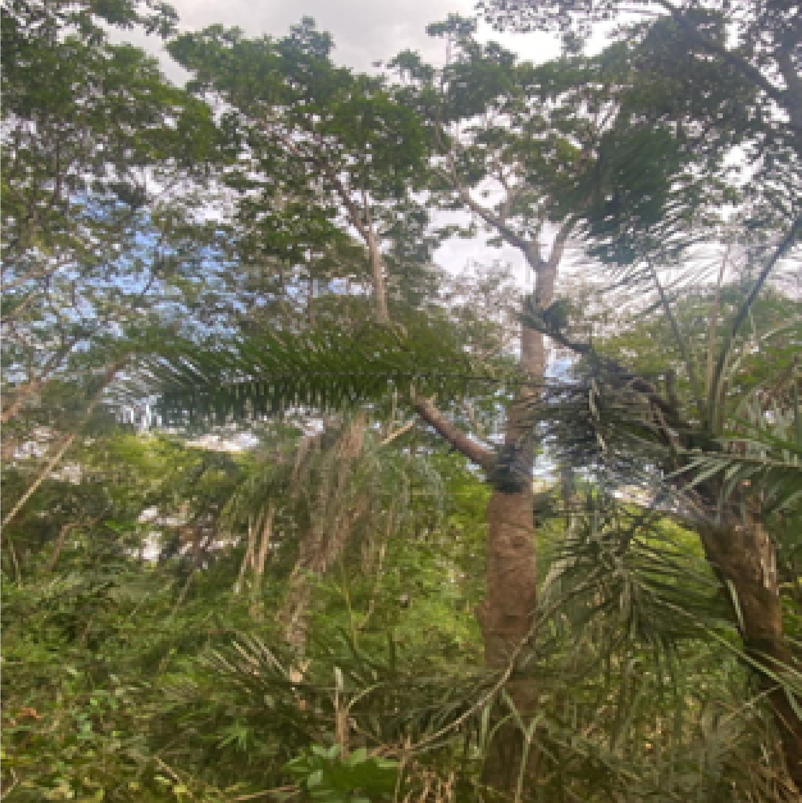
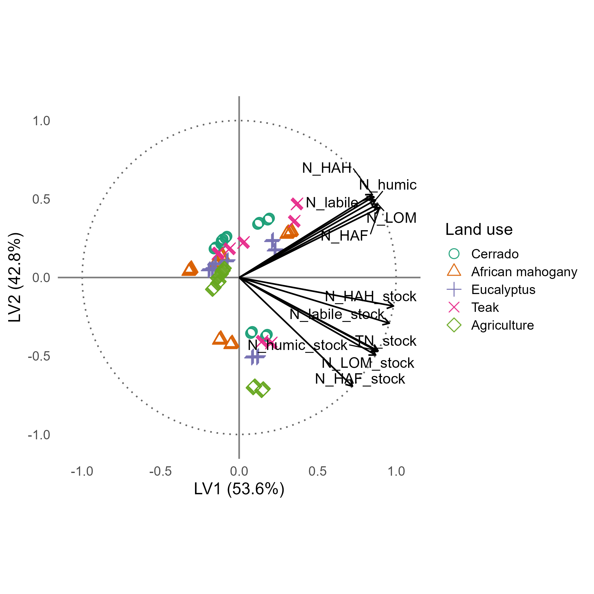
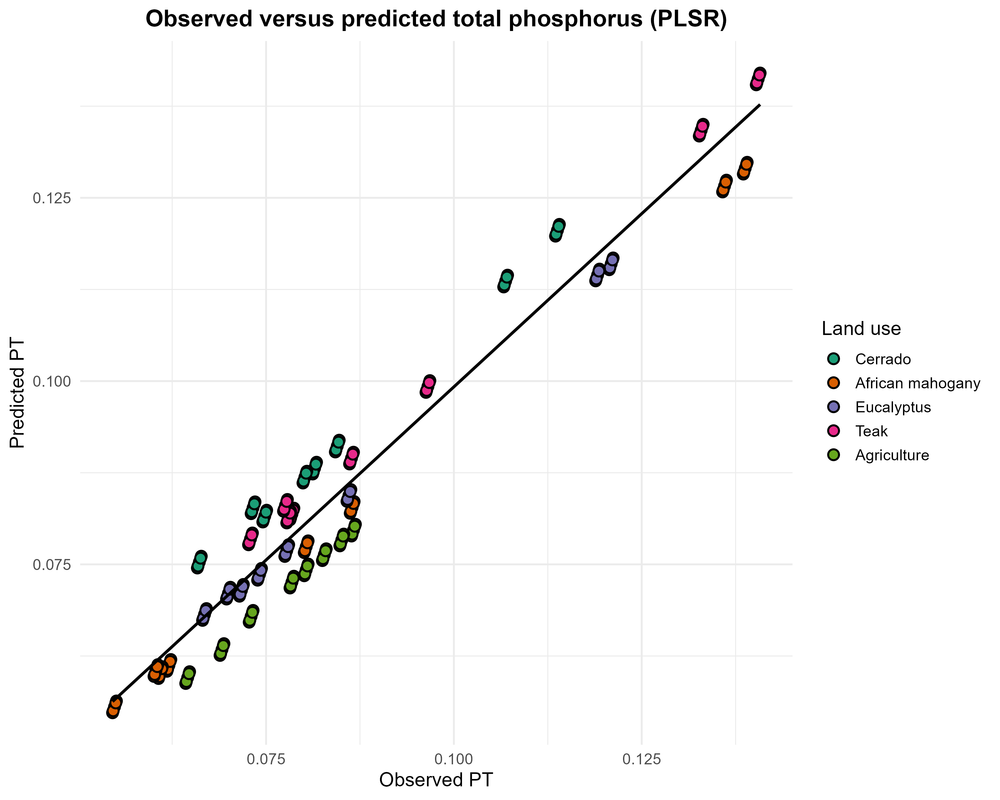
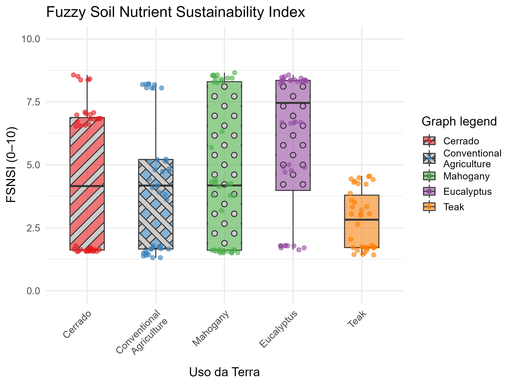

<!-- markdownlint-disable MD025 -->

## Abstract

The conversion of natural ecosystems into agricultural and silvicultural systems reshapes organomineral stabilization kinetics and, consequently, nitrogen and phosphorus stocks in Cerrado Oxisols. This study proposes the Fuzzy Soil Nutritional Sustainability Index (FSNSI) as a decision-support tool that integrates chemical capital, expressed as N and P stocks, and physical constraint, expressed as soil bulk density, into a scalable metric for the production phase in life-cycle sustainability assessment. Compositional partitioning indicated the dominance of humic fractions relative to the total, with a median humic contribution of 76.0% for N, and a low contribution of labile fractions, with a median of 12.18%, supporting a retention regime controlled by recalcitrant reservoirs. Native vegetation showed the highest humic contribution, with a median of 82.0%, and the lowest residual fraction (4.96%), whereas agriculture showed a reduced humic contribution (median 73.0%) and an increased residual fraction (17.15%), suggesting a greater allocation of mass into compartments not recovered by the operational extractions. Forest plantations showed a median total nitrogen stock per layer of 1.362, approximately 21.2% higher than native Cerrado, while maintaining a humic-dominated stabilization regime. The FSNSI discriminated land uses (p < 0.001), with adjusted means ranking in decreasing order as Eucalyptus (6.07), Mahogany (4.54), Cerrado (4.42), Agriculture (4.25), and Teak (2.77), indicating that functional performance is highest when continuous organic inputs occur without recurrent mechanical disturbance and lowest where biochemical impedance restricts nutrient cycling. We conclude that the co-stabilization of N and P in humic fractions, modulated by the physical integrity of the soil, is the central mechanism sustaining nutritional functionality in highly weathered tropical environments, and that FSNSI provides an integrated metric to guide interventions, prioritization, and routine environmental monitoring and assessment in land-management programs.

**Keywords:** Soil nitrogen; Soil quality indicator; Environmental monitoring and assessment; Humic fractions; Land-use change; Oxisol.

**Highlights**

- Conversion of Cerrado to silviculture and agriculture altered N humic fractionation
- Humic fractions retained 76% of total N across all land-use systems
- Forest plantations increased total N stocks by 21% relative to native Cerrado
- FSNSI ranked Eucalyptus highest and Teak lowest among five land uses
- Co-stabilization of N and P in humic pools drives soil nutritional functionality

# 1. Introduction

Tropical soils are complex and dynamic biogeochemical systems in which soil organic matter (SOM) plays a central role in regulating nutrient cycling, structural aggregation, and fertility maintenance [@Lavallee2020; @Lal2020]. The conversion of native ecosystems into agricultural and silvicultural areas alters the input and quality of organic residues, accelerates decomposition, and reduces the formation of stable humic compounds [@Carvalho2023]. This transformation decreases nitrogen (N) and phosphorus (P) stocks, thereby compromising nutrient cycling and soil resilience [@Silva2024; @Tivet2013].

In the Cerrado biome, a global biodiversity hotspot, these impacts are critical because its highly weathered, acidic, and naturally nutrient-poor soils depend on the stability of humic SOM fractions to maintain ecological and productive functions [@Locatelli2023]. Humic substances, humic acids (HA), fulvic acids (FA), and humin (Hum), act as nutrient reservoirs that regulate water retention and the formation of stable aggregates [@Lehmann2015; @Paul2016]. Through adsorption, complexation, and biogenic immobilization, these fractions stabilize N and P, reduce losses, and promote nutrient persistence in the system [@Carvalho2023; @Gerke2022].

Although classical humification has historically supported interpretations of SOM persistence, contemporary frameworks emphasize a continuum of organic compounds and the central role of mineral association and spatial protection in controlling residence time [@Lehmann2015; @Lavallee2020]. In this study, humic fractionation is used as an operational analytical partition to track stabilization pathways, and not as an assumption that humic substances alone explain persistence. The mechanistic interpretation is therefore constrained by convergent evidence from fraction partitioning, PLSR structure, and PLS-SEM path coefficients.

Recent studies in tropical and highly weathered soils have increasingly focused on the biogeochemical coupling between N and P and their co-stabilization in SOM [@Cao2021; @Gerke2022; @MarinhoJunior2021]. Evidence indicates that these nutrients are co-regulated by interdependent decomposition, humification, and organomineral protection processes. Mechanisms such as incorporation into microbial biomass, competition for adsorption sites, complex formation with humic substances, and physical co-occlusion in microaggregates stabilize N and P, protecting them from rapid mineralization and promoting persistence [@Cao2021; @Gerke2022]. These interactions indicate that disturbances in one nutrient cycle induce stoichiometric imbalances that affect the use-efficiency of the other, which compromises SOM stability and soil sustainability [@MarinhoJunior2021]. Nonetheless, most studies still treat N and P separately and overlook their structural and functional interrelations.

Despite advances in modeling edaphic processes, a critical methodological gap remains regarding sustainability indicators that are simultaneously robust, able to handle nonlinearity and uncertainty, and integrable into broader sustainability-assessment frameworks [@vanLeeuwen2023]. Traditional fertility or soil-quality indicators are often reductionist, unidimensional, or difficult to interpret outside the soil-science domain [@Vereecken2018]. To inform life-cycle sustainability assessment and supply-chain decisions, it is necessary to develop metrics that translate soil complexity into an aggregated and scalable index [@Toth2018].

Recent modeling advances enabled the integration of multiple soil attributes to investigate these relations. Partial least squares structural equation modeling (PLS-SEM) can identify causal relations among soil compartments and processes by quantifying direct and indirect effects of variables such as bulk density and humic fractions on nutrient stocks [@HairJr2021]. Computational intelligence methods, such as fuzzy inference systems, integrate chemical and physical variables into a single functionality index that reflects continuous and nonlinear edaphic responses to land use [@Mamdani1977; @Reis2023]. The combination of PLS-SEM and fuzzy inference supports composite indicators such as the Soil Nutritional Functionality Index (FSNSI), synthesizing biogeochemical functionality under different land uses [@Reis2023; @Suganya2024EMA].

Agricultural intensification and conventional tillage reduce particulate organic matter and disrupt organomineral complexes, increase bulk density, and decrease porosity [@Iversen2022]. These physical effects restrict gas diffusion, water infiltration, and microbial activity, which compromises nutrient cycling and the co-stabilization of N and P [@Vereecken2018]. Thus, physical degradation, expressed as increased bulk density, limits soil functionality and interacts with biogeochemical processes, affecting sustainability [@Khalaf2020; @Mendes2019]. Based on this context, the study tests the hypothesis that nutrient stabilization in Cerrado Oxisols is primarily controlled by the balance between humic retention and labile turnover, while bulk density mediates this balance by modifying the intensity of biogeochemical fluxes. Under this mechanism, native vegetation is expected to maintain stronger N and P co-stabilization in humic fractions, whereas managed systems are expected to show higher allocation to labile and residual compartments and weaker coupling between nutrient cycles [@Condron2011; @Jensen2020; @Macci2016].

Within this framework, FSNSI emerges as a relevant solution [@vanLeeuwen2023]. By synthesizing N and P dynamics with physical degradation metrics, FSNSI operates in two ways, it diagnoses local sustainability and provides an aggregated quantitative indicator for the production phase within a life-cycle thinking perspective [@Sala2019; @Powlson2012]. Therefore, soil functionality quantified in this manner becomes an input to life-cycle sustainability assessment and supports decision-making on land management [@Jha2025EMA]. As an environmental monitoring and assessment indicator, FSNSI can also be coupled with GIS layers to support spatial prioritization of management interventions and to identify functional-risk hotspots [@Yang2025EMA]. This study aimed to evaluate the functional dynamics of N and P in humic and labile soil fractions under different land uses, and to propose and validate an integrated analytical framework (PLSR, PLS-SEM, and FSNSI) to diagnose soil nutritional sustainability.

# 2. Materials and Methods

## 2.1 Study area

The research was conducted in the municipality of São Valério, Tocantins, Brazil, in a total area of 53.23 ha, at 11º54’37” S and 48º12’31” W (Figure 1). The area altitude is approximately 360 m. The regional climate is seasonal tropical, classified as Aw according to Köppen [@Thornthwaite1948], with a rainy summer from October to April and a dry winter from May to September. The mean annual precipitation is approximately 1,480 mm and mean monthly temperatures vary slightly throughout the year, with mean daily values around 27 °C, minimums of 21–24 °C, and maximums between 30 and 35 °C [@Santos2025]. The relief is predominantly gently undulating, typical of the Cerrado biome, and soils are mainly well-drained Red-Yellow Oxisols with low natural chemical fertility associated with low available phosphorus and high aluminum influence [@Santos2025].

{#fig:1 width=70%}

## 2.2 Characteristics of the land-use situations

The preserved Cerrado sensu stricto area (Figure 2a), used as the control, covers 44.82 ha and is over 40 years old, located at 11°54’57’’S and 48°11’59’’W. The vegetation exhibits a dense Cerrado physiognomy, with trees ranging from 5 to 8 m, and considerable structural variation across Cerrado physiognomies [@Lacerda2025]. A vegetation survey was conducted to calculate phytosociological parameters, including Relative Density, Relative Dominance, Relative Frequency, and the Importance Value Index [@Queiroz2017] (Appendix 1).

{#fig:2a width=30%} {#fig:2b width=30%} {#fig:2c width=30%} {#fig:2d width=30%} {#fig:2e width=30%}

To improve clarity and reproducibility, the main management characteristics of each land-use situation are summarized in Table 1.

**Table 1. Stand age, soil preparation, planting density, and fertilization regimes by land-use situation.**

| Land-use situation | Area | Stand age | Soil preparation / operations | Planting density / spacing | Fertilization / amendments (as described) |
| --- | --- | --- | --- | --- | --- |
| Cerrado sensu stricto (control) | 44.82 ha | > 40 years | Preserved native vegetation | - | - |
| Eucalyptus (*Eucalyptus* sp.) | 2.29 ha | 5 years | Clearing with crawler tractor blade; plowing and harrowing | ~1,667 seedlings ha⁻¹ (3 × 2 m) | NPK 5-25-15; base amendments with Ca, Zn, S, Cu, and B [@Vera2022; @Boudiar2022] |
| African mahogany (*K. ivorensis*) | 1.94 ha | 7 years | Clearing; plowing and harrowing | 1,111 seedlings ha⁻¹ (3 × 3 m; thinned to 6 × 6 m) | NPK 00-10-10 and cattle manure per pit; repeated applications in year 1 [@Lucena2024; @Lima2023] |
| Teak (*T. grandis*) | 1.12 ha | 10 years | Clearing; plowing and harrowing | 1,667 seedlings ha⁻¹ (3 × 2 m) | NPK 20-05-20 top dressings in year 1 [@Vieira2017; @Lima2023] |
| Agriculture (soybean/corn rotation) | 3.06 ha | > 10 years | Tillage and seedbed operations (harrowing, leveling, furrowing) | Crop-dependent spacing | NPK 4-28-10 (soybean phase) and 4-14-18 + N rates (corn phase) [@Machado2024; @Camargo2024] |

All managed areas were converted from native Cerrado vegetation at different times, resulting in stand ages that range from 5 years (Eucalyptus) to over 10 years (agriculture), as detailed in Table 1. Because synchronous conversion was not feasible within the farm's operational history, the sampling design follows a space-for-time substitution approach in which each land-use situation represents a distinct post-conversion trajectory sampled at a single point in time. None of the three plantation species (*Eucalyptus* sp., *Khaya ivorensis*, *Tectona grandis*) is a nitrogen-fixing legume, so biological N fixation does not confound the observed differences in nitrogen stocks among silvicultural systems. Stand-age heterogeneity is acknowledged as a design constraint and is considered in the interpretation of results.

## 2.3 Soil sampling

Five trenches were opened in each land-use situation, with dimensions of 70 × 70 × 100 cm at different points [@MarinhoJunior2021], totaling 25 trenches and representing five replicates per land-use treatment. Disturbed and undisturbed soil samples were collected for physical and chemical analyses at depths of 0-10, 10-20, 20-30, 30-40, 40-50, 50-60, 60-80, and 80-100 cm. Disturbed samples were air-dried and sieved through a 2 mm mesh for subsequent analyses. For inferential analyses, the data structure was treated as observations stratified by land use and depth, with replicate trenches as the sampling support within each land-use class.

## 2.4 Physical and chemical analyses

Particle-size distribution was determined in disturbed samples using the pipette method [@Teixeira2017], and soil bulk density was obtained by the volumetric-cylinder method [@Teixeira2017] (Appendix 2).

Soil samples were air-dried, sieved through a 2 mm mesh, and homogenized. A subsample was ground in a porcelain mortar and pestle until a fine and uniform powder was obtained, and then sieved again through a 150 μm (100 mesh) sieve. Total nitrogen (Ntotal) was determined by dry combustion using an elemental analyzer (Model PE-2400 Series II, Perkin Elmer). Total phosphorus (Ptotal) was determined after wet digestion and quantified by colorimetry [@MurphyRiley1962].

Humic substances were extracted using the fractionation procedure recommended by the International Humic Substances Society (IHSS) [@Swift1996]. The method is based on differences in solubility in alkaline and acidic solutions, allowing separation of fulvic acid (FA), humic acid (HA), and humin (Hum). Light organic matter (LOM) was separated by flotation in water [@FragaSalcedo2004]. After humic fractionation, samples were frozen and lyophilized to determine N and P in FA, HA, and Hum. Phosphorus was quantified by the colorimetric method [@MurphyRiley1962]. Nitrogen in the same humic fractions was determined by dry combustion. Phosphorus associated with LOM (P-LOM) was determined by colorimetry [@MurphyRiley1962], and nitrogen associated with LOM (N-LOM) was determined by dry combustion.

Labile phosphorus (labile P) was obtained using the Hedley extraction procedure [@Hedley1982] and quantified by colorimetry [@MurphyRiley1962]. Labile nitrogen (labile N) was determined indirectly by the method of [@ShangTiessen1997]. N and P stocks were computed from measured concentrations (in bulk soil and in the respective fractions), bulk density, and the thickness of sampled layers.

## 2.5 Construction of the Fuzzy Soil Nutritional Sustainability Index (FSNSI)

FSNSI was developed using a Mamdani inference system implemented in R (package FuzzyR). The system integrated Total N and Total P stocks (chemical-capital indicators) and soil bulk density (physical-constraint indicator) as input variables. All variables were normalized to a 0-10 scale. For bulk density, an inverted normalization was applied such that lower density corresponds to higher scores.

### 2.5.1 Membership functions and fuzzification

Triangular membership functions were applied to input and output variables, defining three linguistic terms: Low, Medium, and High. Functions were parameterized using empirical quartiles of each variable distribution ($Q_{25}, Q_{50}, Q_{75}$). The general form of the triangular membership function (Eq. 1) is:

$$ \mu_A(x) = \max\left(\min\left(\frac{x-a}{b-a}, \frac{c-x}{c-b}\right), 0\right) $$

where $a$, $b$, and $c$ represent the lower bound, peak, and upper bound, defined as: Low ($0, Q_{25}, Q_{50}$), Medium ($Q_{25}, Q_{50}, Q_{75}$), and High ($Q_{50}, Q_{75}, 10$).

### 2.5.2 Inference rules and defuzzification

The knowledge base consisted of fuzzy rules in an IF-THEN format, using the logical AND operator (minimum) to aggregate antecedents. The activation degree ($\alpha_i$) of each rule was calculated according to Eq. 2:

$$ \alpha_i = \min(\mu_{N}(x_N), \mu_{P}(x_P), \mu_{Bd}(x_{Bd})) $$

The final FSNSI value was obtained by centroid defuzzification (Eq. 3):

$$ \hat{z} = \frac{\int z \cdot \mu_{FSNSI}(z) \, dz}{\int \mu_{FSNSI}(z) \, dz} $$

FSNSI ranges from 0 to 10 and was interpreted as: Low Sustainability (0.0-3.3), Intermediate Sustainability (3.4-6.6), and High Sustainability (6.7-10.0).

## 2.6 Data analysis

Data were analyzed using multivariate generalized linear models (GLM) with bootstrap resampling (n = 1000) to evaluate land-use and soil-depth effects on N and P fractions, stocks, and FSNSI. The GLM framework was adopted instead of traditional ANOVA due to non-normality and heteroscedasticity (Shapiro-Wilk, p < 0.01). A Gamma distribution was selected based on lower AIC and BIC compared with normal and log-normal distributions [@Akaike1974; @McCullaghNelder2019]. Model adequacy was confirmed by residual analysis (Deviance/df < 1) and absence of overdispersion [@CameronTrivedi1990]. Following current recommendations on reporting effect sizes alongside significance levels, land-use effects on FSNSI were quantified as exponentiated coefficients (Exp(B)) with bootstrap 95% confidence intervals, which express effect magnitude on the original response scale and are more informative for practical interpretation than significance tests alone, because a significant test only indicates departure from the null whereas Exp(B) quantifies the predicted mean under each treatment condition.

Multivariate significance was assessed using Pillai, Wilks, Hotelling, and Roy statistics. Pairwise comparisons used Bonferroni correction. Exploratory analyses included principal component analysis (PCA), hierarchical clustering analysis (HCA, Ward.D2), and Pearson correlation to assess linear associations among variables.

Structural relations were modeled using partial least squares regression (PLSR) and PLS-SEM to identify key predictors (VIP > 1.0). The structural model was specified as a second-order hierarchical component model (HCM), and land-use contrasts were evaluated by PLS multi-group analysis (PLS-MGA). Analyses were conducted in R [@RCoreTeam2024] using FactoMineR, factoextra, ggplot2, seminr (PLS-SEM and PLS-MGA), and boot (bootstrap resampling).

In the PLSR workflow, predictors were centered and scaled prior to model fitting, and latent components were estimated with leave-one-out cross-validation to control overfitting under correlated predictors. Two PLSR models were fit, one for the nitrogen system and one for the phosphorus system. In the nitrogen model, the dependent variable was total nitrogen stock (EstNT), with independent variables representing operational fractions and their stocks (NLabil, NMOL, NTAF, NTAH, NTHum, EstNLabil, EstNMOL, EstNAF, EstNAH, and EstNTHum). In the phosphorus model, the dependent variable was total phosphorus stock (EstPT), with analogous independent variables (PLabil, PMOL, PTAF, PTAH, PTHum, EstPLabil, EstPMOL, EstPAF, EstPAH, and EstPTHum).

The modeling dataset comprised 200 observations derived from five land-use classes, five replicate trenches per class, and eight depth intervals per trench. Two latent variables were retained for both nutrient systems. In both models, the first latent variable explained 49.43% of response variance and the second latent variable increased cumulative explained response variance to 94.49%.

# 3. Results and Discussion

## 3.1 Dynamics of nitrogen and phosphorus fractions

Humic fractions accounted for a median of 76.0% of total N (IQR: 74.48% to 79.45%; range: 72.09% to 82.85%), indicating dominance of high-inertia reservoirs in Cerrado Oxisols. In the PLSR latent space (Figure 3), humic fractions show directional coherence with total nitrogen, supporting this mass-balance hierarchy.

Labile fractions contributed a median of 12.18% of total nitrogen (IQR: 11.47% to 12.73%; range: 9.09% to 13.77%), whereas the residual fraction showed a median of 11.47% (range: 3.38% to 18.83%). For phosphorus, the compartment ordering preserved the humic dominance observed for nitrogen, supporting co-stratification of macronutrients within an organomineral framework consistent with mineral-associated organic matter, in which preferential association with silt and clay and physical protection in microaggregates reduce microbial accessibility and prolong element residence time [@Lavallee2020].

In Figure 3, the TN–humic alignment is consistent with the 76.0% median humic share of total N and the observed compositional hierarchy, where most N is allocated to fractions with higher structural complexity. Mechanistically, this dominance implies that N retention is governed by progressive incorporation into low-biodegradability organic networks and by interactions with mineral surfaces that impose physicochemical barriers to enzymatic access, reinforcing a dynamic of immobilization and continuous restabilization. Because humification transfers mass from a high-turnover compartment to a persistent compartment, the labile fraction tends to act as a short-term reservoir rather than a determinant of long-term stocks, consistent with its lower proportional contribution and higher sensitivity to disturbance and microclimate [@Carvalho2023].

In the nitrogen PLSR model, EstNT was treated as the dependent variable and the fraction variables as predictors, with two latent components retained after cross-validation. The first component captured the dominant covariance structure between total stock and humic pools, and the second component improved separation of labile and mineral-associated contributions, consistent with the variance partitioning estimated for the two-component PLSR structure.

{#fig:3 width=70%}

In highly weathered Oxisols, phosphorus cycling is constrained by specific adsorption to Fe and Al oxides (ligand exchange), which increases chemical impedance to biological turnover. Organic matter modulates P availability by competing for reactive sites and favoring incorporation into persistent organomineral pools, consistent with @Gerke2022. In the phosphorus PLSR model, EstPT was treated as the dependent variable and phosphorus fractions were used as predictors with two latent components retained after cross-validation.

Predictive consistency of this model is shown by the observed versus predicted relationship for phosphorus, where the trend indicates coherent model response across land-use systems (Figure 4).

{#fig:4 width=70%}

The convergence between nitrogen and phosphorus patterns in the multivariate space reinforces the hypothesis of stoichiometric coupling during SOM formation and maturation. Retention of one nutrient conditions retention of the other through shared routes of microbial processing and physicochemical protection, rather than independent trajectories governed only by mineral reactivity. This is consistent with the principle that microbial immobilization of N is modulated by carbon quality and, concomitantly, conditions the capture of P in more persistent organic forms [@Cao2021]. In highly weathered Oxisols, this co-stabilization occurs under intense competition for reactive sites on Fe and Al oxides. Organic matter thereby modulates P by interfering with specific phosphate sorption and favoring incorporation into more persistent organomineral fractions [@Condron2011].

When viewed through the lens of aggregates and organometallic associations, the role of Fe and Al as a bridge between microbially processed organic matter and mineral surfaces provides a plausible mechanism for the persistence of P associated with organomineral matrices in highly weathered soils [@Khalaf2020].

Preserved Cerrado showed the highest humic contribution (median 82.0%) and the lowest residual fraction (4.96%), whereas agriculture showed the lowest humic contribution (median 73.0%) and the highest residual fraction (17.15%). When comparisons are summarized into three macro-systems (native vegetation, forest plantations, and agriculture), this ordering reduces interpretative ambiguity. Forest plantations showed an intermediate condition (median 76.0% humic contribution; residual 11.47%), suggesting that the transition from native Cerrado to arboreal systems maintained a substantial part of the stabilization architecture while redistributing mass among compartments, consistent with organomineral protection mechanisms and contrasting pathways between particulate and mineral-associated organic matter [@Paul2016; @Ferreira2021].

Total nitrogen stocks per layer ranked in decreasing order as Teak (median EstNT = 1.383), Eucalyptus (1.335), Mahogany (1.295), Agriculture (1.171), and Cerrado (1.124), corresponding to increases of 23.0%, 18.8%, 15.2%, and 4.1% relative to the native baseline. The higher stock observed in agriculture likely reflects sustained mineral-N additions through fertilization cycles (Table 1), which supplement organically derived N and complicate direct comparison with unfertilized native vegetation. None of the three plantation species is a nitrogen-fixing legume, so the stock gains in silvicultural systems cannot be attributed to biological N fixation and are more plausibly explained by continuous litter input, root turnover, and reduced post-establishment disturbance. Total N stock dynamics should not be equated with bulk SOM trends, because N accumulation reflects the combined outcome of organic-N incorporation, mineral-N retention, and fraction-specific stabilization, processes that may diverge from carbon-driven SOM trajectories [@Gerke2022]. This contrast suggests that stock gains depend primarily on how each management system modulates organic input quality, residence time, and protection within organomineral domains, rather than on input magnitude alone.

The relatively low dispersion of partitioning percentages, especially when compared with the variation in stocks, should be interpreted as a compositional property of a system in which fractions represent a decomposition of the total and are therefore subject to sum constraints and analytical recovery efficiency, not as evidence of absent dynamics [@Aitchison1986]. In process-engineering terms, this indicates that dominant control lies in the transfer flux among compartments and in the balance between stabilization and loss, rather than in large fluctuations in percentage distribution, reinforcing the role of fraction dynamics and structural stability as regulators of long-term stock resilience [@Jensen2020].

## 3.2 Structural mechanisms of nutrient stabilization

In the structural model, humic-to-total path coefficients were > 1.2 and labile-to-total coefficients were approximately -0.3 (Figure 5), indicating that chemical-capital accumulation is governed by stabilization in fractions with greater temporal inertia. These negative labile coefficients should be interpreted as a mass-transfer signature between a high-turnover reservoir and a persistent reservoir, compatible with humification kinetics and the transient nature of the labile compartment, rather than as a functional penalty [@HairJr2021].

{#fig:5 width=70%}

As proposed by @Lehmann2015, the continuum model of SOM implies that labile compounds are continuously processed and stabilized. In this framework, a high stock of labile N or P that does not translate into humic N or P indicates interrupted humification or excessive mineralization, typical of conventionally tilled agriculture. Conversely, balanced coefficients in Cerrado and Eucalyptus systems indicate an active flux of labile inputs into stable reserves.

The symmetry between N and P pathways in the structural model reinforces the concept of biogeochemical co-stabilization. @MarinhoJunior2021 reported that, in Brazilian Cerrado soils, disruption of this coupling (e.g., excessive P fertilization without organic inputs) can reduce SOM quality. Our results extend this interpretation by indicating that this coupling can be maintained under silvicultural transitions, provided that the soil physical structure is preserved. The global PLS-SEM fit corroborated the structural adequacy of the model, with R² = 0.959 for both N total and P total endogenous constructs, SRMR below 0.06, composite reliability exceeding 0.97, and average variance extracted (AVE) above 0.95, collectively indicating that the latent constructs capture more than 95% of indicator variance under satisfactory discriminant validity.

## 3.3 Functional heterogeneity among land uses

Multi-group analysis showed humic coefficients ranging from β = 1.180 (agriculture) to β = 1.372 (teak), indicating that management alters stabilization pathways (Table 2). Native Cerrado showed high humic coefficients (β = 1.286), representing a functional baseline in which nutrient cycling is tightly coupled and efficient.

Agriculture showed a reduction in humic efficiency (β = 1.180), consistent with @Silva2024, who reported that Cerrado conversion to agriculture accelerates particulate organic matter oxidation. Physical aggregate disruption by tillage exposes previously protected organic matter to microbial attack, thereby decoupling N and P cycles.

**Table 2. Path coefficients stratified by land use.**

| Land use | Humic N → Total N | Labile N → Total N | Humic P → Total P | Labile P → Total P |
| --- | --- | --- | --- | --- |
| Teak | 1.372 | -0.445 | 1.372 | -0.445 |
| Cerrado | 1.286 | -0.313 | 1.286 | -0.313 |
| Eucalyptus | 1.275 | -0.283 | 1.275 | -0.283 |
| African mahogany | 1.271 | -0.277 | 1.271 | -0.277 |
| Agriculture | 1.180 | -0.237 | 1.180 | -0.237 |

*Note. Standardized values indicate the magnitude of structural relations in each environment.*

Among silvicultural systems, Eucalyptus (β = 1.275) and African mahogany (β = 1.271) mimicked native Cerrado functionality. This resilience may be attributed to the maintenance of a permanent litter layer and the absence of soil disturbance after plantation establishment. @StLuce2022 reported that deep-rooted tree plantations can pump nutrients from subsoil layers and redeposit them at the surface via litterfall, effectively closing nutrient cycles.

Teak showed a distinct anomaly, with the highest humic coefficient (β = 1.372) paired with the most negative labile coefficient (β = -0.445). While this may appear favorable in a purely structural reading, the pattern is consistent with a cycling bottleneck associated with low litter decomposability. Teak litter is known for high lignin content and secondary metabolites such as tectoquinone, which can reduce decomposition rates and delay nutrient return to labile pools [@AraujoFilho2025]. Combined with the higher bulk density observed in Teak stands (Appendix 2), the result is consistent with increased physical and biochemical impedance, shifting the system toward accumulation in recalcitrant forms and reducing short-term renewal, a condition associated with functional stagnation in compacted soils [@Locatelli2023].

Because plantation ages differ (Eucalyptus 5 yr, Mahogany 7 yr, Teak 10 yr; Table 1), the observed coefficients capture post-conversion trajectories at different maturity stages under a space-for-time design rather than a synchronous experiment. This asynchrony constrains direct age-controlled comparison but reflects the real diversity of silvicultural transitions at the landscape scale, and the results should be interpreted as indicative of management-type effects rather than strict chronosequence trends.

## 3.4 Fuzzy integration of edaphic functionality and the FSNSI

The fitted GLM indicated a statistically significant land-use effect on FSNSI (p < 0.001) and good model fit (Deviance/df = 0.082; Pearson/df = 0.075). Adjusted marginal estimates indicated higher functionality in the Eucalyptus system, whose mean differed significantly from native Cerrado (p < 0.05). Adjusted marginal means ranked in decreasing order as Eucalyptus (Exp(B) = 6.07; 95% CI: 5.45-6.69), Mahogany (Exp(B) = 4.54), Cerrado (Exp(B) = 4.42; 95% CI: 3.80-5.04), Agriculture (Exp(B) = 4.25; 95% CI: 3.68-4.82), and Teak (Exp(B) = 2.77), confirming that functionality was highest under continuous organic inputs without post-establishment soil disturbance and lowest where biochemical impedance restricted cycling.

Eucalyptus exceeded Cerrado (Exp(B) = 6.07 versus 4.42), but this pattern is conditional on the sampling window and on how the index weights chemical capital (N and P) and physical constraint (bulk density). The result is consistent with higher inputs and limited post-establishment disturbance [@Iversen2022], and evidence indicates that well-managed plantations may surpass native baselines for specific soil functions under optimized inputs [@Tang2023].

Across land uses, FSNSI ranged from 1.56 to 8.57 and shifts in medians and within-use dispersion reveal functional heterogeneity integrated by the fuzzy aggregation (Figure 6).

{#fig:6 width=70%}

*Note. Different letters indicate significant differences according to Tukey HSD (p < 0.05). Points represent individual values.*

Native Cerrado showed a bimodal distribution (50% low and 40% high functionality), reflecting strong natural vertical stratification. The wide FSNSI range (1.56-8.57) captures the contrast between organic-rich, porous surface layers (0-20 cm) and a chemically impoverished, naturally compacted subsoil typical of these Oxisols. Conventional agriculture (Exp(B) = 4.25; 95% CI: 3.68-4.82) showed a tendency toward vertical homogenization (CV = 60.6%), consistent with mechanized tillage mixing layers and reducing structural gradients [@Leal2024]. Although functionality is compromised, 22.5% of samples reached the 'high' class, plausibly due to surface fertilization and residual SOM accumulation [@Camargo2024].

Correlations between FSNSI and nutrient pools were strong (r = 0.616–0.789; p < 0.001), supporting the internal coherence of the index, which responds simultaneously to persistent chemical capital and fast-renewal capital under penalization for physical impedance via bulk density (Table 3). This integrative property reduces the interpretative entropy typical of univariate readings and shifts the assessment from fertility to functionality, where stabilization, cycling, and physical constraints coexist as coupled components of system performance. The positive association with total pools indicates that the indicator captures long-term nutrient storage, while the negative association with bulk density indicates that structural compaction constrains edaphic performance by reducing effective pore space for gas and water transfer.

## 3.5 How FSNSI improves interpretation of N and P functional dynamics

The FSNSI framework improves interpretation because it converts multivariate and partially collinear soil information into a single response variable that preserves mechanistic meaning across land uses. Instead of evaluating isolated concentrations or stocks, the index integrates persistent nutrient capital, represented by total and humic-associated pools, with short-turnover pools and with physical impedance represented by bulk density. This joint representation allows direct comparison of functional states among management systems while maintaining sensitivity to the balance between stabilization and renewal. In practical terms, the model identifies whether higher stocks are associated with effective co-stabilization in humic compartments or with transient accumulation under structural restriction, which is essential for distinguishing resilient from vulnerable nutrient regimes. By combining PLS-based structural evidence with fuzzy aggregation, FSNSI therefore extends descriptive comparisons into an operational decision metric for monitoring, prioritization, and management targeting.

**Table 3. Pearson correlation coefficients between soil variables and FSNSI.**

| Variable | Correlation (r) | p-value |
| --- | --- | --- |
| Total N | +0.789 | < 0.001 |
| Total P | +0.789 | < 0.001 |
| Labile N | +0.627 | < 0.001 |
| Labile P | +0.627 | < 0.001 |
| Humic N | +0.616 | < 0.001 |
| Humic P | +0.616 | < 0.001 |
| Bulk density | -0.424 | < 0.001 |
| Sand | -0.439 | < 0.001 |
| Clay | +0.267 | 0.001 |
| Silt | +0.230 | < 0.001 |

Based on a single sampling campaign, the inference represents the system state under the edaphoclimatic conditions of the sampling period. Interannual variation in precipitation and temperature can modulate the balance among mineralization, stabilization, and adsorption, especially in tropical environments. Continued monitoring in subsequent campaigns is therefore necessary to test temporal stability of the estimated structural relations and to validate the robustness of FSNSI as an operational indicator under higher climatic variability [@Vereecken2018; @Toth2018].

# 4. Conclusion

Nutritional functionality in Cerrado Oxisols appears to be sustained primarily by co-stabilization of nitrogen and phosphorus within persistent humic pools, with native vegetation providing a functional baseline characterized by strong organomineral protection. Land-use conversion to conventional agriculture was associated with a shift away from humic dominance and toward less-protected compartments, consistent with recurrent soil disturbance and weakened nutrient coupling. In contrast, tree plantations preserved a stabilization architecture closer to the native baseline, indicating that silvicultural transitions can maintain chemical capital when continuous organic inputs occur without intensive post-establishment disturbance.

The proposed FSNSI provides an operational way to synthesize chemical capital and physical constraint into a single functionality metric, enabling comparisons among land-use systems and supporting monitoring and management prioritization. In our dataset, Eucalyptus showed the highest functional performance, whereas teak highlighted that biochemical accumulation may coexist with cycling and physical bottlenecks, emphasizing the need to interpret functionality jointly with soil physical integrity. Because inference is based on a single sampling campaign, further multi-season validation and complementary biological indicators are recommended to strengthen robustness across pedoclimatic contexts.

## Funding

The authors received no specific funding for this work.

## Competing interests

The authors declare that they have no competing interests.

## Ethics approval

Not applicable.

## Author Contributions Statement

RNAF: Renisson Neponuceno de Araújo Filho; LDVS: Luiz Diego Vidal Santos; FSRH: Francisco Sandro Rodrigues Holanda; AP: Alceu Pedrotti; OCL: Olavo da Costa Leite; LMP: Ludmilla Morais Pereira; MBSS: Mateus Barbosa Santos da Silva; JMS: Jémison Mattos dos Santos. Conceptualization: RNAF, LDVS, FSRH, AP. Methodology: RNAF, LDVS, FSRH, AP. Formal analysis: LDVS, JMS. Investigation: RNAF, OCL, LMP. Data curation: LDVS, MBSS, JMS. Visualization: LDVS, MBSS. Writing – original draft: LDVS. Writing – review & editing: RNAF, LDVS, FSRH, AP, OCL, LMP, MBSS, JMS. Supervision: RNAF, FSRH, AP. Project administration: RNAF. Funding acquisition: None. All authors read and approved the final manuscript.

## Data availability

The dataset used in this study is available in the project repository at https://doi.org/10.5281/zenodo.18077256.

# References

::: {#refs}
:::

# Appendices

## Appendix 1. Phytosociological parameters of the Cerrado sensu stricto area

| Species | RD (%) | RDM (%) | RF (%) | IVI (%) |
| --- | --- | --- | --- | --- |
| *Psidium firmum* | 6.25 | 6.15 | 6.25 | 18.66 |
| *Salvertia convallariodora* | 0.89 | 1.06 | 0.89 | 2.85 |
| *Eugenia dysenterica* | 3.57 | 3.74 | 3.57 | 10.89 |
| *Anacardium occidentale* | 1.78 | 1.46 | 1.78 | 5.04 |
| *Plathymenia reticulata* | 5.35 | 3.39 | 5.35 | 14.11 |
| *Anadenanthera peregrina* | 5.35 | 5.58 | 5.35 | 16.30 |
| *Dimorphandra mollis* | 0.89 | 0.34 | 0.89 | 2.13 |
| *Astronium fraxinifolium* | 2.67 | 2.63 | 2.67 | 7.99 |
| *Pseudobombax tomentosum* | 4.46 | 3.72 | 4.46 | 12.66 |
| *Piptadenia gonoacantha* | 2.67 | 3.07 | 2.67 | 8.43 |
| *Hymenaea courbaril* | 4.46 | 3.85 | 4.46 | 12.79 |
| *Mabea fistulifera* | 3.57 | 3.98 | 3.57 | 11.13 |
| *Byrsonima spicata* | 7.14 | 7.41 | 7.14 | 21.70 |
| *Guazuma ulmifolia* | 6.25 | 8.07 | 6.25 | 20.57 |
| *Tabebuia vellosoi* | 0.89 | 0.78 | 0.89 | 2.57 |
| *Qualea parviflora* | 3.57 | 3.75 | 3.57 | 10.90 |
| *Caryocar brasiliense* | 6.25 | 5.88 | 6.25 | 18.38 |
| *Curatella americana* | 12.50 | 11.88 | 12.50 | 36.89 |
| *Pterodon* sp. | 11.60 | 13.42 | 11.60 | 36.64 |
| *Magonia pubescens* | 9.82 | 9.73 | 9.82 | 29.38 |

## Appendix 2. Physical soil attributes

All experimental sites are located within the same 53.23 ha area on a single Red-Yellow Oxisol mapping unit developed from the same parent material. Particle-size distribution is a conservative pedological property controlled by parent material and pedogenesis rather than by post-conversion management, which explains the minimal textural variation across land uses. Bulk density, by contrast, integrates management-induced compaction and biological loosening and is therefore the physically responsive variable differentiating the systems.

### Depth: 0-10 cm

| Land use | Sand (g kg⁻¹) | Silt (g kg⁻¹) | Clay (g kg⁻¹) | Bulk density (g cm⁻³) |
| --- | --- | --- | --- | --- |
| Cerrado | 614.0±3.1 | 79.6±2.5 | 306.4±4.5 | 1.17±0.01 |
| Teak | 614.5±1.5 | 79.5±3.5 | 306.0±4.2 | 1.11±0.01 |
| Mahogany | 614.1±3.5 | 79.4±2.7 | 306.5±4.4 | 1.20±0.01 |
| Eucalyptus | 614.2±1.2 | 79.7±3.2 | 306.1±4.2 | 1.25±0.02 |
| Agriculture | 614.8±2.5 | 79.0±3.1 | 306.2±5.3 | 1.35±0.01 |

