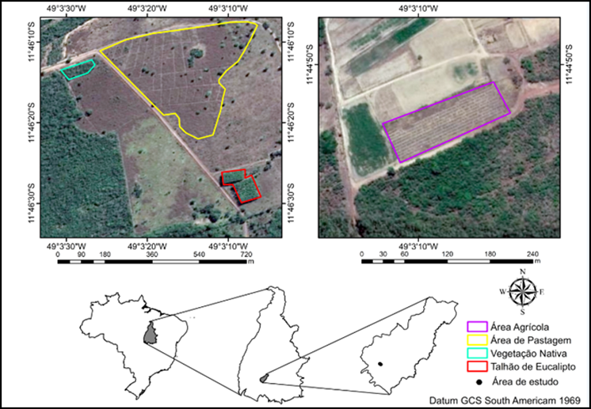
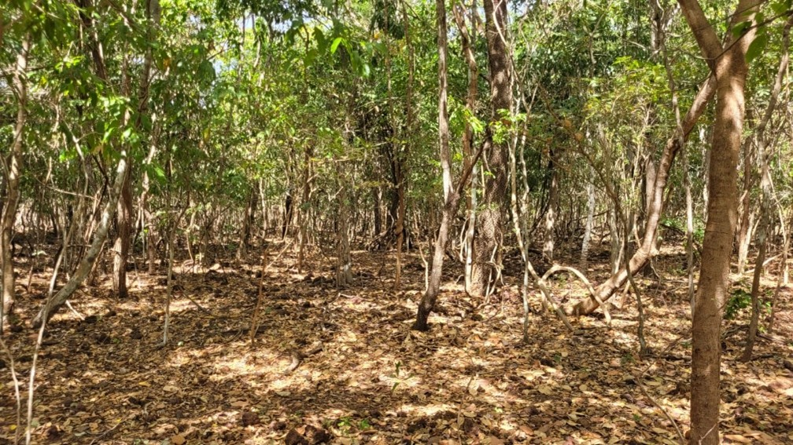
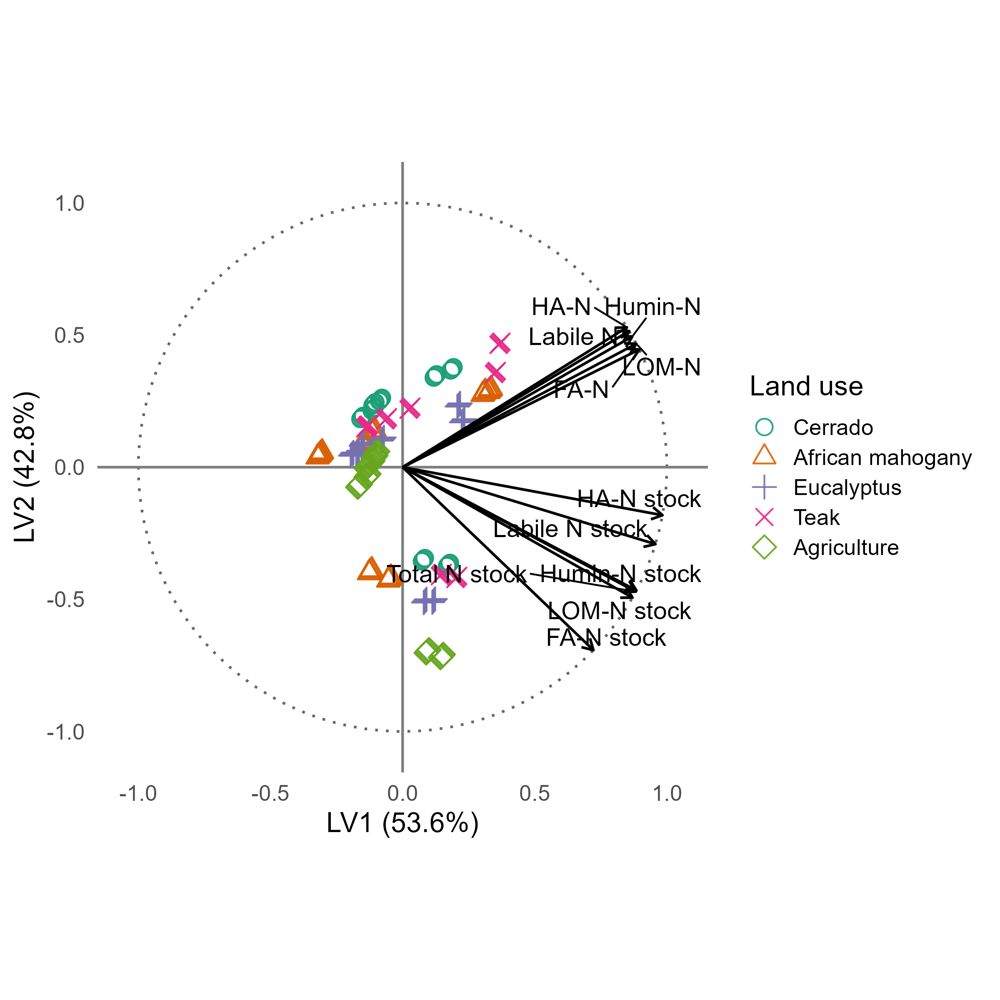
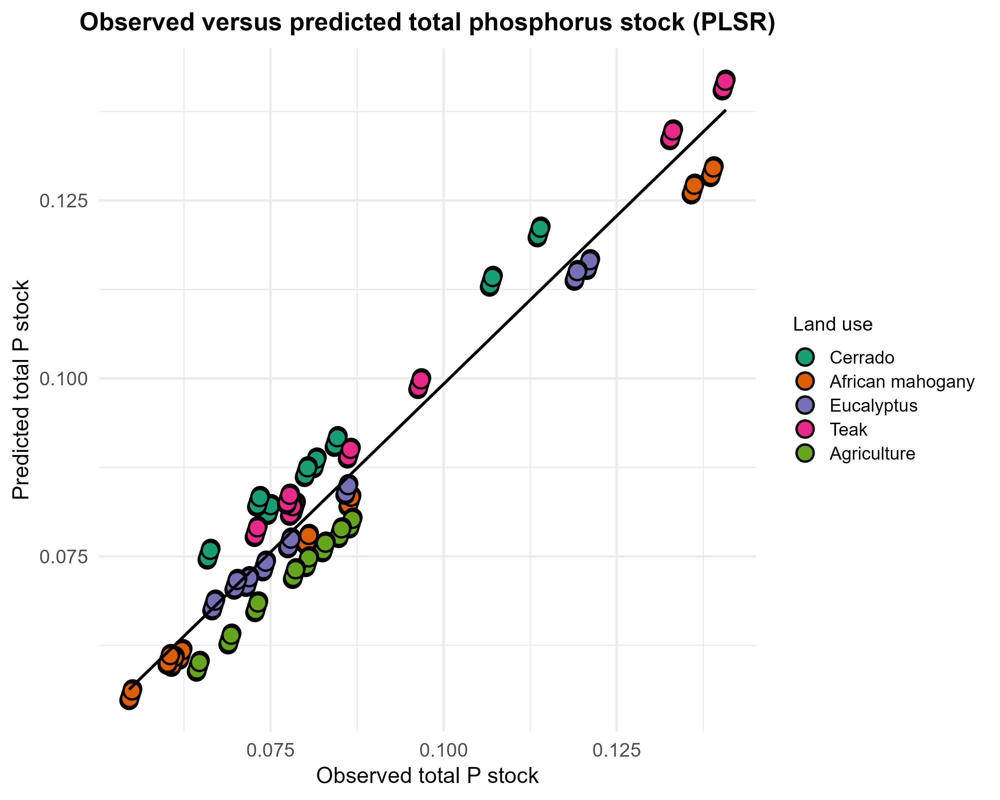
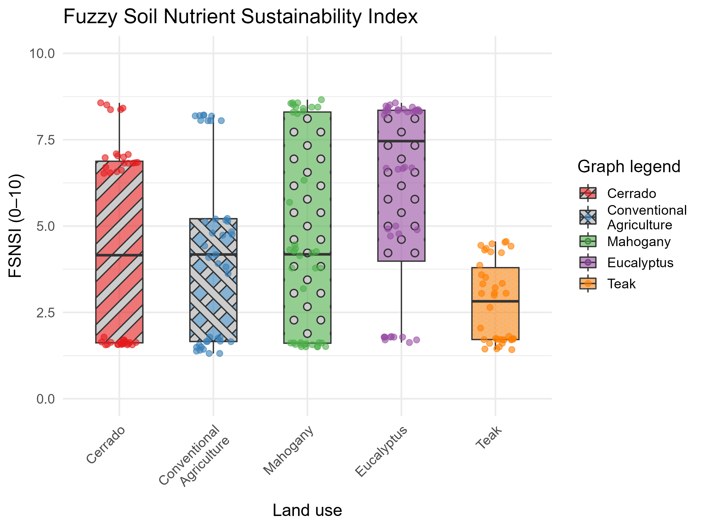

<!-- markdownlint-disable MD025 -->

## Key Message

Among forest plantations established on Cerrado Oxisols, *Eucalyptus* best sustained the co-stabilization of nitrogen and phosphorus in humic fractions, whereas *Tectona grandis* performed lowest, indicating that tree-species selection governs soil nutritional functionality after land-use conversion.

## Abstract

The conversion of natural ecosystems into agricultural and silvicultural systems reshapes organomineral stabilization dynamics and, consequently, nitrogen (N) and phosphorus (P) stocks in Cerrado Oxisols. This study examines how N and P are jointly stabilized across humic and labile fractions under five contrasting land uses, and integrates this evidence into a Fuzzy Soil Nutritional Sustainability Index (FSNSI) used as a decision-support tool that combines chemical capital, expressed as N and P stocks, and physical constraint, expressed as soil bulk density. Compositional partitioning indicated the dominance of humic fractions relative to total N, with a median humic contribution of 76.0% and a low contribution from labile fractions (median 12.18%), supporting a retention regime controlled by persistent reservoirs. Native vegetation showed the highest humic contribution (median 82.0%) and the lowest residual fraction (4.96%), whereas the agriculture system showed a reduced humic contribution (median 73.0%) and an increased residual fraction (17.15%), suggesting a greater allocation of mass to compartments not recovered by the operational extractions. Forest plantations showed a median total nitrogen stock per layer of 1.362 Mg ha⁻¹, approximately 21.2% higher than native Cerrado, while maintaining a humic-dominated stabilization regime. The FSNSI discriminated among land uses, with adjusted means ranking in decreasing order as Eucalyptus (6.07), Mahogany (4.54), Cerrado (4.42), Agriculture (4.25), and Teak (2.77), indicating that functional performance was highest when continuous organic inputs occurred without recurrent mechanical disturbance and lowest when biochemical impedance restricted nutrient cycling. The results suggest that the co-stabilization of N and P in humic fractions, modulated by soil physical integrity and by differences in belowground organic inputs among land uses documented in the same Cerrado region, is a central mechanism sustaining nutrient functionality in highly weathered tropical environments. The FSNSI provides an integrated metric that links tree-species management and soil physical structure to nutrient stabilization, supporting the assessment of soil functionality across land-use systems.

**Keywords:** Forest plantations; Tree species effects; Nitrogen–phosphorus coupling; Soil organic matter fractions; Belowground carbon inputs; Silviculture on Oxisols.

**Highlights**

- Land-use conversion in the Cerrado altered N distribution among humic fractions
- Humic fractions retained 76.0% of total N across land-use systems
- Forest plantations increased total N stocks by 21.2% relative to native Cerrado
- FSNSI ranked Eucalyptus highest and Teak lowest among five land-use systems
- Co-stabilization of N and P in humic pools drives soil nutritional functionality

# 1. Introduction

Tropical soils are complex and dynamic biogeochemical systems in which soil organic matter (SOM) plays a central role in regulating nutrient cycling, structural aggregation, and fertility maintenance [@Lal2020; @Lavallee2020]. The conversion of native ecosystems into agricultural and silvicultural areas alters the input and quality of organic residues, accelerates decomposition, and reduces the formation of stable humic compounds [@Carvalho2023]. This transformation decreases nitrogen (N) and phosphorus (P) stocks, thereby compromising nutrient cycling and soil resilience [@Tivet2013; @Silva2024].

In the Cerrado biome, a global biodiversity hotspot, these impacts are particularly critical because its highly weathered, acidic, and naturally nutrient-poor soils depend on the stability of humic SOM fractions to maintain ecological and productive functions [@Locatelli2023]. Humic substances, such as humic acids (HA), fulvic acids (FA), and humin (Hum), act as nutrient reservoirs that regulate water retention and the formation of stable aggregates [@Lehmann2015; @Paul2016]. Through adsorption, complexation, and biological immobilization, these fractions stabilize N and P, reduce nutrient losses, and promote their persistence in the soil system [@Gerke2022; @Carvalho2023].

Although classical humification has historically underpinned interpretations of SOM persistence, the soil continuum model challenges the view of humic substances as discrete macromolecular entities. Instead, it proposes a progressive decomposition continuum in which persistence is an ecosystem property governed by mineral association, spatial inaccessibility, and microbial processing rather than by intrinsic molecular recalcitrance [@Lehmann2015; @Lavallee2020; @cotrufo2021]. Mineral–organic associations, particularly those involving Fe and Al oxyhydroxides abundant in tropical Oxisols, may stabilize organic compounds through ligand exchange, cation bridging, and co-precipitation, thereby reducing enzymatic access and prolonging residence time regardless of the biochemical class of the sorbed material [@kleber2015; @kallenbach2016].

Within this evolving paradigm, the alkaline–acid fractionation protocol used here, based on the IHSS method, is retained as an operational analytical partition that tracks the distribution of N and P across functionally distinct solubility pools, rather than as an assumption that the extracted fractions correspond to chemically homogeneous macromolecules. This operational approach remains widely adopted in tropical soil studies because it provides reproducible and cost-effective separation of pools with contrasting turnover times. Its results can be interpreted within either the classical or the continuum framework, provided that causal claims are constrained by independent structural evidence [@marschner2008; @Paul2016]. In the present study, mechanistic inferences are therefore anchored in convergent evidence from compositional partitioning, partial least square regression (PLSR) structure, and partial least squares structural equation modeling (PLS-SEM) path coefficients, rather than derived from the fractionation scheme alone.

Recent studies in tropical and highly weathered soils have increasingly focused on the biogeochemical coupling between N and P and their co-stabilization in SOM [@Cao2021; @MarinhoJunior2021; @Gerke2022]. Evidence indicates that these nutrients are co-regulated by interdependent decomposition, humification, and organomineral protection processes. Mechanisms such as incorporation into microbial biomass, competition for adsorption sites, complex formation with humic substances, and physical co-occlusion in microaggregates stabilize N and P, protecting them from rapid mineralization and promoting their persistence [@Cao2021; @Gerke2022]. These interactions indicate that disturbances in one nutrient cycle induce stoichiometric imbalances that affect the use efficiency of the other, thereby compromising SOM stability and soil sustainability [@MarinhoJunior2021]. Nonetheless, most studies still treat N and P separately and overlook their structural and functional interrelations.

A further dimension that remains underexplored concerns the belowground origin of the organic matter that feeds these stable fractions. Root-derived carbon and nitrogen contribute disproportionately to mineral-associated and humified pools relative to aboveground litter, because root exudates and fine-root turnover deliver substrates directly into the rhizosphere, where organomineral protection is most efficient [@cotrufo2021; @Iversen2022]. 

Tree species differ markedly in fine-root biomass, vertical distribution, and tissue nutrient content, and these belowground traits may govern how much N and P are routed toward persistent rather than labile compartments. In the same Cerrado region of Tocantins, root biomass and element stocks under several of these land uses, including native Cerrado, eucalyptus, and agriculture, were quantified independently [@Lima2023], providing local evidence that belowground inputs differ substantially among land uses and offering a mechanistic basis for interpreting fraction-partitioning contrasts that would otherwise be ascribed to unmeasured residue quality.

Agricultural intensification and conventional tillage reduce particulate organic matter, disrupt organomineral complexes, increase bulk density, and decrease porosity [@Iversen2022]. These physical effects restrict gas diffusion, water infiltration, and microbial activity, which compromises nutrient cycling and the co-stabilization of N and P [@Vereecken2018]. Physical degradation, expressed as increased bulk density, thus limits soil functionality and interacts with biogeochemical processes, affecting sustainability at multiple scales [@Mendes2019; @Wagai2020].

Despite these advances in the understanding of edaphic processes, a critical methodological gap remains regarding sustainability indicators that are simultaneously robust, capable of handling nonlinearity and uncertainty, and suitable for integration into broader sustainability-assessment frameworks [@Ros2022]. Traditional fertility or soil-quality indicators are often reductionist, unidimensional, or difficult to interpret outside the soil-science domain [@Vereecken2018]. To inform life-cycle sustainability assessment and supply-chain decisions, metrics are needed that translate soil complexity into an aggregated and scalable index [@Toth2018].

Recent modeling advances have enabled the integration of multiple soil attributes to investigate these relationships. PLS-SEM can identify hypothesized relationships among soil compartments by quantifying direct and indirect effects of variables such as bulk density and humic fractions on N and P stocks, thereby revealing the pathways through which organic and mineral phases may control nutrient retention [@HairJr2021].

Fuzzy inference systems (FIS) use membership functions to represent continuous and nonlinear soil responses as degrees of membership in qualitative categories, such as low, medium, or high functionality. This approach translates multiple chemical and physical input variables, including N and P fractions and bulk density, into a single aggregated index without imposing rigid categorical thresholds [@Mamdani1977; @Reis2023]. The combination of PLS-SEM and fuzzy inference supports composite indicators such as the Fuzzy Soil Nutritional Sustainability Index (FSNSI), which synthesizes biogeochemical functionality under different land uses [@Reis2023; @Suganya2024EMA].

Based on this context, this study tests the hypothesis that nutrient stabilization in Cerrado Oxisols is primarily controlled by the balance between humic retention and labile turnover, while bulk density mediates this balance by modifying the intensity of biogeochemical fluxes. Under this mechanism, native vegetation is expected to maintain stronger N and P co-stabilization in humic fractions, whereas managed systems are expected to show greater allocation to labile and residual compartments and weaker coupling between nutrient cycles. This expectation is consistent with evidence that long-term organic-P accumulation in undisturbed soils is governed by humic retention [@YangPost2011], that N stabilization in persistent SOM pools depends on the balance between litter quality and microbial processing [@Jensen2020], and that land-use conversion disrupts the organomineral protection of both nutrients [@Macci2016].

Five representative land-use systems on the same Oxisol substrate in the Brazilian Cerrado were selected to test this hypothesis. These systems included preserved native savanna vegetation, Cerrado sensu stricto, used as the reference area; three monoculture forest plantations (*Eucalyptus* sp., *Khaya ivorensis*, and *Tectona grandis*); and conventional agriculture. Together, these systems span a gradient of post-conversion management intensity characteristic of the region.

Within this framework, FSNSI is proposed as a relevant solution [@Ros2022], synthesizing N and P dynamics with physical degradation metrics to simultaneously diagnose local sustainability while providing an aggregated quantitative indicator for the production phase within a life-cycle thinking perspective [@Powlson2011; @Sala2019]. Soil functionality quantified in this manner becomes an input for life-cycle sustainability assessment and supports decision-making in land management [@Jha2025EMA]. Its coupling with GIS layers can also support the spatial prioritization of management interventions and the identification of functional-risk hotspots for environmental monitoring and assessment [@Yang2025EMA]. Therefore, this study aimed to evaluate the functional dynamics of N and P in humic and labile soil fractions under these five land uses and to propose and validate an integrated analytical framework, combining PLSR, PLS-SEM, and FSNSI, to diagnose soil nutritional sustainability.

# 2. Materials and Methods

## 2.1 Study area

The study was conducted in the municipality of São Valério, Tocantins, Brazil, in a total area of 53.23 ha, located at 11°54’37” S and 48°12’31” W (Figure 1). The elevation is approximately 360 m. The regional climate is seasonal tropical, classified as Aw according to the Köppen system [@Thornthwaite1948], with a rainy summer from October to April and a dry winter from May to September. Mean annual precipitation is approximately 1,480 mm, and mean monthly temperatures vary slightly throughout the year, with mean daily values around 27 °C, minima of 21–24 °C, and maxima between 30 and 35 °C [@Santos2025]. The relief is predominantly gently undulating, typical of the Cerrado biome, and the soils are mainly well-drained Red-Yellow Oxisols with low natural chemical fertility associated with low available phosphorus and strong aluminum influence [@Santos2025].

{#fig:1 width=70%}

## 2.2 Characteristics of the land-use systems

The preserved Cerrado sensu stricto area (Figure 2a), used as the control, covers 44.82 ha, has been preserved for more than 40 years, and is located at 11°54’57’’ S and 48°11’59’’ W. The vegetation exhibits a dense Cerrado physiognomy, with trees ranging from 5 to 8 m in height and considerable structural variation among Cerrado physiognomies [@Lacerda2025]. A vegetation survey was conducted to calculate phytosociological parameters, including Relative Density (RD), Relative Dominance (RDM), Relative Frequency (RF), and the Importance Value Index (IVI) [@Queiroz2017] (Appendix 1).

{#fig:2 width=90%}

To improve clarity and reproducibility, the main management characteristics of each land-use system are summarized in Table 1.

**Table 1. Stand age, soil preparation, planting density, and fertilization regimes by land-use system.**

| Land-use system | Area | Stand age | Soil preparation / operations | Planting density / spacing | Fertilization / amendments (as described) |
| --- | --- | --- | --- | --- | --- |
| Cerrado sensu stricto (control) | 44.82 ha | > 40 years | Preserved native vegetation | - | - |
| Eucalyptus (*Eucalyptus* sp.) | 2.29 ha | 5 years | Clearing with crawler tractor blade; plowing and harrowing | ~1,667 seedlings ha⁻¹ (3 × 2 m) | NPK 5-25-15; base amendments with Ca, Zn, S, Cu, and B [@Boudiar2022; @Vera2022] |
| African mahogany (*K. ivorensis*) | 1.94 ha | 7 years | Clearing; plowing and harrowing | 1,111 seedlings ha⁻¹ (3 × 3 m; thinned to 6 × 6 m) | NPK 00-10-10 and cattle manure per pit; repeated applications in year 1 [@Lucena2024] |
| Teak (*T. grandis*) | 1.12 ha | 10 years | Clearing; plowing and harrowing | 1,667 seedlings ha⁻¹ (3 × 2 m) | NPK 20-05-20 top dressings in year 1 [@Vieira2017] |
| Agriculture (soybean/corn rotation) | 3.06 ha | > 10 years | Tillage and seedbed operations (harrowing, leveling, furrowing) | Crop-dependent spacing | NPK 4-28-10 (soybean phase) and 4-14-18 + N rates (corn phase) [@Camargo2024; @Machado2024] |

All managed areas were converted from native Cerrado vegetation at different times, resulting in stand ages ranging from 5 years for Eucalyptus to more than 10 years for Agriculture, as detailed in Table 1. Because synchronous conversion was not feasible within the farm's operational history, the sampling design followed a space-for-time substitution approach, in which each land-use system represents a distinct post-conversion trajectory sampled at a single point in time. None of the three plantation species (*Eucalyptus* sp., *Khaya ivorensis*, and *Tectona grandis*) is a N-fixing legume; therefore, biological N fixation does not confound the observed differences in N stocks among silvicultural systems. Stand-age heterogeneity is acknowledged as a design constraint and is considered in the interpretation of the results.

## 2.3 Soil sampling

Five trenches, 70 × 70 × 100 cm, were opened in each land-use system at spatially independent positions within the management unit [@MarinhoJunior2021], totaling 25 trenches and representing five replicates per land-use treatment. Since the experimental unit was the individual trench rather than the plot as a whole, differences in total plot area among land-use systems, 1.12 to 44.82 ha (Table 1), did not change the defined replication structure. Each trench constituted the experimental unit. Within each trench, disturbed and undisturbed soil samples were collected at eight depth intervals: 0–10, 10–20, 20–30, 30–40, 40–50, 50–60, 60–80, and 80–100 cm. This procedure yielded 200 observations in total, corresponding to 5 land uses × 5 trenches × 8 depths.

Disturbed samples were air-dried and sieved through a 2 mm mesh for subsequent analyses. For inferential analyses, the data structure was treated as observations stratified by land use and depth, with replicate trenches as the sampling support within each land-use class. The generalized linear model framework [@McCullaghNelder2019] accounted for this hierarchical structure through the inclusion of land-use and depth factors, followed by Bonferroni-corrected pairwise comparisons.

## 2.4 Physical and chemical analyses

Particle-size distribution was determined in disturbed samples using the pipette method [@Teixeira2017], and soil bulk density was determined using the volumetric-cylinder method [@Teixeira2017] (Appendix 2).

Soil samples were air-dried, sieved through a 2 mm mesh, and homogenized. A subsample was ground with a porcelain mortar and pestle to obtain a fine, uniform powder and was then sieved again through a 150 μm (100-mesh) sieve. Total nitrogen (Ntotal) was determined by dry combustion using an elemental analyzer (Model PE-2400 Series II, Perkin Elmer). Total phosphorus (Ptotal) was determined after wet digestion and quantified by colorimetry [@MurphyRiley1962].

Humic substances were extracted using the fractionation procedure recommended by the International Humic Substances Society (IHSS) [@Swift1996]. The method is based on differences in solubility in alkaline and acidic solutions, allowing the separation of fulvic acid (FA), humic acid (HA), and humin (Hum). Light organic matter (LOM) was separated by flotation in water [@FragaSalcedo2004]. After humic fractionation, samples were frozen and lyophilized to determine N and P in FA, HA, and Hum. Phosphorus was quantified using the colorimetric method [@MurphyRiley1962]. Nitrogen in the same humic fractions was determined by dry combustion. Phosphorus associated with LOM (P-LOM) was determined by colorimetry [@MurphyRiley1962], and nitrogen associated with LOM (N-LOM) was determined by dry combustion.

Labile phosphorus (labile P) was obtained using the Hedley extraction procedure [@Hedley1982] and quantified by colorimetry [@MurphyRiley1962]. Labile nitrogen (labile N) was determined indirectly using the method of @ShangTiessen1997. N and P stocks were computed from measured concentrations in bulk soil and in the respective fractions, bulk density, and the thickness of the sampled layers.

## 2.5 Construction of the Fuzzy Soil Nutritional Sustainability Index (FSNSI)

The FSNSI was developed using a Mamdani inference system [@Mamdani1977] implemented in R with the FuzzyR package. The system integrated Total N and Total P stocks, used as chemical-capital indicators, and soil bulk density, used as a physical-constraint indicator, as input variables [@Reis2023]. All variables were normalized to a 0–10 scale. For bulk density, inverse normalization was applied so that lower density corresponded to higher scores.

### 2.5.1 Membership functions and fuzzification

Triangular membership functions were applied to the input and output variables, defining three linguistic terms: Low, Medium, and High. The functions were parameterized using the empirical quartiles of each variable distribution ($Q_{25}, Q_{50}, Q_{75}$). The general form of the triangular membership function is presented in Eq. 1:

$$ \mu_A(x) = \max\left(\min\left(\frac{x-a}{b-a}, \frac{c-x}{c-b}\right), 0\right) $$

where $a$, $b$, and $c$ represent the lower bound, peak, and upper bound, respectively. The parameter sets were defined as Low ($0, Q_{25}, Q_{50}$), Medium ($Q_{25}, Q_{50}, Q_{75}$), and High ($Q_{50}, Q_{75}, 10$).

### 2.5.2 Inference rules and defuzzification

The knowledge base consisted of sixteen fuzzy rules in an IF-THEN format, using the logical AND operator (represented by the minimum operator) to aggregate antecedents. The rule set encoded the agronomic logic that high N and P stocks combined with low bulk density yield high functionality, whereas the four rules that paired favorable chemical capital with high bulk density received a higher weight (1.5 versus 1.0), so that physical impedance penalized the score even under nutrient sufficiency and prevented compacted layers from reaching the High class on chemical grounds alone. The activation degree ($\alpha_i$) of each rule was calculated according to Eq. 2:

$$ \alpha_i = \min(\mu_{N}(x_N), \mu_{P}(x_P), \mu_{Bd}(x_{Bd})) $$

where $\mu_N$, $\mu_P$, and $\mu_{Bd}$ denote the membership degrees of the N stock, P stock, and bulk density inputs, respectively.

The final FSNSI value was obtained by centroid defuzzification, as shown in Eq. 3:

$$ \hat{z} = \frac{\int z \cdot \mu_{FSNSI}(z) \, dz}{\int \mu_{FSNSI}(z) \, dz} $$

The FSNSI ranges from 0 to 10 and was interpreted using the following classes: Low Sustainability (0.0–3.3), Intermediate Sustainability (3.4–6.6), and High Sustainability (6.7–10.0).

### 2.5.3 Index consistency and robustness

Three independent checks supported the internal validity of the index. The Pearson correlations between FSNSI and its constituent pools verified that the aggregated score tracked the underlying chemical capital, the bootstrap confidence intervals propagated through the GLM (n = 1,000) quantified the stability of the adjusted means across land uses, and the agreement between the fuzzy ranking and the independent PLS-SEM structural coefficients provided convergent evidence from two methodologically distinct routes.

## 2.6 Data analysis

Data were analyzed using generalized linear models (GLMs; R package *stats*) with bootstrap resampling (n = 1,000) to evaluate the effects of land-use and soil depth on N and P fractions, stocks, and FSNSI. The GLM framework was adopted instead of traditional ANOVA because the data showed non-normality and heteroscedasticity, as indicated by the Shapiro–Wilk test (p < 0.01). A Gamma distribution was selected based on lower Akaike Information Criterion (AIC) and Bayesian Information Criterion (BIC) values compared with normal and log-normal distributions [@Akaike1974; @McCullaghNelder2019].

Model adequacy was confirmed by residual analysis (Deviance/df < 1) and by the absence of overdispersion [@CameronTrivedi1990]. Following current recommendations to report effect sizes alongside significance levels, land-use effects on FSNSI were quantified as exponentiated coefficients, Exp(B), with bootstrap 95% confidence intervals. These coefficients express effect magnitude on the original response scale and are more informative for practical interpretation than significance tests alone, because significance tests indicate only departure from the null hypothesis, whereas Exp(B) quantifies the predicted mean under each treatment condition.

Multivariate significance was assessed using Pillai's trace (V), Wilks' lambda (Λ), Hotelling–Lawley trace (T²), and Roy's largest root (Θ) statistics. Pairwise comparisons were performed using Bonferroni correction. Exploratory analyses included principal component analysis (PCA) on the correlation matrix of standardized variables, hierarchical clustering analysis (HCA) using Ward.D2 linkage and Euclidean distance, and Pearson correlation analysis to assess linear associations among variables.

Structural relationships were modeled using PLSR and PLS-SEM to identify key predictors, considering the Variable Importance in Projection (VIP > 1.0). The structural model was specified as a second-order hierarchical component model (HCM), and land-use contrasts were evaluated using PLS multi-group analysis (PLS-MGA). Analyses were conducted in R [@RCoreTeam2024] using the packages FactoMineR, factoextra, ggplot2, seminr (for PLS-SEM and PLS-MGA), and boot (for bootstrap resampling).

In the PLSR workflow, all predictors were standardized, mean-centered, and scaled to unit variance before model fitting [@MevikWehrens2007]. This procedure ensured equal contribution of variables measured on different scales. Latent components were estimated using leave-one-out cross-validation (LOO-CV) to control overfitting under correlated predictors. Two PLSR models were fitted, one for the N system and one for the P system. In the N model, the dependent variable was total N stock (EstNT), with independent variables representing operational fractions and their stocks: NLabil, NLOM, NTFA, NTHA, NTHum, EstNLabil, EstNLOM, EstNFA, EstNHA, and EstNTHum. In the P model, the dependent variable was total P stock (EstPT), with analogous independent variables: PLabil, PLOM, PTFA, PTHA, PTHum, EstPLabil, EstPLOM, EstPFA, EstPHA, and EstPTHum.

The modeling dataset comprised 200 observations derived from five land-use classes, five replicate trenches per class, and eight depth intervals per trench. Two latent variables were retained for both nutrient systems. In both models, the first latent variable explained 49.43% of the response variance, and the second latent variable increased the cumulative explained response variance to 94.49%.

# 3. Results and Discussion

## 3.1 Dynamics of nitrogen and phosphorus fractions

Humic fractions accounted for a median of 76.0% of total N (IQR: 74.48% to 79.45%; range: 72.09% to 82.85%), indicating the dominance of high-inertia reservoirs in Cerrado Oxisols. In the PLSR latent space (Figure 3), humic fractions showed directional coherence with total N, supporting this mass-balance hierarchy. This humic predominance is consistent with values reported for Cerrado Oxisols under native and converted vegetation, where humin and humic acids concentrate the bulk of stabilized N [@Gmach2018; @Ferreira2021], reinforcing that organomineral protection, rather than labile turnover, governs the standing N pool in these soils.

Labile fractions accounted for a median of 12.18% of total N content in the soil profile (IQR: 11.47% to 12.73%; range: 9.09% to 13.77%), whereas the residual fraction showed a median of 11.47% (range: 3.38% to 18.83%). For P, the compartment ordering preserved the humic dominance observed for N, supporting the co-stratification of macronutrients within an organomineral framework consistent with mineral-associated organic matter [@Lavallee2020]. In this framework, preferential association with silt and clay particles and physical protection within microaggregates reduce microbial accessibility and prolong element residence time [@Spohn2024].

In Figure 3, the total-N–humic alignment is consistent with the 76.0% median humic share of total N and with the observed compositional hierarchy, in which most N is allocated to fractions with greater structural complexity. Mechanistically, this dominance suggests that N retention is governed by progressive incorporation into organic networks with low biodegradability and by interactions with mineral surfaces that impose physicochemical barriers to enzymatic access [@kleber2015; @Celi2022], reinforcing a dynamic of immobilization and continuous re-stabilization.

Because humification transfers mass from a high-turnover compartment to a more persistent compartment, the labile fraction tends to act as a short-term reservoir rather than as a determinant of long-term stocks. This interpretation is consistent with its lower proportional contribution and greater sensitivity to disturbance and microclimate [@Carvalho2023].

In the nitrogen PLSR model, EstNT was treated as the dependent variable and the fraction variables as predictors, with two latent components retained after cross-validation [@MevikWehrens2007]. The first component captured the dominant covariance structure between total stock and humic fractions, explaining 49.43% of the response variance, whereas the second component improved the separation of labile and mineral-associated contributions, increasing the cumulative explained variance to 94.49%.

{#fig:3 width=70%}

*Note: Total N stock = total nitrogen stock, used as the dependent variable; FA-N = fulvic acid nitrogen; HA-N = humic acid nitrogen; Humin-N = humin nitrogen; Labile N = labile nitrogen; LOM-N = light organic matter nitrogen. The suffix "stock" denotes stock-level variables, for example, FA-N stock = fulvic acid nitrogen stock.*

In highly weathered Oxisols, P cycling is constrained by specific adsorption to Fe and Al oxides through ligand exchange, which increases chemical impedance to biological turnover. Organic matter modulates P availability by competing for reactive sites and favoring incorporation into persistent organomineral pools, consistent with @Gerke2022. In the phosphorus PLSR model, EstPT was treated as the dependent variable, and P fractions were used as predictors, with two latent components retained after cross-validation.

The predictive consistency of this model is shown by the observed-versus-predicted relationship for P, in which the trend indicates a coherent model response across land-use systems (Figure 4).

{#fig:4 width=70%}

*Note: Each point represents one observation and is colored according to land-use system. The solid line indicates the linear fit between observed and predicted values.*

The convergence between N and P patterns in the multivariate space reinforces the hypothesis of stoichiometric coupling during SOM formation and maturation [@Qaswar2019]. The retention of one nutrient conditions the retention of the other through shared routes of microbial processing and physicochemical protection [@Celi2022], rather than through independent trajectories governed only by mineral reactivity. This interpretation is consistent with the principle that microbial immobilization of N is modulated by carbon quality and, concomitantly, conditions the capture of P in more persistent organic forms [@Cao2021]. In highly weathered Oxisols, this co-stabilization occurs under intense competition for reactive sites on Fe and Al oxides. Organic matter therefore modulates P dynamics by interfering with specific phosphate sorption and favoring incorporation into more persistent organomineral fractions [@YangPost2011].

In the context of aggregates and organomineral associations, the role of Fe and Al as bridges between microbially processed organic matter and mineral surfaces provides a plausible mechanism for the persistence of P associated with organomineral matrices in highly weathered soils [@Wagai2020].

Preserved Cerrado exhibited the highest humic contribution, with a median of 82.0%, and the lowest residual fraction, 4.96%, whereas agriculture showed the lowest humic contribution, with a median of 73.0%, and the highest residual fraction, 17.15% [@Ferreira2021]. When the comparisons are summarized into three broader system groups (native vegetation, forest plantations, and agriculture), this ordering reduces interpretive ambiguity. Forest plantations offered an intermediate condition, with a median humic contribution of 76.0% and a residual fraction of 11.47%, suggesting that the transition from native Cerrado to arboreal systems maintained a substantial part of the stabilization architecture while redistributing mass among compartments. This pattern is consistent with organomineral protection mechanisms [@Paul2016] and with contrasting pathways between particulate and mineral-associated organic matter [@Gmach2018].

Total N stocks per layer ranked in decreasing order as Teak (median EstNT of 1.383 Mg ha⁻¹), Eucalyptus (1.335 Mg ha⁻¹), Mahogany (1.295 Mg ha⁻¹), Agriculture (1.171 Mg ha⁻¹), and Cerrado (1.124 Mg ha⁻¹). These values correspond to increases of 23.0%, 18.8%, 15.2%, and 4.1%, respectively, relative to the native baseline. The higher stock observed in agriculture likely reflects sustained mineral-N additions through fertilization cycles (Table 1), which supplement organically derived N [@McMahon2019] and hinder direct comparison with unfertilized native vegetation.

None of the three plantation species is an N-fixing legume; therefore, the stock gains observed in silvicultural systems cannot be attributed to biological N fixation and are more plausibly explained by continuous litter input, root turnover, and reduced post-establishment disturbance [@SouzaAlmeida2021; @MoraesWS2024]. Comparable surface-soil N accumulation under tree plantations relative to native savanna has been reported for Brazilian sites on weathered substrates [@Tang2023], supporting the plausibility of the magnitude observed here. Total N stock dynamics should not be equated with bulk SOM trends because N accumulation reflects the combined outcome of organic-N incorporation, mineral-N retention, and fraction-specific stabilization, processes that may diverge from carbon-driven SOM trajectories [@Gerke2022]. This contrast suggests that stock gains depend primarily on how each management system modulates organic input quality, residence time, and protection within organomineral domains, rather than on input magnitude alone.

The relatively low dispersion of partitioning percentages, especially when compared with the variation in stocks, should be interpreted as a compositional property of a system in which fractions represent a decomposition of the total and are therefore subject to sum constraints and analytical recovery efficiency, rather than as evidence of absent dynamics [@Aitchison1986]. In process-engineering terms, this finding indicates that the dominant control lies in the transfer flux among compartments and in the balance between stabilization and loss, rather than in large fluctuations in percentage distribution. This interpretation reinforces the role of fraction dynamics and structural stability as regulators of long-term stock resilience [@Jensen2020].

## 3.2 Structural mechanisms of nutrient stabilization

In the structural model, humic-to-total path coefficients exceeded 1.2, whereas labile-to-total coefficients were approximately −0.3 (Figure 5), indicating that chemical-capital accumulation is governed primarily by stabilization in fractions with greater temporal inertia. These negative labile coefficients should be interpreted as a mass-transfer signature between a high-turnover reservoir and a persistent reservoir, compatible with humification kinetics and the transient nature of the labile compartment, rather than as a functional penalty [@HairJr2021].

{#fig:5 width=80%}

*Note: Second-order endogenous constructs are Total N and Total P. Solid arrows indicate positive paths, and dashed arrows indicate negative paths. Coefficient ranges across the five land-use systems are shown on each edge.*

As proposed by @Lehmann2015, the continuum model of SOM implies that labile compounds are continuously processed and stabilized. Within this framework, a high stock of labile N or P that is not translated into humic N or P indicates interrupted humification or excessive mineralization, which is typical of conventionally tilled agriculture. Conversely, balanced coefficients in Cerrado and Eucalyptus systems indicate an active flux of labile inputs into stable reserves [@Gmach2018].

The symmetry between N and P pathways in the structural model reinforces the concept of biogeochemical co-stabilization. @MarinhoJunior2021 reported that, in Brazilian Cerrado soils, disruption of this coupling, such as excessive P fertilization without organic inputs, may reduce SOM quality. Herein, the results extend this interpretation by indicating that this coupling may be maintained under silvicultural transitions, provided that soil physical structure is preserved. The global PLS-SEM fit corroborated the structural adequacy of the model, with R² = 0.959 for both total N and total P endogenous constructs, standardized root mean squared residual (SRMR) below 0.06, composite reliability exceeding 0.97 [@HairJr2021], and average variance extracted (AVE) above 0.95 [@Henseler2015]. Collectively, these metrics indicate that the latent constructs captured more than 95% of the indicator variance, with satisfactory discriminant validity, regarding the Fornell–Larcker criterion [@FornellLarcker1981].

## 3.3 Functional heterogeneity among land uses

Tree species imprinted distinct signatures on the partitioning of N and P, because contrasts in litter chemistry, fine-root turnover, and post-establishment disturbance propagate into the relative weight of humic versus labile stabilization. Multi-group analysis revealed humic coefficients ranging from β = 1.180 in Agriculture to β = 1.372 in Teak, indicating that management alters stabilization pathways (Table 2). Native Cerrado exhibited high humic coefficients (β = 1.286), representing a functional baseline in which nutrient cycling is tightly coupled and efficient.

Agriculture showed reduced humic efficiency (β = 1.180), consistent with @Silva2024, who reported that conversion of Cerrado to agriculture accelerates particulate organic matter oxidation. Physical aggregate disruption by tillage exposes previously protected organic matter to microbial attack [@Assuncao2019; @Purwanto2020], thereby decoupling N and P cycles.

**Table 2. Path coefficients stratified by land-use system.**

| Land use | Humic N → Total N | Labile N → Total N | Humic P → Total P | Labile P → Total P |
| --- | --- | --- | --- | --- |
| Cerrado | 1.286 | -0.313 | 1.286 | -0.313 |
| Agriculture | 1.180 | -0.237 | 1.180 | -0.237 |
| African mahogany | 1.271 | -0.277 | 1.271 | -0.277 |
| Eucalyptus | 1.275 | -0.283 | 1.275 | -0.283 |
| Teak | 1.372 | -0.445 | 1.372 | -0.445 |

*Note: Standardized values indicate the magnitude of structural relationships within each land-use system.*

Among the silvicultural systems, Eucalyptus (β = 1.275) and African mahogany (β = 1.271) closely approximated native Cerrado functionality. This resilience may be attributed to the maintenance of a permanent litter layer and the absence of soil disturbance after plantation establishment. @StLuce2022 reported that deep-rooted tree plantations can pump nutrients from subsoil layers and redistribute them to the surface through litterfall, effectively contributing to nutrient-cycle closure.

Teak revealed a distinct anomaly, with the highest humic coefficient (β = 1.372) paired with the most negative labile coefficient (β = −0.445). Although this pattern may appear favorable in a purely structural interpretation, it is consistent with a cycling bottleneck associated with low residue decomposability. Teak litter is characterized by high lignin content and secondary metabolites such as tectoquinone, which can reduce decomposition rates and delay nutrient return to labile pools [@AraujoFilho2025]. Combined with the higher bulk density observed in Teak stands (Appendix 2), this result is consistent with increased physical and biochemical impedance, shifting the system toward accumulation in recalcitrant forms and reducing short-term renewal, a condition associated with functional stagnation in compacted soils [@Locatelli2023].

Plantation ages differed among the evaluated systems: Eucalyptus, 5 years; Mahogany, 7 years; and Teak, 10 years (Table 1). This reflects the fact that the sampled areas correspond to land uses established in the landscape at different dates, characterizing a space-for-time substitution design [@Pickett1989], in which coexisting systems at different post-conversion stages serve as proxies for temporal trajectories. @Walker2010 demonstrated that such designs may yield reliable inferences on soil development when sites share comparable parent material, climate, and topographic position. These conditions were satisfied in the present study, given the uniform Oxisol substrate and the spatial proximity of all evaluated areas within the same farm.

## 3.4 Fuzzy integration of edaphic functionality and the FSNSI

The fitted GLM indicated a statistically significant land-use effect on FSNSI (p < 0.001; Deviance/df = 0.082; Pearson/df = 0.075), and adjusted marginal estimates indicated higher functionality in the Eucalyptus system, whose mean differed significantly from native Cerrado (p < 0.05). Adjusted marginal means ranked in decreasing order as Eucalyptus (Exp(B) = 6.07; 95% CI: 5.45–6.69), Mahogany (Exp(B) = 4.54; 95% CI: 3.98–5.10), Cerrado (Exp(B) = 4.42; 95% CI: 3.80–5.04), Agriculture (Exp(B) = 4.25; 95% CI: 3.68–4.82), and Teak (Exp(B) = 2.77; 95% CI: 2.35–3.19), suggesting that functionality tends to be highest under continuous organic inputs without post-establishment soil disturbance and lowest where biochemical impedance restricts nutrient cycling.

Eucalyptus exceeded Cerrado (Exp(B) = 6.07 versus 4.42), but this pattern is conditional on the sampling window and on how the index weights chemical capital (N and P) and physical constraint (bulk density). The result is consistent with higher inputs and limited post-establishment disturbance [@Iversen2022], and evidence indicates that well-managed plantations may surpass native baselines for specific soil functions under optimized inputs [@Tang2023].

Across land uses, FSNSI ranged from 1.56 to 8.57, and shifts in medians and within-use dispersion revealed functional heterogeneity integrated by fuzzy aggregation (Figure 6).

{#fig:6 width=70%}

*Note: Different letters indicate significant differences according to Tukey's Honest Significant Difference (HSD) test (p < 0.05). Points represent individual values.*

Native Cerrado showed a bimodal distribution (50% low and 40% high functionality), reflecting strong natural vertical stratification [@SouzaAlmeida2021]. The wide FSNSI range (1.56–8.57) captures the contrast between organic-rich, porous surface layers (0–20 cm) and a chemically impoverished, naturally compacted subsoil typical of these Oxisols. Conventional agriculture (Exp(B) = 4.25; 95% CI: 3.68–4.82) revealed a tendency toward vertical homogenization (CV = 60.6%), consistent with mechanized tillage, which mixes soil layers and reduces structural gradients [@Leal2024]. Although functionality is compromised, 22.5% of samples reached the "High" class, plausibly due to surface fertilization and residual SOM accumulation [@Camargo2024].

Correlations between FSNSI and nutrient pools were strong (r = 0.616–0.789; p < 0.001), supporting the internal coherence of the index (Table 3). FSNSI responds simultaneously to persistent chemical capital and short-turnover nutrient capital while penalizing physical impedance through bulk density, consistent with the principle that robust soil quality indicators must integrate physical, chemical, and biological attributes rather than rely on isolated measurements [@DoranParkin1994]. This integrative property reduces the interpretive complexity typical of univariate readings and shifts the assessment from fertility to functionality, where stabilization, cycling, and physical constraints coexist as coupled components of system performance. This approach was previously validated for physical indicators of Oxisols under contrasting land uses by @Cavalcante2021.

The positive association with total pools indicates that the indicator captures long-term nutrient storage, a relationship consistent with the role of organic matter in sustaining soil water retention and nutrient buffering capacity [@Lal2020]. The negative association with bulk density indicates that structural compaction constrains edaphic performance by reducing effective pore space for gas and water transfer, in agreement with the mechanistic framework relating bulk density to aeration, hydraulic conductivity, and root impedance established by @Letey1985. The coherence between this fuzzy ranking and the PLS-SEM coefficients reinforces convergent validity, whereas the divergence for Teak, which combined the highest humic coefficient (Table 2) with the lowest FSNSI, confirms that the index correctly subordinates chemical sufficiency to physical constraint when bulk density becomes limiting.

## 3.5 How FSNSI improves interpretation of N and P functional dynamics

The FSNSI framework improves interpretation because it converts multivariate and partially collinear soil information into a single response variable that preserves mechanistic meaning across land uses [@Karlen1997], addressing the recognized challenge that multivariate soil assessments produce indicators that are difficult to compare directly when evaluated in isolation [@Bunemann2018]. Instead of evaluating isolated concentrations or stocks, the index integrates persistent nutrient capital, represented by total and humic-associated pools, with short-turnover pools and physical impedance represented by bulk density, following the multicriteria aggregation rationale demonstrated by @MoraHerrera2020 for fuzzy-based soil quality scoring.

This joint representation allows direct comparison of functional states among management systems [@Andrews2002] while maintaining sensitivity to the balance between stabilization and renewal, a property identified as necessary for soil quality indices intended to discriminate among land-use trajectories [@MukherjeeLal2014]. In practical terms, the model identifies whether higher stocks are associated with effective co-stabilization in humic compartments or with transient accumulation under structural restriction, which is necessary for distinguishing resilient from vulnerable nutrient regimes. By combining PLS-based structural evidence with fuzzy aggregation, FSNSI therefore extends descriptive comparisons into an operational decision metric for monitoring, prioritization, and management targeting, consistent with the call for comprehensive and quantitative indices that move beyond isolated indicators toward integrated soil health assessment [@Rinot2019].

**Table 3. Pearson correlation coefficients between soil variables and the Fuzzy Soil Nutritional Sustainability Index (FSNSI).**

| Variable | Correlation (r) | p-value |
| --- | --- | --- |
| Total N | +0.789 | < 0.001 |
| Total P | +0.789 | < 0.001 |
| Labile N | +0.627 | < 0.001 |
| Labile P | +0.627 | < 0.001 |
| Humic N | +0.616 | < 0.001 |
| Humic P | +0.616 | < 0.001 |
| Bulk density | -0.424 | < 0.001 |
| Sand | -0.439 | < 0.001 |
| Clay | +0.267 | 0.001 |
| Silt | +0.230 | < 0.001 |

## 3.6 Limitations and scope

Direct soil organic carbon (SOC) measurements were outside the scope of this initial survey. However, N and P fractionation across humic and labile pools captures key dimensions of SOM functionality [@Paul2016] and provides a self-consistent basis for the structural relationships estimated by PLS-SEM. Future campaigns incorporating SOC quantification would enable the computation of stoichiometric ratios and may further refine the mechanistic interpretation of organomineral coupling [@Lehmann2015].

The dataset originates from a single sampling campaign, representing a cross-sectional snapshot commonly used in baseline monitoring and comparative land-use studies of established systems [@Vereecken2018]. The consistency of the observed contrasts with independent studies conducted under comparable Cerrado conditions [@Gmach2018; @Ferreira2021] supports the representativeness of the observed patterns. However, temporal replication would allow the seasonal stability of FSNSI to be assessed as a monitoring indicator [@Toth2018].

The space-for-time substitution design, widely employed in soil-development research [@Pickett1989], introduces stand-age heterogeneity as an inherent constraint. @Walker2010 showed that such designs may yield reliable inferences when sites share parent material, climate, and topographic position, conditions satisfied herein by the uniform Oxisol substrate and the spatial proximity of all areas within the same farm. Paired chronosequence designs would provide additional control over age effects in future investigations.

Prior nitrogen-focused assessments in comparable Cerrado settings have generally examined a single nutrient or shallower profiles. The present study advances this evidence base by jointly resolving N and P across humic and labile fractions to a depth of 1 m in eight intervals on a uniform Oxisol substrate, which isolates the co-stabilization mechanism rather than the behavior of either nutrient in isolation. Coupling this fraction-level evidence with independent root-stock measurements from the same Cerrado region [@Lima2023], which document contrasting belowground inputs among land uses, further constrains the inference and reduces reliance on residue properties that were not measured directly in the soil campaign.

# 4. Conclusion

The results suggest that soil nutrient functionality in Cerrado Oxisols is primarily regulated by humic retention mechanisms, with bulk density acting as a mediating constraint on biogeochemical fluxes. The coupling between N and P within these humic fractions, rather than the behavior of either nutrient alone, emerged as the central control on nutritional functionality, and the contrast among land uses was consistent with differences in belowground organic inputs documented in the same Cerrado region. The proposed FSNSI differentiated among land-use systems, providing an operational indicator that integrates chemical capital and physical constraint into a single metric of soil functionality. FSNSI may support management prioritization by identifying systems with compromised functionality, such as conventional agriculture, while highlighting silvicultural alternatives that maintain part of the stabilization architecture. The capacity of FSNSI to synthesize biogeochemical relationships into an interpretable metric may contribute to soil functionality assessment in tropical environments, and its coupling with spatial data layers may support prioritization and routine monitoring within land-management programs.

## Funding

The authors received no specific funding for this work.

## Competing interests

The authors declare that they have no competing interests.

## Ethics approval

Not applicable.

## Author Contributions Statement

RNdAF: Renisson Neponuceno de Araújo Filho; LDVS: Luiz Diego Vidal Santos; EGdS: Emersson Guedes da Silva; OdCL: Olavo da Costa Leite; LMP: Ludmilla Morais Pereira; MBSdS: Mateus Barbosa Santos da Silva; JMdS: Jémison Mattos dos Santos. Conceptualization: RNdAF, LDVS, EGdS. Methodology: RNdAF, LDVS, EGdS. Formal analysis: LDVS, JMdS, EGdS. Investigation: RNdAF, OdCL, LMP. Data curation: LDVS, MBSdS, JMdS. Visualization: LDVS, MBSdS. Writing – original draft: LDVS. Writing – review & editing: RNdAF, LDVS, EGdS, OdCL, LMP, MBSdS, JMdS. Supervision: RNdAF, EGdS. Project administration: RNdAF. Funding acquisition: None. All authors read and approved the final manuscript.

## Data availability statement

The data that support the findings of this study are openly available in the Zenodo repository under the title "Tree species modulate nitrogen and phosphorus stabilization in humic fractions of plantation soils in the Brazilian Cerrado" with the persistent identifier <https://doi.org/10.5281/zenodo.18077256>.

# References

::: {#refs}
:::
