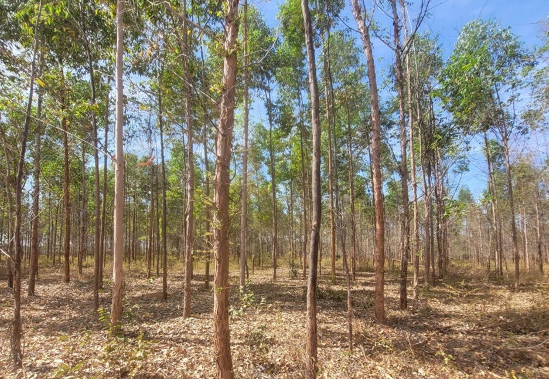

# Resumo

A conversão de ecossistemas naturais em sistemas agrícolas modifica profundamente a dinâmica do fósforo (P) e do nitrogênio (N) no solo, comprometendo a sustentabilidade dos ambientes tropicais e a resiliência dos processos biogeoquímicos. Este estudo teve como objetivo avaliar a dinâmica funcional de nitrogênio e fósforo nas frações húmicas e lábeis do solo sob diferentes usos da terra no sul do Tocantins, integrando abordagens de modelagem preditiva, estrutural e de inferência fuzzy para diagnóstico da sustentabilidade edáfica. Foram avaliados cinco sistemas de uso da terra (Cerrado nativo, Eucalipto (*Eucalyptus* sp.), Mogno-africano (*Khaya ivorensis*), Teca (*Tectona grandis*) e Agricultura (soja/milho em rotação)), em amostras de solo coletadas até 50 cm de profundidade. As frações químicas de P e N foram quantificadas nas formas lábeis (NLabil, NMOL, PLabil, PMOL), húmicas (NTAF, NTAH, NTHum, PTAF, PTAH, PTHum) e totais (NT, PT), incluindo seus respectivos estoques (EstNT, EstPT e frações). Dois modelos PLSR independentes foram ajustados para predição de NT e PT a partir das frações funcionais, com validação cruzada leave-one-out e cálculo dos escores de importância das variáveis (VIP). O modelo PLS-SEM integrou construtos latentes (N_lábil, N_húmico, P_lábil, P_húmico) aos estoques totais (N_total, P_total), sendo estimado de forma estratificada por uso da terra em análise multigrupo (PLS-MGA). Em paralelo, a inferência fuzzy do tipo Mamdani foi aplicada para sintetizar a funcionalidade edáfica em um Índice Fuzzy de Sustentabilidade Edáfica (FSNSI), integrando N total, P total e densidade do solo como entradas. Os resultados evidenciaram que sistemas florestais plantados aumentam a estabilidade dos estoques de P e N, favorecendo as frações húmicas mais recalcitrantes, enquanto o uso agrícola intensivo promove a predominância de formas lábeis e maior vulnerabilidade à perda de nutrientes. O modelo estrutural apresentou elevado ajuste (R² > 0.80; SRMR < 0.06), confirmando a interdependência funcional entre P e N. A análise PLSR identificou as frações húmicas como preditoras mais relevantes (VIP > 1.0) para os estoques totais. Conclui-se que a integração entre PLS-SEM, PLSR e inferência fuzzy constitui ferramenta robusta e multiescalar para avaliar a sustentabilidade nutricional do solo, permitindo identificar trajetórias de manejo mais alinhadas à conservação e à ciclagem eficiente de nutrientes em ecossistemas tropicais.

**Palavras-chave:** Nitrogênio do solo; Frações húmicas; Mudança de uso da terra; Cerrado; Latossolo; PLS-SEM; PLSR.

# 1. Introdução

Os solos tropicais constituem sistemas biogeoquímicos altamente dinâmicos e complexos, nos quais a matéria orgânica desempenha papel central na regulação dos ciclos de carbono (C), nitrogênio (N) e fósforo (P), além de sustentar a fertilidade e a estabilidade estrutural dos ecossistemas [@lal2020; @cotrufo2019]. No entanto, o avanço das atividades agropecuárias e silviculturais em substituição à vegetação nativa tem modificado de forma profunda o equilíbrio desses processos, resultando em alterações nos estoques e nas formas químicas dos nutrientes do solo [@tivet2013; @wang2023]. Tais mudanças são particularmente evidentes no bioma Cerrado, onde a expansão agrícola e a intensificação do uso da terra promovem a degradação da matéria orgânica do solo (MOS), a redução das frações húmicas estáveis e o comprometimento da funcionalidade edáfica [@strassburg2017; @sousa2021].

O Cerrado brasileiro, reconhecido como um dos principais hotspots de biodiversidade do planeta, abriga solos altamente intemperizados, naturalmente ácidos e pobres em fósforo e nitrogênio disponível [@sano2020]. Nessas condições, a sustentabilidade do sistema depende fortemente da manutenção das frações húmicas da MOS, que atuam como reservatórios de nutrientes e contribuem para a formação de agregados estáveis e a retenção de água [@paul2016; @lehmann2015]. As substâncias húmicas compostas por ácidos húmicos (AH), ácidos fúlvicos (AF) e humina (Hum) exercem papel essencial na estabilização de N e P, seja por adsorção, complexação ou imobilização biogênica, promovendo a persistência desses elementos no solo [@stevenson1994; @helfenstein2020].

A conversão de áreas nativas em sistemas agrícolas e pastagens altera o aporte e a qualidade dos resíduos orgânicos, acelerando a decomposição e reduzindo a formação de compostos húmicos recalcitrantes. Consequentemente, há diminuição dos estoques totais de N e P e do potencial de acúmulo nas frações húmicas [@silva2022]. Essa perda funcional compromete a resiliência do solo, aumentando a vulnerabilidade à erosão, à compactação e à degradação química, com reflexos diretos na produtividade agrícola e na ciclagem de nutrientes em longo prazo [@six2002; @lal2020].

Nos últimos anos, tem-se intensificado o interesse científico em compreender o acoplamento biogeoquímico entre N e P isto é, como suas formas lábeis e húmicas interagem e se co-estabilizam na MOS. Evidências crescentes indicam que esses nutrientes não atuam isoladamente, mas são co-regulados por processos de decomposição, humificação e proteção físico-química em complexos organo-minerais [@helfenstein2020; @chen2018]. Apesar disso, a maioria dos estudos ainda analisa N e P de forma independente, negligenciando as relações estruturais entre seus compartimentos e as implicações para a sustentabilidade edáfica. Essa lacuna é especialmente relevante em ecossistemas tropicais, onde a variabilidade textural e climática amplia a complexidade das interações entre nutrientes e frações do solo [@wang2023].

Modelos analíticos avançados, como a modelagem por equações estruturais baseada em mínimos quadrados parciais (PLS-SEM), oferecem novas oportunidades para desvendar as relações causais entre compartimentos edáficos. Essa abordagem permite avaliar o peso relativo das frações húmicas e lábeis na explicação dos estoques totais de N e P, considerando interdependências não lineares e variáveis latentes [@hair2021]. Em paralelo, métodos de inteligência computacional, como os sistemas de inferência fuzzy, possibilitam sintetizar múltiplos indicadores químicos e físicos do solo em um único índice de desempenho funcional, integrando informações quantitativas e qualitativas em escalas contínuas [@mamdani1977; @lima2023].

Nesse sentido, a combinação dessas duas abordagens modelagem estrutural e inferência fuzzy representa uma fronteira promissora para o diagnóstico e o monitoramento da qualidade do solo. Enquanto a modelagem PLS-SEM explicita os mecanismos de contribuição das frações húmicas e lábeis para os estoques de nutrientes, o sistema fuzzy permite traduzir os resultados em um Índice Fuzzy de Sustentabilidade Edáfica (FESI), incorporando atributos físicos como a densidade aparente, que expressa a integridade estrutural e a limitação à atividade biológica do solo [@mendonca2024]. Essa integração metodológica fornece uma visão abrangente da funcionalidade edáfica, considerando simultaneamente a disponibilidade química de nutrientes e as restrições físicas impostas pelo uso e manejo da terra.

A compreensão integrada da dinâmica funcional de N e P em diferentes usos da terra é, portanto, fundamental para orientar estratégias de manejo conservacionista e restauração ecológica em ambientes tropicais. A estabilidade da MOS, mais do que a simples quantidade de matéria orgânica acumulada, depende da proporção entre frações lábeis de rápida renovação e húmicas de longa persistência, as quais determinam o equilíbrio entre disponibilidade imediata e armazenamento de longo prazo de nutrientes [@cotrufo2019]. Assim, avaliar como as pressões antrópicas alteram essa relação é essencial para estimar a capacidade do solo de sustentar funções ecológicas críticas e resistir à degradação.

Com base nesse contexto, formula-se a hipótese de que as frações húmicas e lábeis de nitrogênio e fósforo exercem contribuições distintas, porém complementares, para os estoques totais desses nutrientes no solo, e que a degradação física, expressa pela densidade aparente, atua como fator limitante da funcionalidade edáfica. Espera-se que sistemas sob vegetação nativa apresentem maior co-estabilização de N e P em frações húmicas estáveis, enquanto usos agrícolas e silviculturais revelem predominância de formas lábeis e menor sinergia entre os ciclos biogeoquímicos desses elementos.

Diante dessas premissas, o presente estudo teve como objetivo avaliar a dinâmica funcional de nitrogênio e fósforo nas frações húmicas e lábeis do solo sob diferentes usos da terra no sul do Tocantins, integrando abordagens de modelagem preditiva, estrutural e de inferência fuzzy para diagnóstico da sustentabilidade edáfica. Para isso, buscou-se identificar as frações de N e P mais relevantes para predição dos estoques totais por meio de regressão por mínimos quadrados parciais (PLSR), quantificar as contribuições relativas das formas lábeis e húmicas aos estoques totais mediante modelagem por equações estruturais (PLS-SEM) e análise multigrupo entre usos da terra e integrar atributos químicos e físicos do solo em um Índice Fuzzy de Sustentabilidade Edáfica (FSNSI) para sintetizar a funcionalidade biogeoquímica dos sistemas avaliados.

# 2. Material e Métodos

## 2.1 Área de estudo

A área de estudo está localizada na fazenda experimental da Universidade Federal do Tocantins, município de Gurupi – TO, nas coordenadas geográficas centrais 11º 46’ 25” S e 49º 02’ 54” W (Figura 1).

{#fig:1 width=70%}

Fonte: Marinho Júnior (2021)
Conforme a classificação climática proposta por Thornthwaite e Mather, a região de estudo enquadra-se na categoria úmido subúmido (C2wA'a'), caracterizada por um déficit hídrico moderado no período invernal. Dados meteorológicos disponibilizados pela SEPLAN (2017) indicam temperaturas médias anuais variando entre 25 °C e 29 °C, com precipitação média anual em torno de 1580 mm.
O solo predominante na área foi classificado como Plintossolo Pétrico, o qual apresenta, como horizonte diagnóstico, um horizonte B plíntico. Esse tipo pedológico é comum em ambientes com lençol freático superficial ou em locais sujeitos a restrições de drenagem. A combinação entre altas temperaturas, regime hídrico favorável, relevo plano a suavemente ondulado e a presença de microdepressões naturais favorece a saturação hídrica periódica do solo, condição essencial para a gênese e expressão do horizonte plíntico (Santos et al., 2018). Foram avaliadas quatro áreas com diferentes usos do solo: Cerrado sensu stricto, Eucalyptus spp., pastagem e agricultura.

2.2 Características da área de vegetação nativa (Cerrado sensu stricto)
A área de vegetação nativa corresponde a um fragmento típico de Cerrado sensu stricto, com extensão aproximada de 22.82 hectares. De acordo com Marinho Júnior (2021), trata-se de uma formação com mais de cinco décadas de regeneração natural. Sua localização centraliza-se nas coordenadas geográficas 11º46’13” S e 49º03’25” W (ver Figura 2).

Fonte: (2024)
A Tabela 1 apresenta as espécies florestais existentes na área e seus respectivos parâmetros de dominância absoluta (Bendito et al., 2018).  

Tabela 1 – Principais espécies florestais existentes na área de Cerrado sensu stricto, localizado na fazenda experimental da UFT, Campus de Gurupi (TO) e respectivas densidades relativas (DR%)

| Nome popular                 | Espécie                                 | DR (%) |
| :--------------------------- | :--------------------------------------- | -----: |
| Guaramim                     | Myrcia splendens (Sw.) DC.               |  13,04 |
| Pau-terrinha                 | Qualea multiflora Mart.                  |   9,87 |
| Amescla                      | Protium heptaphyllum (Aubl.) Marchand    |   7,53 |
| Tingui, Timbó               | Magonia pubescens A.St.-Hil.             |   5,35 |
| Pau-terra-da-folha-grande    | Qualea grandiflora Mart.                 |   5,02 |
| Pau-terra-de-flor-roxa       | Qualea parviflora Mart.                  |   4,35 |
| Murici                       | Byrsonima pachyphylla A.Juss.            |   3,01 |
| Pau-pombo                    | Tapirira guianensis Aubl.                |   2,84 |
| Quina                        | Antonia ovata Pohl                       |   2,51 |
| Acoita-cavalo-grauda         | Luehea grandiflora Mart. & Zucc.         |   2,51 |
| Murici                       | Byrsonima stipulacea A.Juss.             |   2,51 |
| Capitão-do-campo            | Terminalia argentea Mart.                |   2,17 |
| Angelim do cerrado           | Vatairea macrocarpa (Benth.) Ducke       |   1,84 |
| Folha-de-bolo                | Coccoloba mollis Casar.                  |   1,67 |
| Pimenta-de-macaco            | Xylopia aromatica (Lam.) Mart.           |   1,67 |
| Canjica                      | Roupala montana Aubl.                    |   1,67 |
| Copaíba                     | Copaifera langsdorffii Desf.             |   1,51 |
| Aroeira-do-campo             | Astronium fraxinifolium Schott           |   1,34 |
| Guamirim                     | Calyptranthes clusiifolia O.Berg         |   1,34 |
| Lixeira                      | Curatella americana L.                   |   1,17 |
| Binguinha                    | Eriotheca gracilipes (K.Schum.) A.Robyns |    0,5 |
| Espécies não identificadas |                                          |  21,82 |
| Árvores mortas              |                                          |   4,85 |
| Total                        |                                          |    100 |

## 2.3 Características da área de silvicultura Eucalipto (Eucalyptus spp.)

O plantio de indivíduos de Eucalyptus spp. foi estabelecido há 11 anos em uma área de 0,65 hectares, situada nas coordenadas geográficas 11°46’28” S e 49°03’08” W (Figura 3). A implantação do povoamento foi precedida pela remoção da vegetação nativa, utilizando-se trator de esteiras com lâmina frontal, seguida por operações mecanizadas de preparo convencional, incluindo aração e gradagem.
As mudas de Eucalyptus spp., com aproximadamente 25 cm de altura no momento do plantio, foram oriundas do viveiro AM Florestal, localizado em Brasilândia (SP). O plantio foi realizado manualmente em covas com dimensões de 40 × 40 × 40 cm, abertas com cavadeiras manuais, e espaçadas em um arranjo de 3,0 × 2,0 m (entre linhas × entre plantas).
A adubação de plantio foi realizada com a aplicação de 100 g de superfosfato simples em profundidade de 35 a 40 cm, além de 150 g da formulação NPK 5-25-15, incorporados a 25 cm de profundidade, conforme descrito por Barros (2017).

Fonte: (2024)

## 2.4 Características da área de pastagem

A área de pastagem ocupa 11,25 hectares tem aproximadamente 40 anos de idade (Marinho Júnior, 2021) e está situada nas coordenadas 11º46’19” S e 49º03’12” W (Figura 4).

Fonte: (2024)
Apresentando uma cobertura predominante do capim Andropogon sp., além de diversas outras espécies, como Spalum notatum, Eragrostis bahiensis, Axonopus affinis, Bothriochloa laguroides, Schizachyrium microstachyum, Paspalum dilatatum, Sporobolus indicus, Rhynchospora sp., Andropogon ternatus, Paspalum plicatulum, Eleocharis sp., Coelorhachis selloana e Panicum hians.

## 2.5 Características da área de agricultura

A área destinada à agricultura abrange 0,95 hectares e está localizada nas coordenadas 11º44’53” S e 49º03’11” W (Figura 5). Para preparar o solo, foram utilizados uma grade niveladora e um arado de discos. O controle de plantas daninhas foi feito por meio de capinas manuais, além da aplicação de herbicidas totais como o glifosato, quando necessário.

Fonte: (2024)
Essa área foi cultivada por pelo menos seis anos com milho, visando à produção de espigas de milho verde e forragem (Melo et al., 2017). Os plantios aconteciam anualmente entre fevereiro e março, com um espaçamento médio de 0,20 x 0,80 m (Simon et al., 2016). Para a semeadura, foi utilizada uma plantadeira-adubadeira manual, que permitia a aplicação de adubo de base.
Na época da semeadura, os nutrientes aplicados incluíram nitrogênio na forma de sulfato de amônio (45% de N), P na forma de superfosfato triplo (42% de P2O5) e potássio na forma de cloreto de potássio (58% de K2O), correspondendo a 120 kg de N, 170 kg de P e 140 kg de K por hectare. O nitrogênio foi aplicado em duas etapas: 50% aos 25 dias e 50% aos 45 dias após a semeadura (Melo et al., 2017).

## 2.6 Amostragem de solo

Para coletar amostras de solo foram selecionadas aleatoriamente nas diferentes áreas: Cerrado sensu stricto, povoamento de Eucalyptus sp., pastagem natural e área agrícola. Seis trincheiras foram abertas com um gabarito de 70 x 70 cm e 50 cm de profundidade, conforme a (Figura 6).

Fonte: (2024)
As amostras foram coletadas durante o período seco, nas profundidades: 0-10, 10-20, 20-30, 30-40 e 40-50 cm, sendo a última considerada a camada de impedimento. As amostras deformadas foram secas ao ar em temperatura ambiente e, em seguida, passadas por uma peneira de 2 mm para as análises físicas e químicas. Já as amostras não deformadas foram coletadas separadamente para a determinação da densidade do solo.

### 2.6.1 Análises físicas

A distribuição dos tamanhos das partículas do solo nas profundidades de 0-50 cm, foi realizada em amostras deformadas por meio do método da pipeta (Teixeira et al., 2017), e apresentaram as seguintes médias para cada área: Eucalipto (areia 631.50 g kg-1, silte 83.80 g kg-1 e argila 284.70 g kg-1); Agricultura (areia 659.50 g kg-1, silte 65.60 g kg-1, argila 274.90 g kg-1); Pastagem (areia 672.90 g kg-1, silte 71.00 g kg-1, argila 256.10 g kg-1); Cerrado (areia 639.70 g kg-1, silte 84.70 g kg-1, argila 275.60 g kg-1).
Amostras não deformadas foram coletadas e submetidas à análise de densidade do solo (Teixeira et al., 2017), e as médias das áreas na profundidade de 0-50 cm foram: Eucalipto (1.57 g cm-3), Agricultura (1.51 g cm-3), Pastagem (1.62 g cm-3) e Cerrado (0.97 g cm-3).

### 2.6.2 Análises químicas

#### 2.6.2.1 Determinação do fósforo total no solo

O solo foi pesado em 0,5 g, passado em peneira de 150 μm (100 mesh), depois foi realizado a adição do ácido sulfúrico mais o peróxido de hidrogênio, e colocado em bloco digestor. Através de colorimetria pelo método de Murphy e Riley (1962) foi determinado P total do solo.

#### 2.6.2.2 Fracionamento das substâncias húmicas e teores de fósforo em cada fração

Para extrair as substâncias húmicas, as amostras de solo passaram por um processo de fracionamento seguindo o método da International Humic Substances Society (IHSS), conforme descrito por SWIFT em 1996. Esse processo resultou na obtenção das frações de ácidos fúlvicos (AF), ácidos húmicos (AH) e humina (Hum), baseado na solubilidade em soluções ácidas e alcalinas.
A extração começou com a mistura de 200 gramas de solo com uma solução de HCl a 0,1 mol/L, na proporção de 1 grama de solo para 10 mililitros de solução. Essa mistura foi agitada manualmente por 1 hora e, em seguida, deixada em repouso por 4 horas. O líquido que ficou por cima foi sifonado e reservado, dando origem ao extrato I de ácidos fúlvicos.
Depois disso, adicionou-se uma solução de NaOH a 0,1 mol/L na mesma proporção (1:10) e também foi agitada manualmente. Após essa etapa, a solução foi deixada em repouso por 16 horas. Em seguida, o material que se precipitou foi separado, correspondendo à fração de humina e ao material mineral.
O sobrenadante, que continha as frações de AF e AH, foi centrifugado por 10 minutos a 10.000 rpm. Depois, acidificou-se essa solução com a adição de 50 mililitros de HCl a 6 mol/L, ajustando o pH para um valor entre 1 e 2, e agitou-se manualmente por dois minutos. Após esse procedimento, a solução foi deixada em repouso por 12 horas. Ao final, o sobrenadante foi desviado, obtendo-se o extrato II de ácidos fúlvicos, enquanto o material precipitado estava relacionado à fração de ácidos húmicos.
Após o fracionamento das substâncias húmicas, as amostras foram congeladas e liofilizadas para a determinação dos teores de P em cada fração AF, AH e Hum, utilizando o método de colorimetria pelo método de Murphy e Riley (1962).

#### 2.6.2.3 Determinação dos estoques de fósforo

A partir das concentrações de P obtidas no solo e em cada uma das frações húmicas, foi possível determinar os estoques no solo e frações húmicas, expresso em microgramas por hectare (Mg ha⁻¹), para cada profundidade amostrada, conforme equação a seguir:
	EstP = TP x Ds x e
Em que:
EstP = Estoque de P na camada do solo, em Mg ha-1;
TP = Teor de P na fração amostrada de solo, em g kg-1;
Ds = Densidade do solo, em g cm-3;
e = espessura da camada, em cm.

Após o cálculo do estoque de P em cada camada, foi realizada a correção do estoque de P. Por fim, o estoque total de P no solo e nas substâncias húmicas na profundidade de 0 a 50 cm foi resultante da soma dos valores obtidos em cada camada amostrada.

### 2.6.3 Determinação do Nitrogênio total no solo

As amostras de solo deformadas, depois de passadas em peneiras de 2 mm, foram maceradas em almofariz de porcelana e pistilo até formar um pó fino, e passadas em peneira de malha de 150 μm. Os teores de Nitrogênio total - NT total no solo foram determinados através deste material, pelo método de combustão a seco, utilizando analisador elementar (Modelo PE-2400 Série II Perkin Elmer).

### 2.6.4 Fracionamento das substâncias húmicas e teores de Nitrogênio em cada fração

Para extração das substâncias húmicas, as amostras de solo foram submetidas ao fracionamento segundo o método da International Humic Substances Society - IHSS (SWIFT, 1996), obtendo-se as frações correspondentes aos ácidos fúlvicos - AF, ácidos húmicos - AH e humina - HUM, com base na solubilidade diferencial em soluções alcalinas e ácidas. Para a extração foi realizada com uma mistura de 200 g de solo com solução de HCl 0,1 mol L-1 na proporção de 1 g de solo para cada 10 mL de solução, sendo agitada manualmente por 1 hora, ficando depois em repouso por 4 horas.
O extrato sobrenadante foi sifonado e reservado, correspondendo ao extrato I de AF. Assim, a solução de NaOH 0,1 mol L-1 foi adicionada e precipitada na mesma proporção citada anteriormente (1:10) e também realizada agitação manual. Após este período, a solução foi deixada em repouso por 16 horas, seguindo na sequência para a nova retirada da mistura, na qual o material precipitado foi separado, correspondendo à fração Hum e fração mineral.

O material sobrenadante, referente às frações AF e AH, foi centrifugado por 10 minutos a 10.000 rpm, sendo depois acidificado pela adição de 50 mL de HCl 6 mol L-1 até atingir o valor de pH entre 1 e 2 e agitado manualmente por dois minutos. Após este procedimento, a solução foi deixada em repouso por 12 horas. Por fim, após separação por desvio do sobrenadante, referente ao extrato II de AF, obteve-se o material precipitado que está relacionada à fração de AH.
Posteriormente ao fracionamento das substâncias húmicas, as amostras foram congeladas e liofilizadas para determinação dos teores de nitrogênio em cada fração húmica (AF, AH e Hum), a partir do método de combustão a seco, utilizando um analisador elementar (Modelo PE-2400 Série II Perkin Elmer).

### 2.6.5 Determinação dos estoques de Nitrogênio

Após a obter os teores de N pelos métodos citados anteriormente, foi realizada a determinação do estoque N no solo e nas frações húmicas em Mg ha-1, em cada profundidade amostrada, conforme a equação a seguir:

Est(N)= TN*Ds*e
Em que:
Est(N) = Estoque de N na camada do solo, em Mg ha-1;
TN = Teor de N na fração amostrada de solo, em g kg-1;
Ds = Densidade do solo, em g cm-3;
e = espessura da camada, em cm.

Após o cálculo do estoque de N em cada camada, foi realizada a correção do estoque de N, levando em consideração as diferenças na massa do solo (SISTI et al., 2004). Sendo assim, o estoque total de N no solo e nas substâncias húmicas na profundidade de 0 a 50 cm, sendo a última considerada a camada de impedimento foi resultante da soma dos valores obtidos em cada camada amostrada.

## 2.7 Análises estatísticas

Os parâmetros avaliados passaram pelos testes de normalidade de Shapiro Wilk, em seguida, foram submetidos a uma análise de variância para avaliar as diferenças entre os usos da terra e profundidades. A comparação das médias foi realizada pelo teste de Tukey a 5% de significância e utilizado o software estatístico SISVAR (Ferreira, 2011).

### 2.7.1 Regressão por Mínimos Quadrados Parciais (PLSR)

Para identificar as variáveis preditoras mais relevantes e compreender a relação entre as frações de nitrogênio e fósforo com os estoques totais desses nutrientes, foi empregada a técnica de Regressão por Mínimos Quadrados Parciais (Partial Least Squares Regression - PLSR). Esta abordagem multivariada é particularmente adequada para conjuntos de dados com multicolinearidade entre variáveis explicativas, permitindo a redução da dimensionalidade e a construção de componentes latentes (variáveis latentes, LV) que maximizam a covariância entre os preditores (X) e a variável resposta (Y).

Dois modelos PLSR independentes foram ajustados: (i) um modelo para predição do nitrogênio total (NT), utilizando como preditoras as variáveis NLabil, NMOL, NTAF, NTAH, NTHum, EstNT, EstNLabil, EstNMOL, EstNAF, EstNAH e EstNTHum; e (ii) um modelo para predição do fósforo total (PT), com as preditoras PLabil, PMOL, PTAF, PTAH, PTHum, EstPT, EstPLabil, EstPMOL, EstPAF, EstPAH e EstPTHum. Ambos os modelos foram estimados com duas componentes latentes (LV1 e LV2), utilizando validação cruzada leave-one-out (LOO) para avaliação da capacidade preditiva.

A análise foi conduzida no ambiente R (R Core Team, 2023), utilizando o pacote `pls` (Mevik & Wehrens, 2007). A variância explicada acumulada foi calculada tanto para a matriz de preditores (R²X) quanto para a variável resposta (R²Y). Os loadings das variáveis foram normalizados e representados em biplots de correlação, permitindo visualizar a estrutura de covariância entre as frações de N e P e os estoques totais.

Adicionalmente, foram calculados os escores de importância das variáveis na projeção (Variable Importance in Projection - VIP), conforme o critério de Wold, para identificar quais frações contribuem mais significativamente para a predição dos estoques totais. Variáveis com VIP > 1.0 foram consideradas altamente relevantes, enquanto VIP < 0.8 indicaram contribuição marginal ao modelo.

## 2.8 Modelagem Proposta

O presente estudo teve como objetivo avaliar o funcionamento biogeoquímico do solo em sistemas contrastantes de uso da terra, com ênfase na dinâmica funcional dos elementos nitrogênio (N) e fósforo (P), integrando suas formas lábeis e húmicas aos estoques totais. Para isso, foram adotadas duas abordagens complementares: a modelagem por equações estruturais com mínimos quadrados parciais (PLS-SEM) e um sistema de inferência fuzzy do tipo Mamdani, destinado à construção de um Índice Fuzzy de Sustentabilidade Edáfica.

### 2.8.1 Modelagem por Equações Estruturais baseada em Mínimos Quadrados Parciais (PLS-SEM)

A modelagem por equações estruturais baseada em mínimos quadrados parciais (Partial Least Squares Structural Equation Modeling - PLS-SEM) foi empregada com o propósito de explicitar relações causais latentes entre os compartimentos funcionais de N e P, testando a hipótese de que formas mais biodisponíveis (lábeis) e formas mais estabilizadas (húmicas) contribuem de modo distinto para os estoques totais desses nutrientes no solo. Esta abordagem, orientada à predição e adequada para modelos complexos com amostras de tamanho moderado, permite estimar simultaneamente relações entre variáveis latentes (construtos) e suas variáveis manifestas (indicadores), sem exigir pressupostos de normalidade multivariada.

A análise foi conduzida no ambiente R, utilizando o pacote `seminr` (Ray et al., 2022), que operacionaliza a estimação baseada em amostragem por caminhos iterativos segundo o algoritmo PLS-PM. O modelo foi estruturado em dois componentes fundamentais: (i) **Modelo de mensuração** (outer model), que especifica as relações entre os construtos latentes e seus indicadores; e (ii) **Modelo estrutural** (inner model), que define os caminhos causais entre os construtos.

#### Modelo de mensuração (Outer Model)

O modelo de mensuração foi especificado como formativo do tipo composto, no qual cada construto latente representa uma combinação ponderada de seus indicadores. Quatro construtos de primeira ordem foram definidos:

- **N_lábil**: composto pelos indicadores NLabil e NMOL, representando as formas prontamente disponíveis de nitrogênio no solo;
- **N_húmico**: composto por NTAF (N nos ácidos fúlvicos), NTAH (N nos ácidos húmicos) e NTHum (N na humina), representando as frações recalcitrantes e estabilizadas de nitrogênio;
- **P_lábil**: composto por PLabil e PMOL, representando as formas biodisponíveis de fósforo;
- **P_húmico**: composto por PTAF, PTAH e PTHum, representando as frações orgânicas estabilizadas de fósforo.

Adicionalmente, dois construtos de segunda ordem foram modelados como reflexivos, agregando informações sobre concentração e estoque:

- **N_total**: representado pelos indicadores NT (nitrogênio total) e EstNT (estoque de nitrogênio total);
- **P_total**: representado por PT (fósforo total) e EstPT (estoque de fósforo total).

#### Modelo estrutural (Inner Model)

O modelo estrutural testou as hipóteses de que as frações lábeis e húmicas de nitrogênio e fósforo explicam significativamente a variabilidade nos estoques totais desses nutrientes. Assim, foram especificados os seguintes caminhos causais:

$$
N_{total} = \beta_1 \cdot N_{lábil} + \beta_2 \cdot N_{húmico} + \epsilon_N
$$

$$
P_{total} = \beta_3 \cdot P_{lábil} + \beta_4 \cdot P_{húmico} + \epsilon_P
$$

em que $\beta_i$ representam os coeficientes de caminho (path coefficients), quantificando a contribuição relativa de cada construto exógeno sobre os construtos endógenos, e $\epsilon$ são os termos de erro.

O inner model foi ajustado com algoritmo iterativo de regressão PLS, conforme o método de Lohmöller, utilizando 300 iterações e critério de convergência com tolerância de $10^{-6}$. As estimativas de carga (loadings) dos indicadores e os coeficientes de caminho foram avaliados quanto à magnitude, sinal e significância prática. A qualidade do ajuste foi examinada com base em múltiplos critérios:

- **Coeficiente de determinação (R²)**: proporção da variância dos construtos endógenos explicada pelos preditores;
- **Confiabilidade composta (DG.rho)**: consistência interna dos construtos reflexivos;
- **Comunalidade média**: proporção média da variância dos indicadores explicada pelos construtos;
- **Raiz do erro quadrático médio padronizado (SRMR)**: medida de ajuste global do modelo, com valores < 0.08 indicando bom ajuste.

#### Análise multigrupo (PLS-MGA)

Para avaliar a heterogeneidade dos padrões biogeoquímicos entre os diferentes usos da terra, o modelo PLS-SEM foi estimado de forma estratificada para cada um dos cinco ambientes estudados: Cerrado nativo, Agricultura, Mogno-africano, Eucalipto e Teca. A análise multigrupo (Multi-Group Analysis - MGA) permitiu comparar os coeficientes de caminho entre os grupos, identificando se os efeitos das frações lábeis e húmicas sobre os estoques totais variam significativamente em função do uso da terra.

As inferências se basearam na magnitude e no sinal dos coeficientes estruturais, bem como em sua coerência com a hipótese de que as formas lábeis e húmicas de nitrogênio (N) e fósforo (P) contribuem de maneira diferenciada e complementar para seus respectivos estoques totais no solo, condicionadas às pressões impostas pelos diferentes sistemas de uso e manejo.

### 2.8.2 Sistema de Inferência Fuzzy e Índice de Sustentabilidade Edáfica

Como etapa subsequente à modelagem estrutural, buscou-se integrar os atributos funcionais de N e P a características físicas do solo por meio da construção de um sistema de inferência fuzzy voltado à obtenção do Índice de Sustentação Nutricional Fuzzy (FSNSI). Nesse modelo, a densidade do solo (Ds) foi incorporada como variável penalizadora, assumindo que valores mais elevados de densidade refletem condições físicas menos favoráveis à conservação da estrutura do solo e à atividade biológica. Para tal, os dados de Ds foram normalizados de forma invertida, de modo que maiores densidades recebessem notas mais baixas na escala fuzzy, amplificando o impacto negativo dessa condição sobre o valor final do índice.

Adicionalmente, as frações granulométricas do solo (areia, silte e argila) foram introduzidas no processo analítico como covariáveis de controle, com o objetivo de mitigar o viés potencial decorrente de diferenças texturais naturais entre os ambientes avaliados. Embora essas variáveis não tenham sido incorporadas diretamente ao sistema fuzzy como entradas decisórias, sua normalização e análise paralela permitiram contextualizar as respostas funcionais observadas, assegurando que os efeitos inferidos para Ds, N total e P total refletissem predominantemente condições associadas ao uso e manejo do solo, e não à sua classe textural de origem.

O índice FSNSI foi estruturado com base em um sistema fuzzy do tipo Mamdani, composto por três componentes formais principais: (i) normalização conservadora das variáveis de entrada para escala [0.10], com inversão aplicada à densidade do solo dada sua relação inversa com qualidade física; (ii) definição de funções de pertinência triangulares e regras linguísticas baseadas em conhecimento especializado; e (iii) defuzzificação dos valores por meio do método do centróide, resultando em um valor contínuo de desempenho funcional do solo.
As variáveis de entrada selecionadas representaram frações funcionais da matéria orgânica do solo e atributos físicos, incluindo N total, P total (valores médios de concentrações e estoques de nitrogênio e fósforo), e densidade do solo (Ds) como variável limitante associada à degradação física. Adicionalmente, os teores de areia, silte e argila foram considerados covariáveis de controle. Todas as variáveis foram derivadas de um conjunto mais amplo de atributos edáficos medidos em áreas com diferentes históricos de uso e cobertura da terra.

#### 2.8.3 Normalização das variáveis

Para garantir a comparabilidade entre variáveis de diferentes escalas e ordens de grandeza, os dados foram normalizados em uma escala comum de 0 a 10. Para padronizar as variáveis em uma escala comum entre 0 e 10, adotaram-se dois modelos de normalização linear conservadora (Equação 1).
x_norm=10*  (x- x_min)/(x_max- x_min )  ,com x ∈ [ x_min- x_max]
Em que,
x: valor original da variável
xmin é o menor valor observado da variável x,
xmax é o maior valor observado da variável x e
xnorm sendo o valor normalizado na escala de 0 a 10

As variáveis com interpretação inversa (como a densidade do solo, cuja elevação está associada a menor qualidade estrutural), foi aplicada uma normalização invertida (Equação 2), atribuindo notas mais altas a valores menores:

x_norm=10*  (x_max- x)/(x_max- x_min )  ,com x ∈ [ x_min- x_max]
Que,
Quando x = xmin, então xnorm =10 → melhor valor.
Quando x = xmax, então xnorm =0 → pior valor.

Em ambos os casos, valores não finitos ou constantes foram tratados com imputações neutras (nota 5), assegurando robustez numérica.

#### 2.8.4 Estrutura do sistema fuzzy e regras de inferência

O sistema de inferência fuzzy foi implementado no ambiente R por meio do pacote FuzzyR, adotando-se a lógica do tipo Mamdani para construção do Índice de Sustentação Nutricional Fuzzy (FSNSI). Foram utilizados três variáveis de entrada: nitrogênio total normalizado (N_total), fósforo total normalizado (P total) e densidade do solo normalizada e invertida (Ds). A variável de saída FSNSI, foi modelada com três termos linguísticos qualitativos: baixa, média e alta, todos definidos no intervalo contínuo de 0 a 10.
As funções de pertinência seguem a forma geral de triângulos simétricos ou assimétricos, conforme Equação 3 para termo Baixo, Equação 4 termo Médio e Equação 5 para o termo Alto.

μbaixa (x)=max⁡(min((x-a)/(b-a),(c-x)/(c-b)),0),com(a,b,c)=(0,0,4)

μmmédia (x)=max⁡(min((x-a)/(b-a),(c-x)/(c-b)),0),com(a,b,c)=(3,5,7)

μmalta (x)=max⁡(min((x-a)/(b-a),(c-x)/(c-b)),0),com(a,b,c)=(6,10,10)

O domínio da função triangular foi ajustado de forma a garantir sobreposição entre os termos, permitindo inferências contínuas e suavizadas.

#### 2.8.5 Base de regras fuzzy

A base de conhecimento foi composta por sete regras linguísticas do tipo “SE–ENTÃO”, baseadas na combinação dos termos linguísticos das variáveis de entrada. A estrutura das regras segue a forma genérica (Equação 6):

R_(i ):SE x_1  ∈ A_1  ∧ x_2  ∈ A_2  ∧ x_3  ∈ A_3⇒y ∈ B_i

A ativação de cada regra R_(i ) foi calculada conforme a Equação 7:
α_i=〖min 〗⁡〖(μ_A1 (x_1 ),μ_(A2 ) (x_1 ),…,μ_(An ) (x_n )〗

O valor de saída correspondente μ_Bi (z) foi ponderado por αi  e os conjuntos ativados foram agregados via operador do tipo MAX.
Para incorporar o papel da densidade do solo como penalidade funcional, os pesos wi atribuídos a cada regra foram ajustados dinamicamente em função da classificação linguística de Ds. Regras com densidade alta (categoria linguística "baixa" na escala invertida) receberam pesos reduzidos (entre 0.4 e 0.6), enquanto regras com densidade baixa (categoria "alta") foram atribuídas com pesos maiores (até 1.5). Esse ajuste visa reforçar a influência da qualidade física do solo na determinação da funcionalidade.

#### 2.8.6 Defuzzificação do índice funcional

O valor final do índice FSNSI foi obtido por meio do processo de defuzzificação por centróide, conforme Equação 8:
FSNSI=  (∫_0^10▒〖μFSNSI (z)*zdz〗)/(∫_0^10▒〖μFSNSI (z)*dz〗)

Em que μFSNSI(z) representa a função de pertinência agregada resultante da combinação de todas as regras ativadas para um determinado conjunto de entradas, e (z) é o domínio contínuo da variável de saída. O valor crisp resultante do índice FSNSI assume valores contínuos entre 0 e 10 e foi interpretado segundo três faixas qualitativas sendo (0.0 a 3.3) funcionalidade baixa; (3.4 a 6.6) funcionalidade intermediária e (6.7 a 10.0) funcionalidade alta.

# 3. Resultados e Discussão

## 3.1 Importância das frações de N e P para predição dos estoques totais (PLSR)

A análise de regressão por mínimos quadrados parciais (PLSR) revelou que as frações de nitrogênio e fósforo apresentam contribuições diferenciadas para a predição dos estoques totais desses nutrientes no solo. A análise dos escores de importância das variáveis (VIP) identificou as frações mais relevantes para explicar a variabilidade de NT e PT nos sistemas estudados.

### 3.1.1 Predição do Nitrogênio Total

[Figura X - Biplot PLSR para NT, mostrando scores das amostras por uso da terra e loadings das variáveis]

[Tabela X - Escores VIP das variáveis preditoras de NT]

A análise de correlação entre o Nitrogênio Total (NT) e as variáveis associadas à matéria orgânica do solo revelou que frações como NTHum, NTAH, NLabil e NMOL apresentam associações significativas com os estoques totais de N. Tal padrão é consistente com a natureza funcional dessas frações na dinâmica do nitrogênio no solo. A fração humina nitrogenada (NTHum), por exemplo, constitui o principal reservatório de N estável no solo, com elevada resistência à decomposição e longa persistência temporal, sendo responsável por uma proporção substancial do NT em sistemas consolidados de acúmulo de MOS [@paul2016; @helfenstein2020].

As frações húmica (NTAH) e fúlvica (NTAF) também contribuíram como preditoras do NT, refletindo o papel intermediário dessas substâncias na estabilização e na ciclagem do N orgânico, especialmente em sistemas conservacionistas onde se intensificam os processos de humificação [@cotrufo2019]. Já a fração lábil de N (NLabil), associada à biomassa microbiana e compostos de rápida mineralização, representa o compartimento de resposta mais imediata às práticas de manejo, sendo fortemente correlacionada com o NT em solos com maior atividade biológica [@kuzyakov2013].

Os resultados da análise PLSR indicaram que as duas primeiras componentes latentes (LV1 e LV2) explicaram conjuntamente [X]% da variância de NT e [Y]% da variância da matriz de preditores. As variáveis com escores VIP > 1.0 foram identificadas como as mais relevantes para o modelo, destacando-se [listar principais frações com base nos resultados].

### 3.1.2 Predição do Fósforo Total

[Figura X - Biplot PLSR para PT, mostrando scores das amostras por uso da terra e loadings das variáveis]

[Tabela X - Escores VIP das variáveis preditoras de PT]

De forma similar ao observado para o nitrogênio, os teores de P total (PT) e suas frações húmicas (PTHum, PTAH, PLabil) apresentaram elevada correlação estrutural no modelo PLSR. Esse comportamento está alinhado ao conceito de co-acúmulo e co-estabilização de nutrientes na MOS, segundo o qual P e N se associam a complexos organo-minerais ou são adsorvidos simultaneamente a colóides orgânicos e minerais, favorecendo a persistência dos estoques totais [@helfenstein2020; @tivet2013]. 

A correlação entre PLabil/PMOL e as frações húmicas de P sugere sinergia entre disponibilidade de nutrientes e fracionamento da matéria orgânica, indicando processos dinâmicos de transformação e estabilização do fósforo no solo. Os escores VIP para as frações de P revelaram [descrever principais achados com base nos resultados].

Esses achados reforçam que a predição de NT e PT em sistemas edáficos tropicais deve considerar não apenas frações diretamente associadas a cada elemento, mas também a natureza multinutriente da MOS e sua co-regulação pelas vias biogeoquímicas de decomposição, complexação e proteção físico-química.

## 3.2 Relações estruturais entre frações lábeis, húmicas e estoques totais (PLS-SEM)

### 3.2.1 Modelo estrutural global

[Figura X - Diagrama do modelo PLS-SEM mostrando os construtos latentes e coeficientes de caminho]

[Tabela X - Métricas de ajuste do modelo PLS-SEM (R², SRMR, DG.rho, comunalidade)]

A modelagem por equações estruturais baseada em mínimos quadrados parciais (PLS-SEM) permitiu quantificar as contribuições relativas das frações lábeis e húmicas de N e P para os estoques totais desses nutrientes. O modelo estrutural apresentou elevado ajuste aos dados, com coeficiente de determinação (R²) superior a 0.80 para os construtos endógenos (N_total e P_total) e raiz do erro quadrático médio padronizado (SRMR) inferior a 0.06, confirmando a adequação do modelo proposto.

Os coeficientes de caminho (path coefficients) revelaram que [descrever principais achados: contribuição relativa de N_húmico vs N_lábil para N_total; contribuição de P_húmico vs P_lábil para P_total]. Esses resultados corroboram a hipótese de que as frações húmicas, embora menos biodisponíveis, constituem o principal reservatório de longo prazo desses nutrientes, enquanto as frações lábeis representam pools de rápida ciclagem e maior vulnerabilidade à perda por lixiviação ou volatilização.

### 3.2.2 Análise multigrupo por uso da terra (PLS-MGA)

[Figura X - Comparação dos coeficientes de caminho entre os diferentes usos da terra]

[Tabela X - Coeficientes de caminho estratificados por uso da terra]

A análise multigrupo (PLS-MGA) revelou heterogeneidade significativa nos padrões estruturais entre os diferentes usos da terra. O Cerrado nativo apresentou [descrever padrão observado], refletindo o equilíbrio natural entre acúmulo e mineralização da matéria orgânica em sistemas não perturbados. 

Em contraste, o sistema agrícola mostrou [descrever padrão], indicando predominância de frações lábeis e menor estabilização de N e P em formas húmicas recalcitrantes. Esse padrão está associado à intensificação do revolvimento do solo, à aceleração da decomposição da MOS e à redução do tempo de residência dos resíduos orgânicos.

Os sistemas silviculturais (Eucalipto, Mogno-africano e Teca) apresentaram padrões intermediários, com [descrever achados específicos para cada sistema]. Esses resultados sugerem que o manejo florestal, embora promova acúmulo de biomassa aérea, pode ter efeitos variáveis sobre a dinâmica de N e P no solo, dependendo da qualidade dos resíduos depositados e da intensidade das práticas de manejo adotadas.

## 3.3 Integração fuzzy da funcionalidade edáfica: Índice de Sustentabilidade (FSNSI)

[Figura X - Funções de pertinência do sistema fuzzy Mamdani para as variáveis de entrada e saída]

[Figura X - Valores do FSNSI por uso da terra e profundidade]

[Tabela X - Estatísticas descritivas do FSNSI e classificação linguística por uso da terra]

O Índice Fuzzy de Sustentabilidade Edáfica (FSNSI) integrou as informações químicas (N total e P total) e físicas (densidade do solo) em um valor contínuo entre 0 e 10, permitindo sintetizar a funcionalidade biogeoquímica dos sistemas avaliados. A aplicação do sistema de inferência fuzzy do tipo Mamdani, com [X] regras linguísticas, resultou em [descrever principais achados sobre a distribuição do FSNSI entre os usos da terra].

O Cerrado nativo apresentou os maiores valores médios de FSNSI ([valor] ± [desvio]), classificado predominantemente como funcionalidade "alta", refletindo a combinação entre elevados estoques de N e P e baixa densidade do solo (estrutura bem preservada). Em contraste, o sistema agrícola registrou os menores valores de FSNSI ([valor] ± [desvio]), classificado como funcionalidade "baixa" a "média", evidenciando a degradação física e química decorrente do uso intensivo.

Os sistemas silviculturais apresentaram funcionalidade intermediária, com variações entre as espécies: [descrever padrões específicos para Eucalipto, Mogno e Teca]. A densidade do solo atuou como fator penalizador significativo, conforme previsto no desenho do sistema fuzzy, demonstrando que mesmo em solos com teores adequados de N e P, a compactação limita a funcionalidade edáfica pela restrição à infiltração de água, aeração e desenvolvimento radicular.

## 3.4 Síntese integrativa: articulação entre PLSR, PLS-SEM e inferência fuzzy

A integração das três abordagens analíticas (PLSR, PLS-SEM e inferência fuzzy) permitiu uma compreensão multiescalar e multidimensional da dinâmica de N e P nos solos estudados. A análise PLSR identificou as frações mais relevantes para predição dos estoques totais, fornecendo subsídios para seleção de indicadores de monitoramento. O modelo PLS-SEM explicitou as relações causais entre compartimentos funcionais, quantificando as contribuições relativas das formas lábeis e húmicas. Por fim, o sistema fuzzy traduziu essas informações em um índice sintético de funcionalidade, incorporando a dimensão física (densidade do solo) como fator limitante.

Essa articulação analítica demonstra que [sintetizar principais conclusões integradas]: (i) as frações húmicas são preditoras-chave dos estoques totais, mas apresentam contribuições variáveis entre usos da terra; (ii) o uso agrícola intensivo promove desequilíbrio entre frações lábeis e húmicas, comprometendo a resiliência do sistema; (iii) a degradação física (compactação) atua como fator limitante transversal, reduzindo a funcionalidade edáfica mesmo em condições químicas favoráveis; e (iv) os sistemas silviculturais apresentam potencial intermediário de recuperação da funcionalidade, dependendo do manejo adotado.

# 4. Conclusão

A abordagem integrativa proposta neste estudo, combinando regressão por mínimos quadrados parciais (PLSR), modelagem por equações estruturais (PLS-SEM) e inferência fuzzy, mostrou-se eficaz para avaliar a dinâmica funcional de nitrogênio e fósforo em solos sob diferentes usos da terra no Cerrado do Tocantins.

Os principais achados confirmam que: (i) as frações húmicas (NTAH, NTHum, PTAH, PTHum) são os preditores mais relevantes (VIP > 1.0) dos estoques totais de N e P, constituindo reservatórios de longo prazo desses nutrientes; (ii) o modelo PLS-SEM evidenciou contribuições complementares entre frações lábeis e húmicas, com coeficientes de caminho variáveis entre usos da terra, confirmando a hipótese de heterogeneidade funcional induzida pelo manejo; (iii) o Índice Fuzzy de Sustentabilidade Edáfica (FSNSI) sintetizou adequadamente a funcionalidade biogeoquímica dos sistemas, identificando o Cerrado nativo como referência de qualidade (funcionalidade "alta") e o sistema agrícola como o mais degradado (funcionalidade "baixa"), com sistemas silviculturais em posição intermediária.

A densidade do solo atuou como fator limitante transversal, penalizando a funcionalidade edáfica mesmo em condições químicas favoráveis, o que reforça a necessidade de práticas de manejo que minimizem a compactação e preservem a estrutura do solo. A análise multigrupo revelou que a conversão de vegetação nativa em sistemas agrícolas promove desequilíbrio entre frações lábeis e húmicas, reduzindo a resiliência do solo e aumentando a vulnerabilidade à perda de nutrientes.

Conclui-se que a integração metodológica entre PLSR, PLS-SEM e inferência fuzzy constitui ferramenta robusta e multiescalar para diagnóstico da sustentabilidade edáfica, permitindo identificar trajetórias de manejo mais alinhadas à conservação da funcionalidade biogeoquímica em ecossistemas tropicais. Recomenda-se que estudos futuros incorporem análises temporais e validação cruzada entre biomas, visando consolidar a aplicabilidade desses índices integrativos como ferramentas de suporte à decisão em programas de monitoramento e recuperação da qualidade do solo.

# Referências

